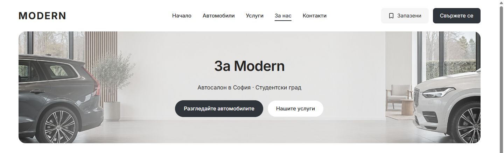
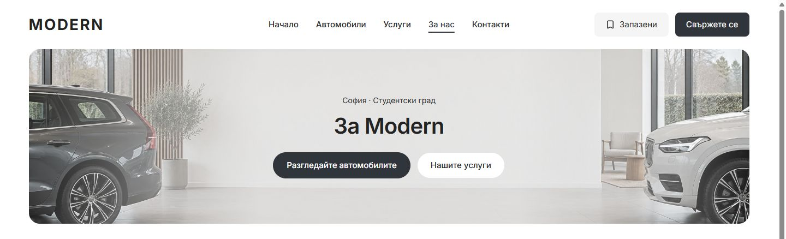
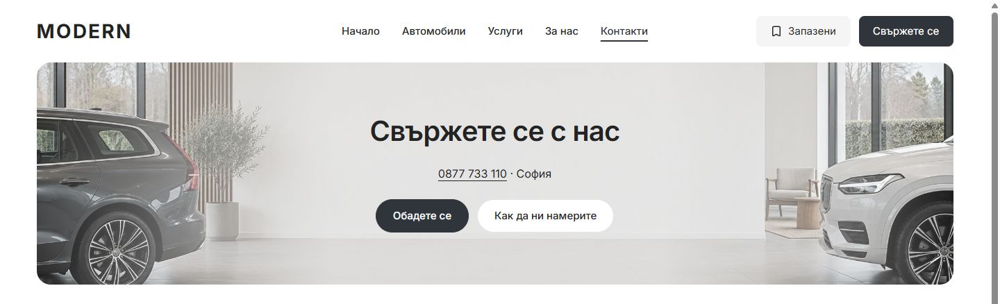
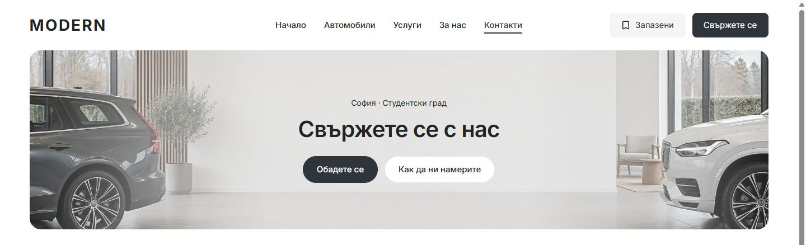

# About and Contact location eyebrows — 6 October 2026

Both desktop heroes now read location → title → actions. The configured city/district is a small eyebrow above the title: “София · Студентски град” in Bulgarian and “Sofia · Studentski grad” in English. Contact's phone remains in the existing call action. The former repeated phone row and generic showroom sentence are removed.

The shared hero accepts an optional string `eyebrow`; the unused `supportingContent` API and phone-specific underline/focus rules are removed. The eyebrow uses the existing 14/22 px type role with a 12 px gap to the title. Artwork, 320 px banner height, existing buttons and mobile composition are preserved.

## Before and after

Matched 1440 px Bulgarian captures, including the header and full hero:

| Page | Before | After |
| --- | --- | --- |
| About |  |  |
| Contact |  |  |

## Verification

- Both pages in BG/EN at 1024/1440 px: eyebrow above the title, 14/22 px text, 320 px hero height, unchanged overall page height and headings below the hero. Existing action destinations match. No overflow or visible broken images.
- Both pages in BG/EN at 320/390/1023 px: all 12 before/after screenshots are pixel-identical. Visible text, heading geometry and page height match.
- Scoped Biome passed for all four source files.
- Marketplace UI and web typechecks passed.
- Desktop refactor contracts: 7/7 passed. Release contract preflight passed; preflight tests: 87/87 passed.
- Provider-free production `next build` passed with Node 22.23.2. Isolated output: `apps/web/.next-public-e2e-hero-eyebrow-20261006-demo`. The protected `apps/web/next-env.d.ts` is restored byte-for-byte to its pre-task contents.

[DOM measurements](about-contact-hero-eyebrow-2026-10-06/measurements.json) and [pixel/geometry comparisons](about-contact-hero-eyebrow-2026-10-06/comparison.json) record the actual checks. This is local in-app browser verification; hosted and WebKit checks were not rerun.

Changed source: `packages/marketplace-ui/components/dealer-desktop-hero.tsx`, `dealer-desktop-hero.module.css`, `apps/web/app/[locale]/about/page.tsx`, and `apps/web/app/[locale]/contact/page.tsx`. The existing main checkout and unrelated work are preserved; no commit, release selection or deployment was made. Task preimages remain in ignored `runtime/hero-eyebrow-20261006/`.
