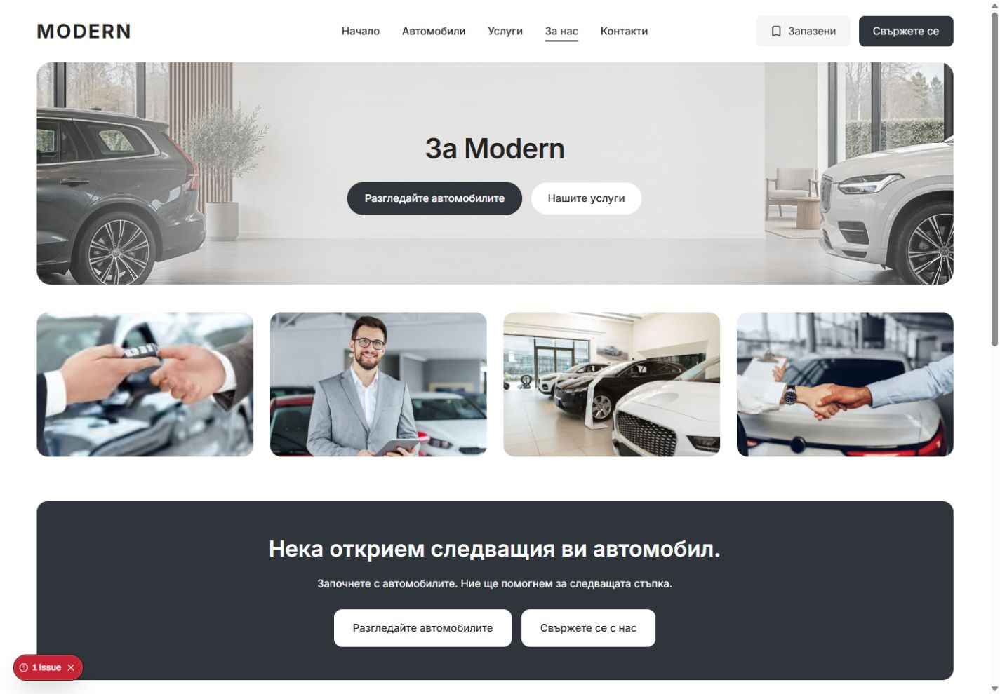
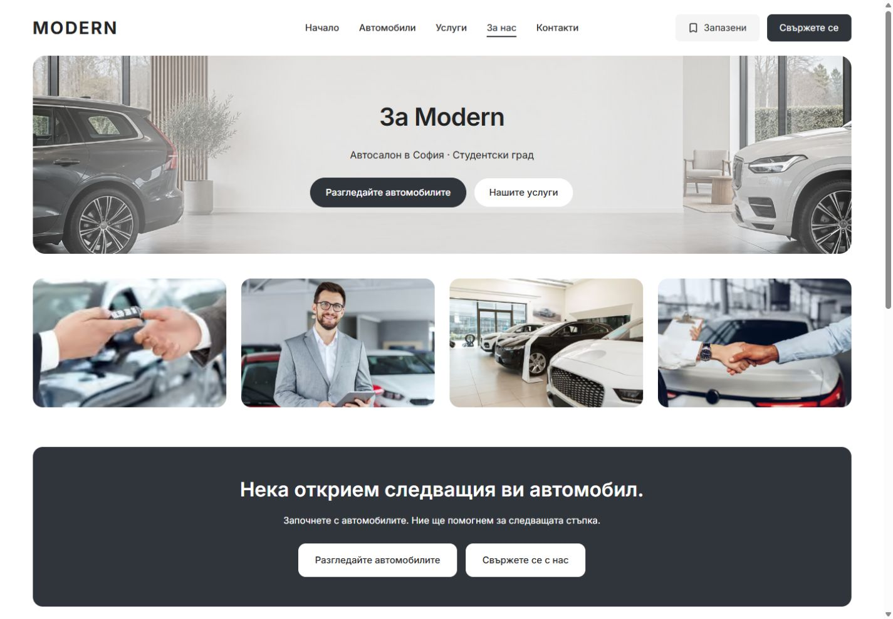
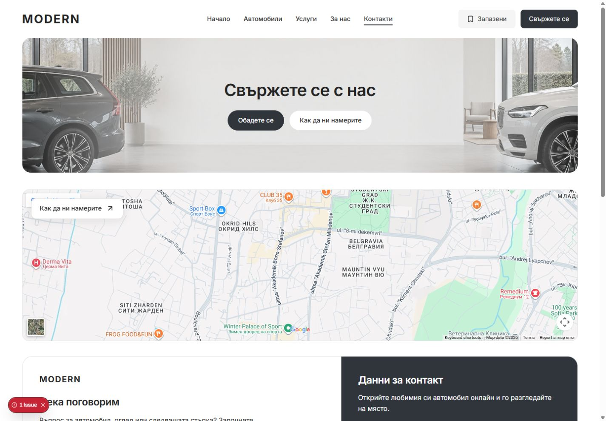
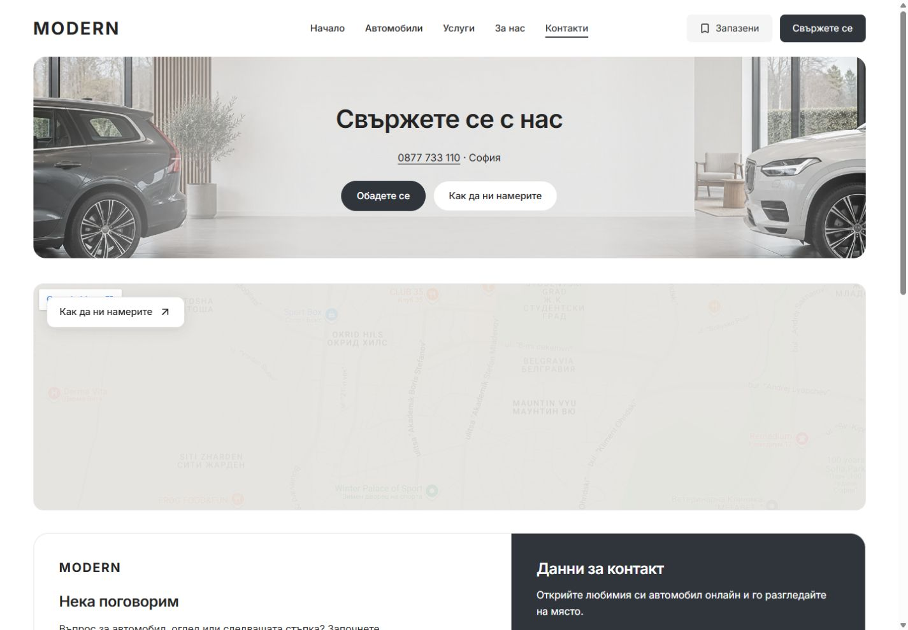

# About and Contact desktop heroes — 6 October 2026

Historical evidence: the owner replaced the below-title supporting row with a location eyebrow above both titles. [Current eyebrow implementation and checks](ABOUT-CONTACT-HERO-EYEBROW-2026-10-06.md).

About and Contact now have three centered rows: title, useful supporting detail, then their existing buttons. About shows “Автосалон в София · Студентски град”; Contact shows “0877 733 110 · София”, with the phone number as a native telephone link. Both locales use the configured dealer city, district and phone data. The artwork, 320 px hero height and existing action destinations are preserved.

The shared hero has an optional `supportingContent` slot. Its 16/26 px Inter text and 24 px title gap use existing design tokens, with an underlined phone link and visible keyboard focus. The row is hidden below 1024 px. The current-page navigation underline also uses the existing spacing token, preserving its 2 px thickness and 8 px offset while satisfying the desktop style contract.

## Matched desktop captures

Bulgarian, 1440 × 1000 viewport:

| Page | Before | After |
| --- | --- | --- |
| About |  |  |
| Contact |  |  |

The evidence folder also contains matched BG/EN captures at 1024 px desktop and 320/390/1023 px mobile. [Measurements](about-contact-hero-support-2026-10-06/measurements.json) record text, typography, dimensions, action destinations, overflow and visible broken images.

## Verification

- Eight desktop route/locale/width combinations: both pages in BG/EN at 1024/1440 px. All heroes remain 320 px tall; the supporting row is visible and uses 16/26 px text. No horizontal overflow or visible broken images. Overall page heights and content geometry below the hero remain unchanged.
- Twelve mobile comparisons: both pages in BG/EN at 320/390/1023 px. Every screenshot pair is pixel-identical; visible text, heading geometry and page height also match. [Pixel and geometry comparison](about-contact-hero-support-2026-10-06/mobile-comparison.json).
- Contact phone link retains `tel:+359877733110`. Keyboard navigation reaches it with a visible 2 px focus outline. Call and map destinations were inspected without placing a call or navigating externally. [Focus evidence](about-contact-hero-support-2026-10-06/phone-focus.json).
- Fresh Contact reload has no console errors. During editing, the development server restarted at its memory threshold and stale CSS updates produced HMR errors; the recovered fresh render is clean. [Fresh console evidence](about-contact-hero-support-2026-10-06/fresh-render-console.json).
- Scoped Biome: five source files passed.
- `pnpm --filter @repo/marketplace-ui typecheck`: passed.
- `pnpm --filter web exec tsc --noEmit --emitDeclarationOnly false --incremental false`: passed.
- `pnpm refactor:contracts`: 7/7 passed after replacing literal underline dimensions with spacing tokens.
- `pnpm release:preflight:contracts`: passed.
- `pnpm release:preflight:test`: 87/87 passed.
- Production `next build`: passed with Node 22.23.2 and the existing provider-free demo configuration. Isolated output: `apps/web/.next-public-e2e-hero-support-20261006-demo`, build ID `dTAR5f1tn0_4oYaAFUD82`. The generated `apps/web/next-env.d.ts` was restored byte-for-byte to its pre-task contents.

## Source and scope

Changed source: `packages/marketplace-ui/components/dealer-desktop-hero.tsx`, `dealer-desktop-hero.module.css`, `dealer-desktop-header.module.css`, `apps/web/app/[locale]/about/page.tsx` and `apps/web/app/[locale]/contact/page.tsx`. `TEMPLATE.md` and `docs/QA.md` describe the current presentation and checks.

This is a local Modern master refinement on the existing `main` checkout. Pre-existing staged, unstaged and untracked work is preserved. No commit, release selection or dealer deployment was made. Browser proof uses the existing in-app browser; WebKit and hosted release checks were not rerun for this focused change. Task preimages remain under ignored `runtime/hero-support-20261006/`.
