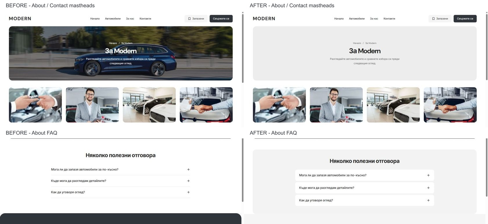

# About FAQ and neutral mastheads — 5 October 2026

About FAQ now sits in a rounded grey container aligned to the page frame. Its white accordion rows retain native `details`/`summary` behavior; Enter opens and closes a row while retaining focus. The section has a labelled region and a stable `about-faq` slot.

Desktop About and Contact use the shared hero's new `neutral` appearance: the same `#ededed` surface as Home/Cars, dark headings and secondary copy, the existing breadcrumb, 320 px banner height and 40 px gap to the gallery/map. The showroom gallery and charcoal benefit artwork remain intact. No new imagery was generated. The neutral variant is reusable; photographic artwork support is retained for its other consumers.

The reviewed Make/Model modal has 44 px footer actions and 48 px option buttons. Their dimensions remain unchanged.

Verification:

- Native desktop checks pass for both affected routes in BG/EN at 1024, 1280, 1440 and 1920 px: 16 cases, neutral colour, no background image, 320 px banner height, 40 px content gap and no horizontal overflow. FAQ width matches the shared frame.
- Matched About/Contact screenshots and geometry at 320/390 × 844 and 1023 × 1000: all six comparisons pass without layout changes or overflow. Evidence is in the adjacent `mobile-before.json`, `mobile-after.json` and screenshots.
- FAQ keyboard opening/closing and focus retention pass. Four development CSS hot-reload errors were captured during editing; a fresh document load reports no new errors. The historical and fresh log entries are preserved in the task runtime folder.
- Production web build passes: `.next-public-e2e-about-faq-neutral-20261005-demo`, build ID `h0CDnJ3Jn_yWdo2esnbwi`. Web typecheck passes. Generated `next-env.d.ts` is restored to its saved pre-start state.
- Scoped Biome checks pass for six source/test files. Refactor contracts: 7 passed; release preflight contracts pass; preflight tests: 87 passed. Scoped `git diff --check` passes.

The existing shared-frame browser assertions are updated for the neutral About/Contact banners. The rendered checks in this pass use the native development browser; a Chromium/WebKit production suite rerun is not claimed. The new isolated build does not replace the running development output.

Task-owned changes are in `apps/web/app/[locale]/{about/page.tsx,contact/page.tsx,components/boxcar-desktop-pages.module.css}`, `packages/marketplace-ui/components/dealer-desktop-hero.{tsx,module.css}`, `apps/e2e/specs/desktop-panel-flows.spec.ts`, the current template/QA references and this evidence. Task preimages and commands are preserved in ignored `runtime/about-faq-neutral-20261005/`; earlier unrelated edits remain untouched.

The actual app remains running at `http://127.0.0.1:6482/bg` under PID 48868. The normal browser viewport is restored with About open. Source remains in `L:/CODEX/cars` on `main`, HEAD `08c89d63f9e11939acd5b135ece4278252b80f43`, with no remote drift at the initial fetch. The existing zero-byte `.git/index.lock` still prevents a scoped commit/non-force push and is preserved. Once its owner releases the lock, review and commit the task-owned diff against the saved preimages. No source release selection, dealer regeneration or hosting publication was performed.
