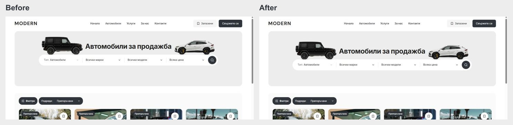

# Cars buy-box centering — 5 October 2026

Cars retained a 120 px controls frame after its category/filter row was removed. Its visible title/search group was centred at y222 inside a banner centred at y250. The unused 56 px beneath search made the composition sit 28 px too high.

The inventory controls frame now matches the 64 px search capsule. The visible title/search group moves down 28 px and centres at y250. Both vehicle cutouts move with it, retaining tyre alignment at the capsule top (y254; 164 px from the banner top). The loading frame has the same height to avoid a shift after loading. Home retains its existing composition because it still contains category pills.

Source: `packages/marketplace-ui/components/dealer-desktop-hero.module.css`; the existing banner hierarchy assertion and current TEMPLATE/QA references are updated to reflect the per-page vertical centering. Filters and Sort remain above the grid.

Focused local verification: BG/EN Cars at 1024/1280/1440/1920, unchanged Home at 1440, and matched Home/Cars mobile geometry at 320/390/1023. Scoped Biome and diff whitespace checks passed. Screenshots and measured rectangles are in `docs/buy-box-center-2026-10-05/`. No new production build or Playwright suite was run for this small CSS correction.

Unrelated work remains preserved on main. The existing Git index lock still prevents scoped commit/push; no publication occurred.

## Heading clearance follow-up

Each cutout now sits 32 px farther outward on both Home and Cars. This changes only the horizontal inset; the search positions, artwork size and tyre baselines remain unchanged. At 1440 px, the BG title has approximately 39 px of clearance per side on Home and 46 px on Cars. Both tyres still rest over the capsule's ends.

Focused live checks passed for Home/Cars in BG/EN at 1200 and 1440 px, with no title collision or overflow and unchanged vertical positions. All six Home/Cars mobile geometry comparisons at 320/390/1023 remained equal. Scoped CSS Biome and diff whitespace checks passed. Evidence is in `docs/vehicle-heading-space-2026-10-05/`; an exact CSS preimage and incremental patch are in ignored `runtime/vehicle-heading-space-20261005/`.

