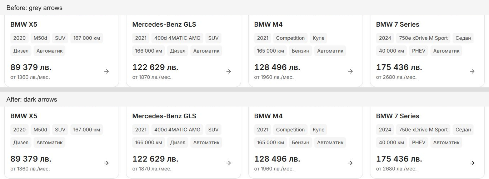

# Card arrow contrast — 7 October 2026

Desktop showroom card arrows now use `var(--foreground)` instead of `var(--desktop-muted-text)`, giving the standalone glyph the same dark contrast as the card title. The 18 px glyph, 36 px slot, transparent default background and light grey hover/keyboard-focus treatment remain. The change is one CSS declaration within the existing 1024 px media query in `packages/marketplace-ui/components/vehicle-card-desktop.module.css`.

The comparison uses matching 1440 px inventory captures, cropped to card titles, facts, prices and arrows. Full-page source captures are preserved alongside it.

Checked the live preview at `http://127.0.0.1:6482`:

- All 12 inventory arrows, four Home arrows and three related PDP arrows render `rgb(35, 35, 35)` at 1440 px. Inventory card geometry matches the baseline exactly.
- Keyboard Tab reaches the content link; its visible focus retains the dark arrow and `rgb(245, 245, 245)` fill.
- Matched inventory captures at 320, 390 and 1023 px have identical measured page, heading and card geometry, with the desktop arrow hidden. Full screenshots are not pixel-identical; image rendering varies between the captures. No image source or crop rule was edited.
- Biome and release contract preflight passed. The required repository contract checks passed 92/94, with the same two existing failures: the undeclared `mobile-dealer-title` export used by `public-route-loading.tsx`, and local dimensions/timing in `dealer-desktop-discovery.module.css`.

Measurements and screenshots are in [the evidence folder](card-arrow-contrast-2026-10-07/). The CSS preimage, comparison script and contract log are under ignored `runtime/card-arrow-contrast-20261007/`. Existing dirty work was preserved; no staging, commit, release promotion or deployment was performed.
