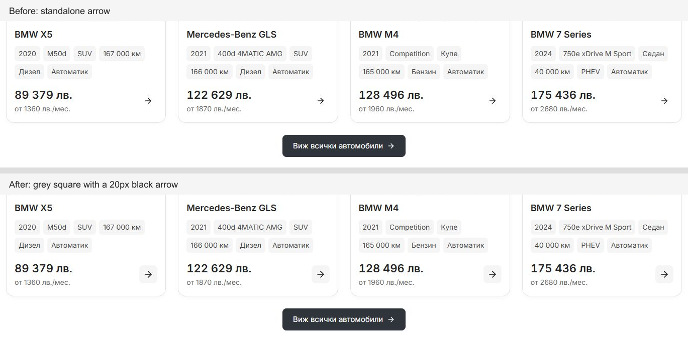

# Grey card arrow preview — 7 October 2026

Desktop showroom cards now contain a 20 px dark arrow in a 36 px light grey square with 8 px corners. Default fill uses `var(--control)` and content hover/keyboard focus uses `var(--control-hover)`, matching secondary controls. The glyph remains decorative inside the existing content link. This supersedes the preceding standalone 18 px arrow in [the contrast adjustment](CARD-ARROW-CONTRAST-2026-10-07.md).

[Full Home stock preview](card-arrow-grey-2026-10-07/grey-arrow-home-preview.png) shows the treatment alongside the primary black section CTA.

## Focused local checks

- Home at 1440 px: all four glyphs measure 20 × 20 px inside 36 × 36 px grey squares with 8 px corners. The foreground is `rgb(35, 35, 35)` and the default fill is `rgb(245, 245, 245)`. Page, headings and card geometry match the preceding capture exactly.
- Inventory at 1024/1440 px and three related BMW X5 PDP cards at 1440 px use the same treatment without document overflow.
- Tab reaches the content link with visible focus and the darker secondary fill; Enter opens `/bg/listing/bmw-x5-m50d-sofia-2020`, with the settled heading `2020 BMW X5 M50d`.
- Home at 320/390/1023 px has identical measured page, heading and card geometry. The desktop glyph remains hidden. Captures are retained; no pixel-identical claim is made.
- Biome on both changed source files and release contract preflight passed. Repository contract checks passed 92/94; the two existing failures remain the undeclared `mobile-dealer-title` export used by `public-route-loading.tsx` and local dimension/timing literals in `dealer-desktop-discovery.module.css`.

Changed source: `packages/marketplace-ui/components/vehicle-card-content.tsx` and `packages/marketplace-ui/components/vehicle-card-desktop.module.css`. Source preimages and logs are retained in ignored `runtime/card-arrow-grey-20261007/`; screenshots and measurements are in [the evidence folder](card-arrow-grey-2026-10-07/). Existing dirty work was preserved. This is a local live-preview refinement; no fresh production build, commit, promotion or deployment was performed.
