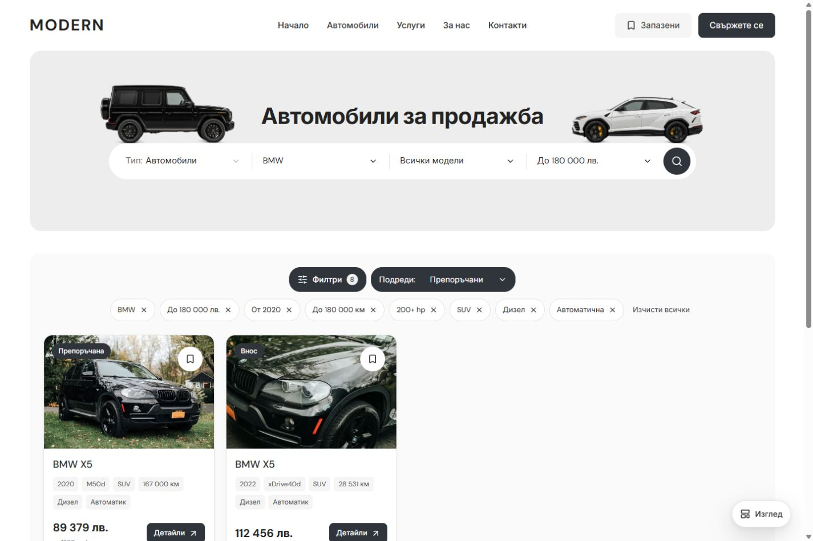

# Centered results controls — 5 October 2026

Filters and Sort now form a centered row above the cars. Applied filters have their own centered, wrapping row underneath with a 12 px gap. The chip row is rendered only when filters exist, so the default state has no empty reserved row. The existing removal, Clear all, draft dialog and sort state are reused.

Source change: `packages/marketplace-ui/components/dealer-inventory.module.css`. The desktop filter bar uses a single-column grid instead of a wrapping shared flex row; the controls and chips each center within the full available width. The banner and mobile layout are unchanged.

Focused live checks passed in BG/EN at 1024 and 1440 px. Seven chips wrap into two rows at 1024 and one at 1440. The controls remain centered within 0.01 px, with a 12 px gap before the chips and no horizontal overflow. An eight-chip 1440 px view is also captured. Single-chip removal, Clear all, Filters/Escape focus restoration and visible Sort selection were exercised. Cars geometry remained equal at 320/390/1023 px. Scoped CSS Biome and diff whitespace checks passed.

Screenshots/rectangles are in `docs/centered-results-controls-2026-10-05/`; exact source preimage and incremental patch are in ignored `runtime/centered-results-controls-20261005/`. No new production build or Playwright suite was run for this CSS correction. Existing dirty work and the Git index lock remain preserved; scoped commit/push is blocked by that lock. No publication occurred.

