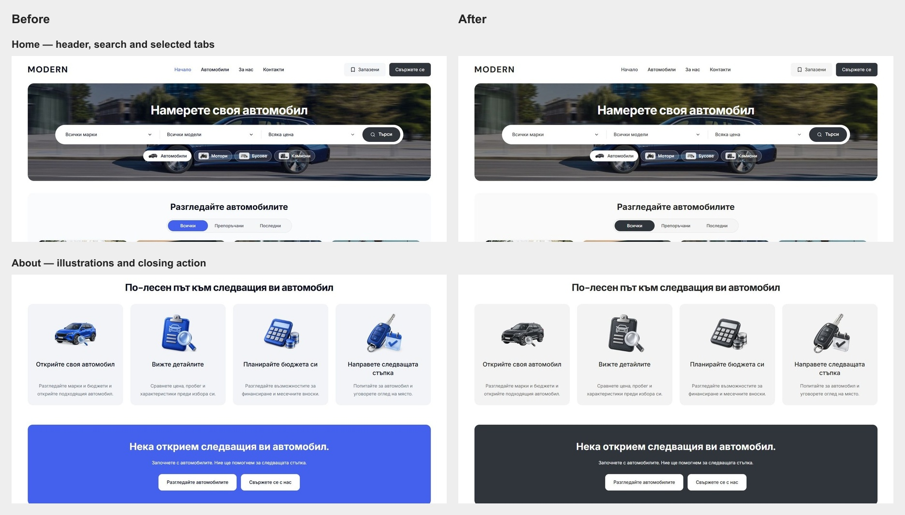

# Modern: app-wide charcoal theme

The reusable public app now defaults to charcoal `#30343b` on mobile and desktop. Primary actions, selected tabs and filters, links and focus rings use the configured dealer accent. Secondary actions use grey surfaces and dark text. The four About illustrations retain their subjects in charcoal and silver. This is a local source and preview change; template promotion and dealer publication remain separate work.

## Implementation

- `packages/marketplace/lead-site.ts` supplies one default accent. The master no longer configures separate red mobile and blue desktop accents; the optional desktop override remains compatible with older dealer configurations.
- `packages/design-system/styles/desktop-tokens.css` owns the neutral public palette and decorative surfaces. Component modules consume the shared brand values rather than a separate fixed primary-button palette. Public semantic variables also cover mobile and portalled controls.
- Mobile service headers use brand, grey-control and inverse tokens. Header, card, banner, form and navigation geometry is retained.
- `artwork.aboutBenefits` validates and configures the complete `choice`, `details`, `budget` and `viewing` illustration set. The About page consumes those roles through the existing public configuration boundary.
- Four transparent 384 × 384 WebP derivatives total 98,730 bytes. Generated PNGs, editing prompts, blue references, dimensions, hashes and transparency checks are retained in [artwork provenance](../provenance/assets/about-charcoal-v1/generation.json). The preceding blue artwork remains preserved.

## Local verification

Preview: `http://127.0.0.1:6482/bg`. Production output: `apps/web/.next-public-e2e-charcoal-theme-20261005-demo`, build `jtWto_1oJ8NOfbeXHQR_N`. Source hashes matched at cutover; the generated `next-env.d.ts` was restored byte-for-byte. Runtime receipts and raw logs are in `runtime/charcoal-theme-20261005/`.

| Check | Result |
| --- | --- |
| Scoped Biome | Passed for all 16 changed TS/TSX/CSS files |
| Domain unit tests | 21 passed |
| Marketplace unit tests | 147 passed, including About artwork adaptation/path validation |
| Marketplace UI unit tests | 101 passed |
| Web unit tests | 188 passed |
| Refactor contracts | 7 passed |
| Release contract preflight | Passed |
| Architecture/preflight tests | 87 passed |
| Production build and separate web typecheck | Passed |
| Desktop Chromium/WebKit cases | All 60 relevant cases qualified across the initial run and the final animation check |
| Mobile Chromium/WebKit Sell overlay contrast | Both touch-context cases passed at 320 px, with no serious or critical WCAG violations |

The desktop cases cover 16 public routes, BG/EN frames at 1024/1440/1920 px, stock filtering and keyboard/reduced-motion behavior, Contact card actions/focus, search/sidebar drafts, listing gallery and phone handoff, financing and import routing. About is additionally verified in the native browser; all four served illustrations loaded with 384 px intrinsic dimensions.

The initial browser run contained two mobile tap cases in desktop contexts; those failed before interaction because touch support was disabled. They passed in dedicated touch contexts. The WebKit intermediate-frame assertion also exposed a probe timing race: the existing test now waits for the initial paint and arms its initial measurement before clicking. Intermediate movement, final alignment and reduced-motion assertions remain intact and pass in both engines. Raw initial failures and final results are retained. The first web-unit run hit a worker startup timeout; all 188 passed with two workers. The first build hit machine memory pressure; its retry passed with bounded build threads and a 4 GB Node heap.

## Matched visual checks

Eight BG desktop pages were compared at 1440 × 1000: Home, Cars, About, Contact, Imports, Sell, Leasing and a listing. Six mobile pages were compared at both 320 × 900 and 390 × 900: Home, About, Contact, Imports, Sell and Leasing. Every matched page retained its exact document height and heading geometry. All had no horizontal overflow, broken rendered images or blue action-control colours. Mobile colour changes are intentional.

Additional native-browser checks at 1280 px cover BG/EN Home and About; the 1023 px mobile boundary was checked on Home. These also had no overflow, broken rendered images or blue controls. The temporary viewport override was reset and the updated Home preview was left open.

Saved and Contact remain equal 136 × 44 px controls. Saved uses grey, Contact uses charcoal, and both have no shadow. Photograph/inverse actions, genuine logos and semantic status colours keep their appropriate roles.

Full captures and geometry records are in [the evidence directory](charcoal-theme-2026-10-05/).

## Source preservation and integration

Work remains in the canonical `L:/CODEX/cars` checkout on `main`, HEAD `08c89d63f9e11939acd5b135ece4278252b80f43`. Existing staged/unstaged/untracked drafts were preserved, and the Modern index was empty at closeout. The task changes 19 existing source/document/test paths and adds the served artwork, provenance and visual evidence.

Commit and push are blocked by the pre-existing zero-byte `L:/CODEX/cars/.git/index.lock`, created at 02:43:04 UTC on 5 October. It was preserved. Task-only source differences, original working-file preimages and SHA-256 records are saved in `runtime/charcoal-theme-20261005/task-source.diff`, `source-paths.txt` and `task-source-hashes.json`. These differences are against the starting working files, including their pre-existing drafts; they must not be treated as a blanket HEAD patch. Once the index owner releases the lock, review and stage the task-owned changes, commit and non-force push on main. No template lock or dealer deployment was changed.
