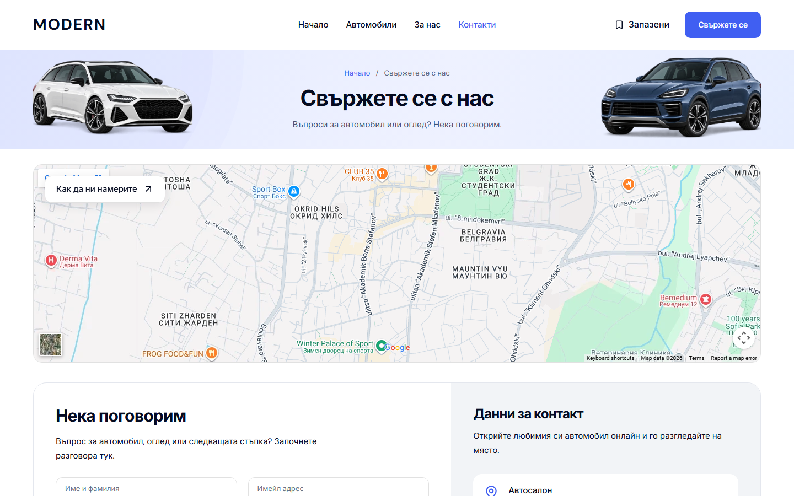
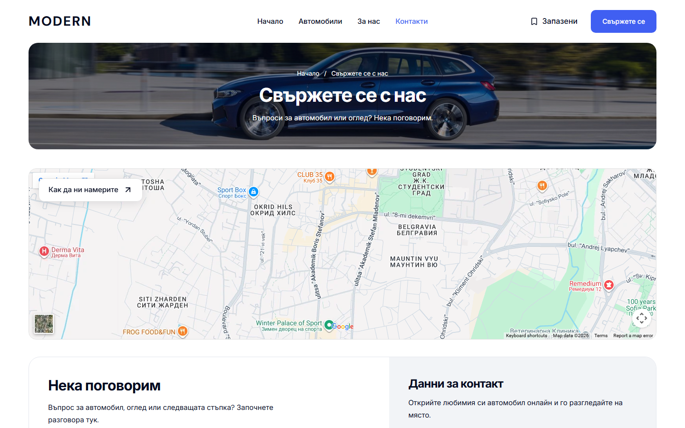

# Modern About and Contact desktop polish — 4 October 2026

About and Contact now carry the configured Home/Cars photograph into the same contained masthead. Both use a 224px hero, the shared 1320px maximum frame and a 40px gap to the gallery or map. The native gallery, benefits, FAQ, map, contact details and enquiry form retain their existing owners and composition. About's first gallery column has enough room for its Bulgarian heading at narrow desktop widths; its heading scales from 24px to the existing 30px size.

`DealerDesktopHero` owns the optional `appearance="photo"` treatment, configured artwork, breadcrumb focus and desktop-only preload. Contact retains its service-content wrapper, keeping the map and form on their normal white canvas. These remain server-rendered pages; no client state, dependencies, provider integrations or new artwork were added. All changed presentation rules apply at 1024px and above.

## Verification

Baseline Cars commit: `6861dad21711ef36b0954df33eccc456e094ba3d`; baseline Modern revision: `2fa502e3d0f41be38924ef995e818a7fcbfdce9b`. Final local production build: `8pAC4ReE7eV6i2F8mJuo4`, using Node 22.23.2 / pnpm 11.4.0 / Next.js 16.3.8. The reviewed preview runs on `http://127.0.0.1:6482`.

| Check | Result |
| --- | --- |
| Final production build and build TypeScript | Passed. |
| Web, marketplace UI and E2E TypeScript | Passed; web used the existing generated route types with read-only `tsc --noEmit --emitDeclarationOnly false --incremental false`. |
| Changed-source Biome / Git whitespace | Seven code/test files passed; no whitespace errors. |
| Unit tests | 186 web tests in 36 files and 95 UI tests in 20 files passed. |
| Refactor / release contracts | Seven refactor tests, preflight contracts and 87 preflight tests passed. |
| Focused desktop browsers | 10/10 passed on the final production build in one run: Chromium and WebKit hero media/request checks, common page frames, navigation loading, local enquiry preview and master wordmarks. This is the affected-flow suite, not a fresh full-template release audit. |
| About/Contact geometry | 16 states: BG/EN at 1024, 1280, 1440 and 1920px. Hero/body alignment, 40px gap, heading containment, keyboard breadcrumb focus and no horizontal overflow passed. About FAQ keyboard open/close passed in both locales. |
| Accessibility | Four BG/EN About/Contact scans; zero WCAG 2 A/AA or 2.1 AA violations. |
| Native captures | 28 About/Contact states plus three Home/Cars regression frames, all HTTP 200. No reported application/console errors, overflow, broken images, duplicate IDs or empty buttons. |
| Mobile preservation | All 12 before/after captures match exactly in pixels, visible geometry, headings and links: BG/EN About/Contact at 320, 390 and 1023px. |
| Home/Cars regression | BG Home and Cars are pixel-identical at 1440px. EN Home has 58 pixels differing by at most two RGB levels along photo edges; all three frames have identical visible geometry, headings and links, excluding the added banner audit attribute. No exact EN Home pixel-match claim is made. |

The keyboard helper enters the breadcrumb from the preceding native header control so the external map iframe cannot change the return focus sequence. Earlier helper attempts and the interrupted screenshot run remain in the raw artifacts and are excluded from pass claims. No product change was needed for breadcrumb focus.

## Before / after

| Before | After |
| --- | --- |
|  |  |
|  |  |

[Verification receipt](assets/modern-desktop-pages-20261004/verification.json) records source and screenshot SHA-256 hashes, the browser run, accessibility and mobile comparisons. Images are native browser screenshots copied without editing. Full-page captures and logs are retained in `L:/CODEX/cars/runtime/modern-about-contact-20261004/`.

## Scope and limits

C: filled during capture. The task's records were copied intact into Cars' ignored runtime folder, and the final build used a separate ignored Next output in the canonical template. Existing generated outputs, the earlier compiler-cache junction and recovery files were left intact. The final preview reuses the existing image cache; this is local rendered evidence, not a cold-optimizer qualification.

The [previous browse report](DESKTOP-BROWSE-POLISH-2026-10-03.md) records the existing Windows cold PNG optimizer issue and `braces` advisory release holds. Contact remains a local preview until real delivery is configured and verified. Dealer copies, `templates.lock.json`, provider configuration, unrelated Cars work and the pre-existing untracked hero-correction note were preserved. Mounted/hosted release acceptance and owner visual acceptance remain separate.
