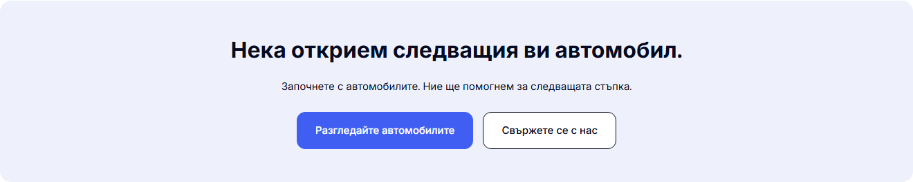

# Modern About CTA — 4 October 2026

The closing About panel, “Нека открием следващия ви автомобил.” / “Let’s find your next car.”, now uses the configured solid brand blue, white heading and body copy, and two white buttons with dark text. Both actions have a subtle neutral hover background and a white keyboard focus outline that remains visible against the blue panel.

This is a palette change in the existing desktop CSS Module, under `min-width: 1024px`. The panel and button dimensions, spacing, copy and links are retained. No client state, new component or dependency is introduced. The existing About gallery and generated benefit artwork are documented separately in the [gallery report](DESKTOP-ABOUT-GALLERY-2026-10-04.md).

## Local verification

Baseline build: `WgJSolw4iI8FV0LLKy0_4`, the previously qualified local gallery/artwork revision. CTA build: `_Zp0sscLR7dNexOlhppCG`, produced with Node 22.23.2, pnpm 11.4.0 and Next.js 16.3.8. Local preview: `http://127.0.0.1:6482/bg/about`.

| Check | Result |
| --- | --- |
| Production build and build TypeScript | Passed. |
| Changed-source Biome and scoped Git whitespace | Passed. |
| Refactor / release contracts | Seven refactor tests, preflight contracts and 87 preflight tests passed. |
| CTA palette, text containment, hover and keyboard focus | 16 states passed: Chromium/WebKit, BG/EN, 1024/1280/1440/1920px. |
| Panel and button geometry | Identical before/after in all 16 CTA states. |
| CTA links and keyboard order | Both Cars and Contact actions navigated to their correct localized routes; Tab moves from the first action to the second. |
| Accessibility | Two BG/EN About WCAG 2 A/AA and 2.1 AA scans found zero violations. |
| About/Contact native captures | 28 final states returned HTTP 200 with no recorded application/console errors, overflow, broken images, duplicate IDs or empty buttons. |
| About page layout | All eight desktop BG/EN captures retain identical visible layout, headings and links. |
| Contact | All eight desktop BG/EN captures retain identical visible geometry, palette, headings and links. |
| Mobile preservation | All 12 BG/EN About/Contact captures at 320/390/1023px are pixel-identical and retain identical visible geometry, palette, headings and links. |

The browser harness waits for the expected hover and focus styles before sampling them. Immediate samples occasionally preceded browser style invalidation; the early diagnostic records are retained. The production source and build did not change for those harness retries.

The prior gallery revision's broader unit, TypeScript and desktop-flow results remain in its own report and receipt. This color-only follow-up reran the production build, relevant contracts and focused rendered checks; it does not present the prior unit/flow runs as newly executed.

## Before / after

| Before | After |
| --- | --- |
|  |  |

These matched 1440px Chromium captures are native element screenshots copied without image editing. The [verification receipt](assets/modern-about-cta-20261004/verification.json) records build/source/screenshot hashes, palette, interaction and preservation results. Full-page captures and raw checks are retained under `L:/CODEX/cars/runtime/modern-about-cta-20261004/`.

This is local desktop template verification. Existing mobile presentation and Contact form behavior are preserved. No template release selection, dealer deployment or provider-delivery change was performed. Prior optimizer/security release limits remain in the earlier audit reports.
