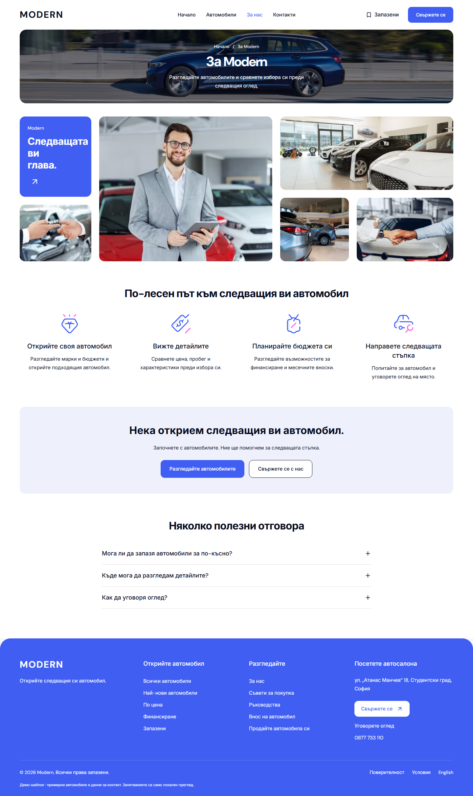
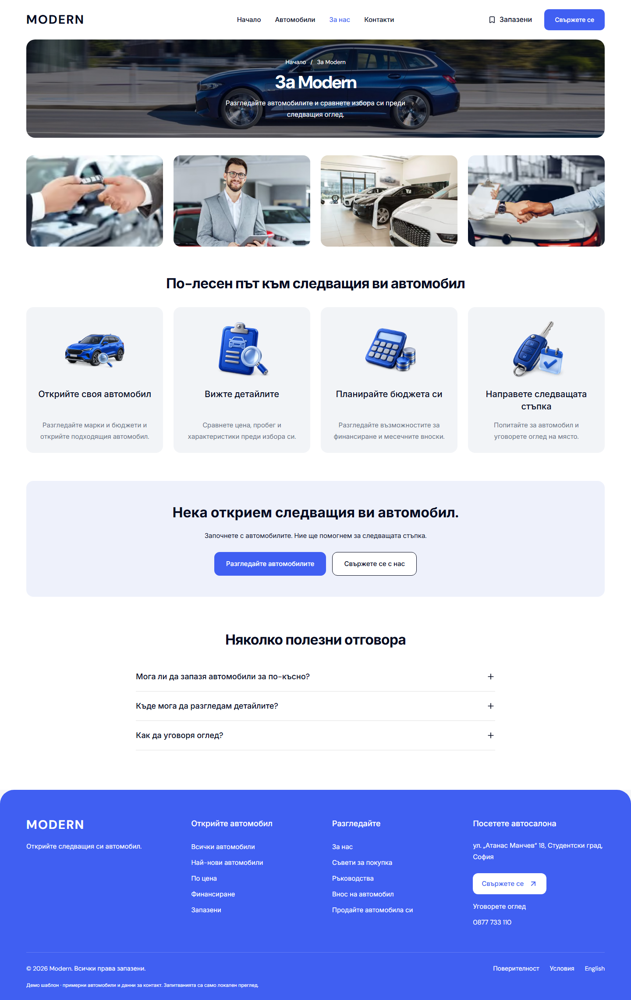

# Modern About gallery and blue artwork — 4 October 2026

About now uses four equal 3:2 photo tiles with a 24px gap. The previous mosaic and chapter tile are replaced by a regular row of the existing illustrative showroom photographs. The gallery keeps the shared 1320px frame and begins 40px below the configured photo masthead. The portrait crop keeps the representative's face in view.

“По-лесен път към следващия ви автомобил” now has four neutral cards with blue 3D illustrations for finding a car, checking details, planning a budget and arranging a viewing. CSS subgrid aligns the artwork, heading and description rows as Bulgarian and English text wraps. Their heights follow the content; no fixed card height, client state or new dependency is needed. Native list markup and decorative empty image alternatives keep the text as the accessible content. The page remains a server component.

All changed presentation rules apply at 1024px and above. The existing mobile About/Contact component, hero, action links, FAQ, form behavior and dealer data are preserved.

## Artwork and source ownership

Four assets were generated with the built-in imagegen tool using transparent backgrounds. The shared direction is a restrained cobalt-blue studio render with pale-blue glass and brushed-silver details, without lettering or manufacturer branding. These are decorative illustrations rather than evidence of inventory, staff or business services.

The unchanged generated originals and exact final prompts are saved in [generation provenance](../provenance/assets/about-blue-v1/generation.json), alongside `choice-source.png`, `details-source.png`, `budget-source.png` and `viewing-source.png`. The four runtime files live in `apps/web/public/images/about/blue-*-v1.webp`.

The runtime copies are 384×384 transparent WebP files, totaling 117,696 bytes (about 115KiB). Processing only resizes and encodes the originals; it does not crop, recolor or replace their backgrounds. The existing `PublicImage` owner supplies base-path handling. These prepared small files are served directly with `unoptimized`, native lazy loading and explicit intrinsic dimensions.

The page composition lives in `apps/web/app/[locale]/about/page.tsx`, and desktop styling remains in the existing `boxcar-desktop-pages.module.css`. Obsolete mosaic/chapter selectors were removed. The existing desktop frame test checks the equal gallery tiles. Its width/locale combinations are independent cases, retaining the same route and geometry assertions.

## Verification

Baseline Cars/Modern commit: `7a82a6333376caa8d5526c53b97c255ba1368e1f`; baseline build: `8pAC4ReE7eV6i2F8mJuo4`. Gallery/artwork qualification build: `WgJSolw4iI8FV0LLKy0_4`, using Node 22.23.2, pnpm 11.4.0 and Next.js 16.3.8. This report and its receipt retain that stage's captures and source hashes. The subsequent solid-blue CTA refinement has separate [verification and screenshots](DESKTOP-ABOUT-CTA-2026-10-04.md). The preview is available at `http://127.0.0.1:6482/bg/about`.

| Check | Result |
| --- | --- |
| Final production build / build TypeScript | Passed. |
| Web and E2E TypeScript | Passed with read-only `tsc --noEmit --emitDeclarationOnly false --incremental false`. |
| Changed-source Biome / Git whitespace | Three code/test files passed; no whitespace errors. |
| Unit tests | 186 web tests in 36 files and 95 UI tests in 20 files passed. |
| Refactor / release contracts | Seven refactor tests, preflight contracts and 87 preflight tests passed. |
| Focused desktop browsers | 20 cases qualified against the same production build: all 12 independent BG/EN frame cases passed in one final Chromium/WebKit run; the eight unchanged media, enquiry, navigation and wordmark cases passed in the initial run. |
| Gallery and card geometry | 16 states: Chromium and WebKit, BG/EN at 1024, 1280, 1440 and 1920px. Shared hero/gallery alignment, equal card rows, complete illustrations, text containment and no horizontal overflow passed. |
| Artwork loading | All four prepared files returned HTTP 200 at every desktop state. No new artwork requests at the six BG/EN mobile states: 320, 390 and 1023px. |
| FAQ / accessibility | Native keyboard open/close passed in both locales. Four BG/EN About/Contact scans found zero WCAG 2 A/AA or 2.1 AA violations. |
| Native captures | 28 About/Contact states returned HTTP 200 with no reported application/console errors, overflow, broken images, duplicate IDs or empty buttons. Complete About frames were inspected in both locales at all four desktop widths. |
| Mobile preservation | All 12 states retain identical visible geometry, headings and links. Eleven primary captures are pixel-identical. EN About at 320px has 34 changed pixels around existing social images; a separate capture on the unchanged final build matches the baseline exactly. Both original captures and the control are retained. |
| Contact preservation | All eight desktop captures retain identical visible geometry, headings and links. |

The original aggregate desktop frame test exceeded its 180-second budget in WebKit in the focused suite and again in isolation. The trace records cumulative route/measurement work rather than a failed layout assertion. The test was divided into six independent width/locale cases with unchanged assertions and the normal per-case timeout. The initial reports, isolated retry and traces remain in the raw artifacts; they are not counted as a clean full-suite pass. Final split-case results are recorded in the verification receipt.

## Before / after

| Before | After |
| --- | --- |
|  |  |

[Verification receipt](assets/modern-about-gallery-20261004/verification.json) records source, generated assets and screenshot SHA-256 hashes, browser results, accessibility checks, loading checks and preservation comparisons. Screenshots are native full-page browser captures copied without editing. Raw records live in `L:/CODEX/cars/runtime/modern-about-grid-20261004/`.

## Scope and limits

This is local desktop About qualification. The new prepared WebP assets were qualified directly; the retained cache for older images does not qualify the previous Windows cold PNG optimizer. The [prior browse report](DESKTOP-BROWSE-POLISH-2026-10-03.md) and [masthead report](DESKTOP-ABOUT-CONTACT-POLISH-2026-10-04.md) retain the older optimizer and `braces` advisory release limits.

Dealer copies, `templates.lock.json`, provider configuration, unrelated Cars work, the earlier compiler-cache junction and the pre-existing untracked hero-correction note were preserved. No dealer deployment or template release selection was performed. Owner visual acceptance and mounted/hosted release acceptance remain separate.
