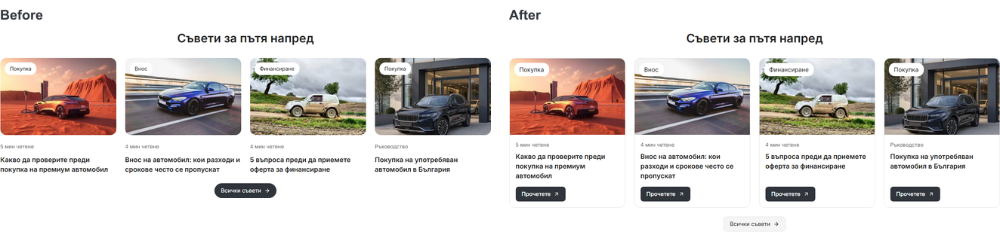
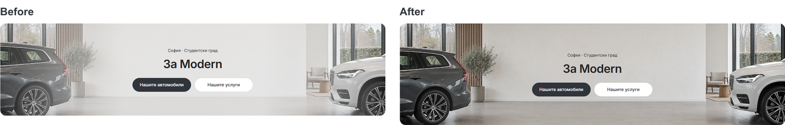
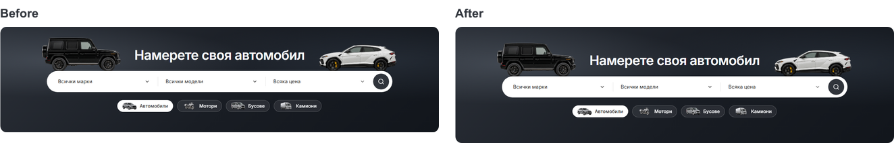

# Modern advice cards and heroes — 6 October 2026

The [local preview](http://127.0.0.1:6482/bg) now has four complete advice cards and slightly taller shared desktop mastheads. This continues the [preceding Home/listing polish](DESKTOP-FINAL-POLISH-2026-10-06.md).

## Advice cards

Each card has a light border, contained photograph and 16 px copy padding. The 40 px “Прочетете” / “Read more” action sits inside the card with 16 px beneath it. Buttons align along the bottom of each grid row, including when titles have different lengths. Four columns remain at 1200 px and above; narrower desktop uses two columns.

Card actions, All advice and the viewing CTA use 8 px corners, matching the other section CTAs. All advice is a quiet secondary button below the cards. Each card remains one navigation link with visible keyboard focus; the internal button treatment does not add nested interactive elements. Existing article and guide destinations are preserved, including the article route's canonical guide redirect.

## Hero sizing and artwork

One shared token sets desktop mastheads to a 352 px minimum height, an increase of 32 px. Home and Cars keep their matching title/search positions and vehicle tyre baseline; that composition moves down together by 16 px. The 64 px search capsule and 36 px category pills retain their sizes.

About, Contact and Services retain the original showroom image. Its previous 80% centre wash is reduced to 24%, and the edges are clear. The taller frame crops less of the photograph. This restores detail in the cars, windows and interior while keeping the dark copy readable. The source images, discovery cutouts and service artwork are preserved.

## Verification

- Production demo build passed using Node 22.23.2 and pnpm 11.4.0; isolated output is `.next-public-e2e-advice-heroes-build-20261006-demo`.
- Web and marketplace UI TypeScript checks passed. Biome checked the five source/test files; task-scoped whitespace checks passed.
- [Eight advice cases](desktop-advice-heroes-2026-10-06/advice-checks.json) passed in Chromium/WebKit, Bulgarian/English and 1024/1440 px. They check contained actions, aligned bottoms, button size/corners, keyboard focus and actual article/guide navigation. No browser errors were recorded.
- Eight existing shared-frame cases passed across Chromium/WebKit, Bulgarian/English and 1024/1440 px, including the Cars controls and About/Contact/Imports/Lease/Sell/Guides/Terms mastheads. They now use 352 px and account for the current category fieldset, available grid width and results toolbar. Matched desktop captures also include Services.
- [24 mobile comparisons](desktop-advice-heroes-2026-10-06/mobile-comparisons.json) cover those eight pages at 320/390/1023 px. All measured layouts, headings and screenshot dimensions match their task preimages. Nineteen pairs are pixel identical; the other five differ by only 14–76 pixels. Captures wait for the mobile Import/Sell controls to become ready and finish their transitions.

## Source and delivery

Reusable changes are in `packages/design-system/styles/desktop-tokens.css`, `packages/marketplace-ui/components/dealer-desktop-hero.module.css`, and `dealer-desktop-discovery-content.tsx` / `dealer-desktop-discovery.module.css`. The existing frame spec and current TEMPLATE/QA references were updated to the new masthead size.

Changes remain local and uncommitted on `main`. Existing unrelated source, the Git index lock and the preview on port 6482 are preserved. Generated `next-env.d.ts` was restored to its pre-build preview references; `tsconfig.json` is unchanged. No source artwork was regenerated or edited. Template release and dealer publication are outside this local polish.
