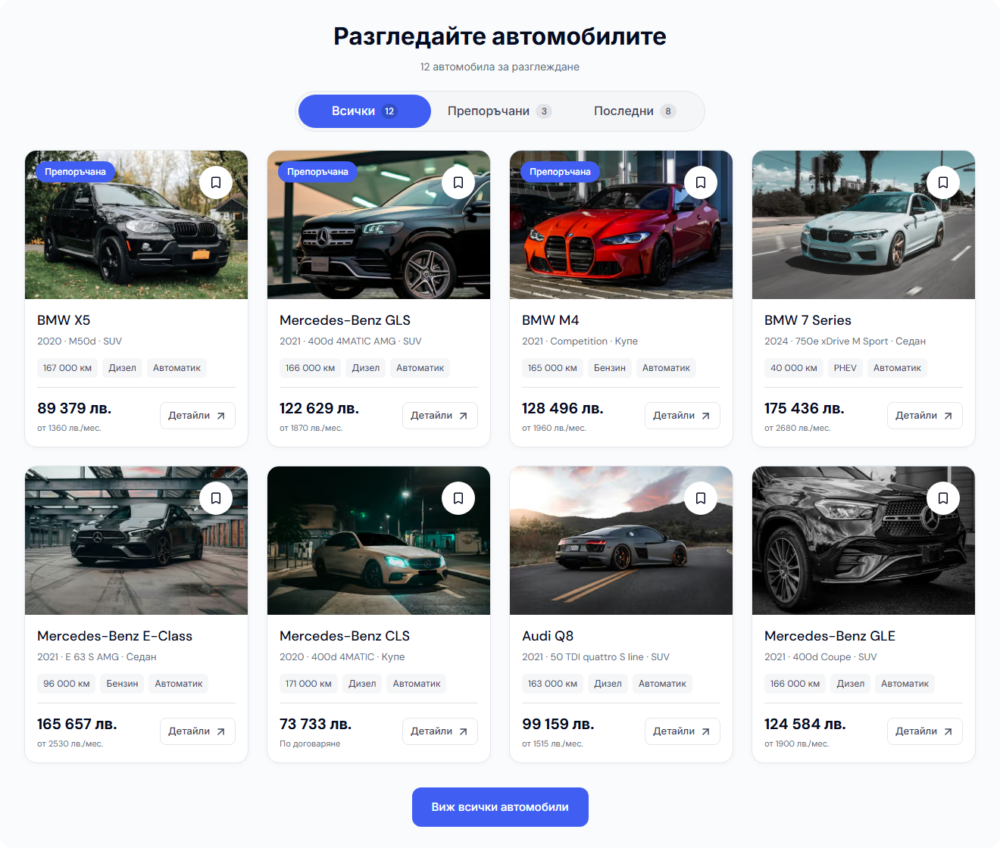
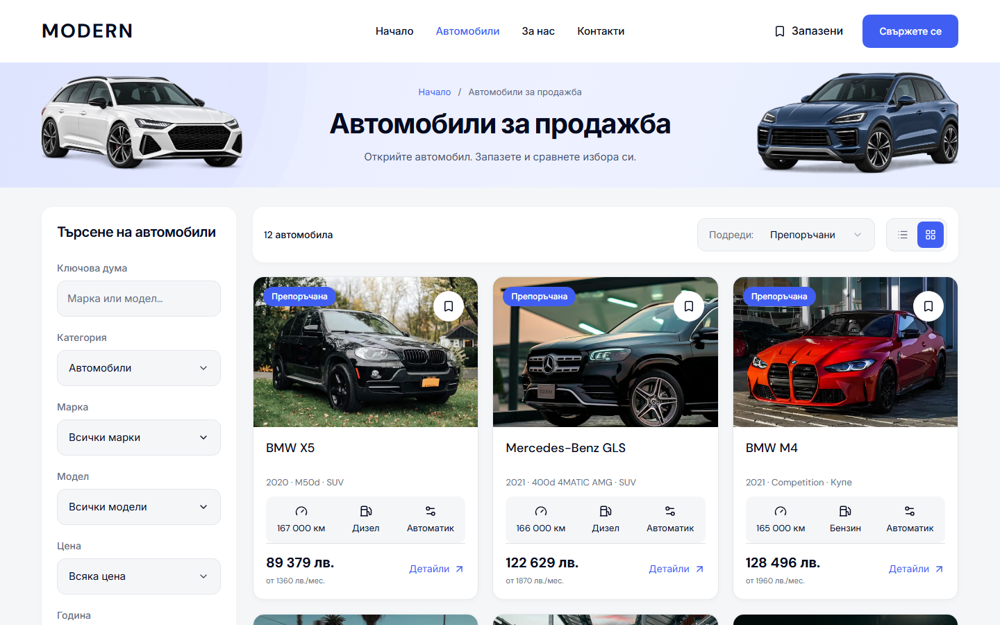
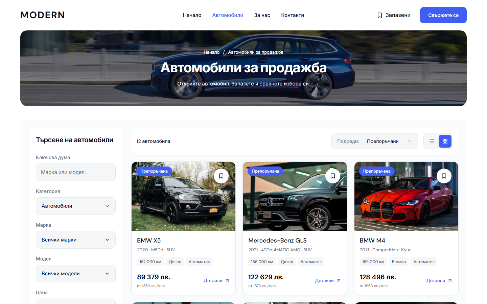

# Modern desktop browse polish — 3 October 2026

Cars now carries Home's configured photograph and 1320px frame into a shorter, 224px inventory hero. Filters, sorting and Grid/List controls sit with the complete inventory in a contained panel below. Home, inventory and related showroom cards share compact facts, a steady neutral border and a quiet inline Details action. The horizontal price divider and boxed Details treatment are removed; price and monthly-payment hierarchy remain.

The [Turo reference](https://turo.com/us/en) was inspected in the rendered browser, including an airport search and its price-filter popover. Its results retain compact search context and restrained cards. This revision applies that browsing continuity to Modern's existing photographic design, following the owner's requested Home-to-Cars continuity; it does not replace Modern with Turo's layout.

## Shared ownership

- `DealerDesktopHero` owns the common frame, configured artwork and desktop-only image preload. `DealerDesktopToolbar` supplies inventory context and the same artwork as Home.
- `dealer-inventory.module.css` owns the desktop results panel. Existing search drafts, URL filters, sorting, pagination and Grid/List behavior retain their native owners.
- `vehicle-card-desktop.module.css` and `ShowroomVehicleCardContent` own the common desktop cards. Removing the separate Home fact styling reduces duplication. Full fuel names remain available to assistive technology and the native title tooltip when the visible value is abbreviated.
- Inventory and related-card image hints reflect their actual desktop columns. The existing mobile image-size prefix is retained. Related-card layout and inventory sidebar widths are preserved.
- Card borders remain neutral on pointer hover; keyboard focus remains a visible outline on the actual link. Only a subtle shadow changes on hover, and the Details text underlines when its link is hovered or keyboard-focused.

All presentation changes are scoped to widths of 1024px and above. The added inventory-panel data attribute is the only changed mobile audit metadata; visible mobile pixels, text and geometry match exactly.

## Verification

The baseline Cars commit was `598b46c34e010d2ce185c33b167fb4314460454d`; the last Modern revision was `5b111b173`. Final local production build: `ZSaUENOWEtkvQWb11LcuM`. Runtime pins remain Node 22.23.2 / pnpm 11.4.0 / Next.js 16.3.8. The preview is at `http://127.0.0.1:6482/bg`.

| Check | Result |
| --- | --- |
| Production build, web build TypeScript, final UI/E2E typechecks | Passed. |
| Changed-source Biome and Git whitespace checks | 13 code files passed; no whitespace errors. |
| UI unit tests | 95 passed in 20 files on the final source. |
| Refactor / release contracts | 7 refactor tests and preflight contracts passed; 87 preflight tests passed. |
| Desktop Chromium/WebKit coverage | Full run: 29/30 passed. The WebKit rail-motion probe missed an intermediate frame while other capture work ran. Both unchanged rail-motion cases passed in isolation, qualifying all 30 unique cases across the recorded runs. This is not a clean 30/30 full-suite claim. |
| Desktop card geometry, image hints, hover and keyboard focus | 24 states: BG/EN Home, Cars and PDP at 1024/1280/1440/1920px. No card collisions, text escape, page overflow or application errors. Image-size hints are within 2px of rendered widths. |
| Native Grid/List controls | Eight BG/EN states at the four desktop widths; 12 cards per state, no collisions or application errors, with return to Grid verified. |
| Accessibility | Six Home/Cars/PDP scans across BG/EN; zero WCAG 2 A/AA or 2.1 AA violations. |
| Rendered captures | 34 desktop/mobile states, HTTP 200; no reported application/console errors, overflow, broken images, duplicate IDs or empty controls. |
| Mobile preservation | Seven final before/after frames are pixel-identical, with matching visible text and geometry: BG Home/Cars/PDP at 320/390px and Home at 1023px. |
| Fully loaded Home stock | All eight cards are 387px high at 1440px in both locales, previously 393px. The captures wait for all photos and zero image skeletons. |

The preload test waits for DOM readiness and checks hero visibility, preload media and actual hero requests. Its earlier WebKit `load` timeout was caused by existing cold PNG optimizer stalls for the mobile logo/header artwork, not by a desktop-hero request. Earlier failed records are retained and excluded from pass claims. An initial list helper used the browser's default viewport; the final helper explicitly sets and verifies each actual viewport before measuring.

## Before / after

| Before | After |
| --- | --- |
|  |  |
|  |  |

[Verification receipt](assets/modern-desktop-browse-20261003/verification.json) records source/screenshot SHA-256 hashes, exact browser-run outcomes and mobile comparisons. Screenshots are native browser captures copied without editing. Before records and early check logs remain in `runtime/desktop-stock-polish-20261003/`; final raw QA artifacts are in the task's `C:/Users/radev/.codex/visualizations/2026/10/03/01a10012-f99a-7673-875a-b17ba05099d3/modern-browse-qa/` folder.

## Local runtime and release limits

L: ran out of space during QA. An inactive generated build and the compiler cache were moved intact to the task's `modern-build-recovery` folder on C:, with every file verified by SHA-256. The production files stayed in the canonical Modern checkout. The final compiler cache uses a verified working copy on C: through an ignored cache junction; the recovery copy is preserved. No source checkout, database, Git history or unrelated files were moved or deleted.

This is local desktop evidence using the retained image cache. The existing Windows cold PNG optimizer issue and the previously documented `braces` security advisory remain release holds. Native/mounted/hosted acceptance and owner visual acceptance are separate. `templates.lock.json`, dealer copies and provider configuration were not changed. Other Cars changes and the pre-existing untracked `DESKTOP-HERO-CORRECTION-2026-10-03.md` note are preserved.
