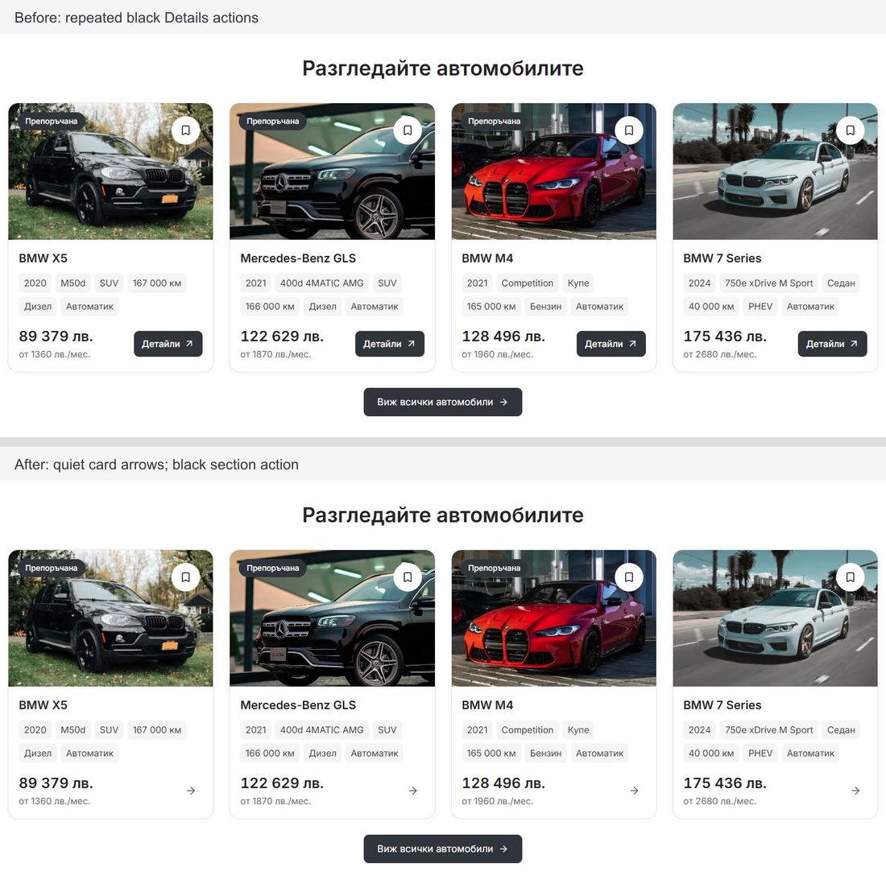

# Desktop card actions and hero assessment — 6 October 2026

Home, inventory Grid/List and related listing cards now use a muted right arrow instead of repeated black Details blocks. View all cars keeps the primary charcoal treatment. The arrow is decorative inside the existing content link, with an 18 px glyph and a 36 px reserved area. Content hover and visible keyboard focus add a light grey fill. Photo links, content destinations, price/facts and the separate Save control are preserved.

The shared change is confined to the desktop showroom content branch and the existing CSS media query at 1024 px. Hero placement, artwork, shell width and mobile styles were not edited in this task.

The comparison uses the same Home stock crop at a 1440 px viewport. The optimized vehicle photographs have capture-time crop variation; their source assets and styling were not changed by this task.

## Hero assessment

The existing composition is balanced and was retained. Twelve settled Home/Cars views were inspected: Bulgarian at 1200, 1280, 1440 and 1920 px, plus English at 1200 and 1920 px. Both cutouts loaded in every view, with no heading overlap or document overflow. Left/right heading clearance was symmetric; the minimum recorded clearance was about 40 px. Both configured tyre baselines remain about 2 px below the search top, preserving the existing slight overlap.

## Actual local verification

- Fifteen card geometry cases: Bulgarian Home/Cars/PDP at 1024, 1280, 1440 and 1920 px, and English at 1440 px. All visible desktop arrows measured 36 × 36 px, with no price overlap, escaped arrows or horizontal document overflow.
- Inventory List at 1024 and 1440 px passed the same clearance checks; Grid was restored after testing.
- Six actual navigation flows across Bulgarian and English passed: content-link Enter activation, arrow click and View all cars. Keyboard focus retained the link outline and changed the arrow fill to light grey.
- Nine matched mobile/boundary capture pairs cover Home, Cars and the Mercedes-Benz GLS PDP at 320, 390 and 1023 px. Eight had identical page, heading and card geometry. The 320 px PDP capture shifted all content below the gallery upward by 11.25 px, with unchanged heading/card dimensions and text. This capture variation is recorded rather than claimed as exact preservation. No mobile source rule changed, and no horizontal overflow was measured.
- Sixteen existing vehicle-card policy tests passed. UI TypeScript checking and Biome on the two changed source files passed. Release contract preflight passed.
- The broader repository contract run passed 92 of 94 cases. Its two existing failures concern an undeclared `mobile-dealer-title` export used by `public-route-loading.tsx` and local dimension/timing literals in `dealer-desktop-discovery.module.css`; neither file was edited here.

The live Node 22.23.2 development preview compiled and rendered the change at `http://127.0.0.1:6482`. No fresh production build, release promotion or dealer deployment was performed for this small local visual refinement.

## Source and evidence

Changed source: `packages/marketplace-ui/components/vehicle-card-content.tsx` and `packages/marketplace-ui/components/vehicle-card-desktop.module.css`. Current guidance was added to `TEMPLATE.md` and `docs/QA.md`. Existing shared dirty changes were preserved; this task did not commit or stage source.

Captures and DOM measurements are in [the evidence folder](desktop-card-actions-2026-10-06/): `hero-checks.json`, `desktop-checks.json`, `list-checks.json`, `navigation-checks.json`, before/after mobile measurements and `mobile-comparison.json`. Source preimages and check logs are retained under ignored `runtime/desktop-card-actions-20261006/`.
