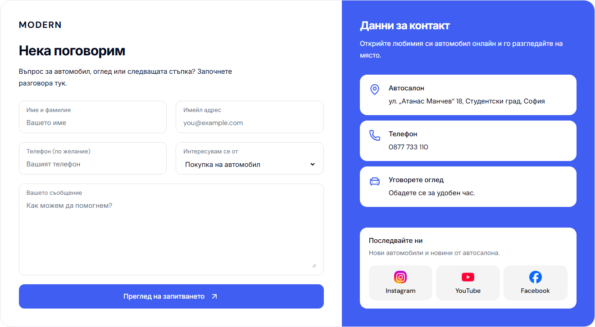
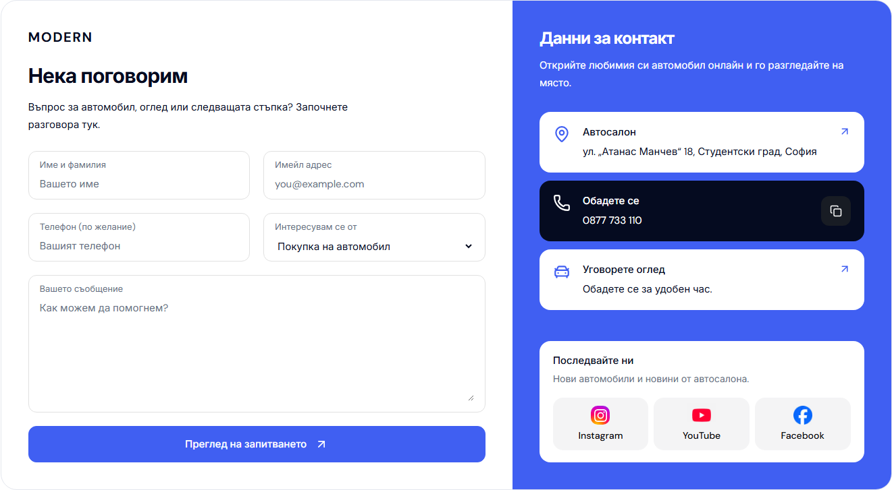

# Desktop Contact: clickable cards

The showroom, phone, viewing and optional email cards now work across their entire surface. They retain the white resting state on the solid blue pane and turn dark on hover or keyboard focus. The phone heading becomes “Обадете се” / “Call us” while keeping the configured number visible. Its separate 44 px copy button confirms a successful clipboard write and selects the number for manual copying if access is denied or unavailable. Copying does not trigger the call link. The viewing description remains on one line, and the social destinations remain individual links.

| Before | After, phone hovered |
| --- | --- |
|  |  |

These matched captures use Bulgarian Contact at 1440 × 1000 with a visible classic scrollbar.

## Verification

- Chromium and WebKit, Bulgarian and English, at 1024, 1280, 1440 and 1920 px: one-line viewing subtext, equal-height columns, no clipping, horizontal overflow or browser errors (16 desktop states).
- Six matched mobile captures at 320, 390 and 1023 px in both locales have zero changed pixels. Four accessibility scans reported no WCAG A/AA violations.
- All 16 interaction tests passed. Hover and keyboard focus retain card geometry, and the accessible names include the visible labels.
- Scoped Biome, web typecheck, production webpack build, seven refactor contracts, release preflight contracts and all 87 release preflight tests passed. The build uses Node 22.23.2, pnpm 11.4.0 and Next.js 16.3.8. `workspace-doctor.mjs --fetch` completed before integration.
- Port 6482 serves build `nxN7SjSeJ7SeOm9xEPtod`. Bulgarian and English Contact screenshots match the qualified candidate exactly. Cars still opens Make with zero page movement and restores focus with Escape.

The production build and final browser evidence are recorded in [structured verification](assets/modern-contact-card-actions-20261004/verification.json). The changed sources are the Contact server page, its desktop CSS module and a small client component for clipboard interaction. The reusable component receives only locale and configured phone strings; it introduces no provider dependency.

The regression suite is `apps/e2e/specs/desktop-contact-card-actions.spec.ts`. It checks card padding clicks, call/map destinations, hover and focus without movement, keyboard access, clipboard success and denial/unavailability. Chromium verifies the actual system clipboard; WebKit uses a clipboard stub for the success case. All external navigation and calls are prevented during verification.

Build output lives in `K:/Temp/cars-modern-contact-card-actions-20261004/.next`, reached through `apps/web/.next-public-e2e-contact-card-actions-20261004-demo`. Absolute dependency links in its parent folder resolve to the existing complete Modern workspace. The previous output, evidence and unrelated work are preserved. No template promotion or dealer deployment is included.
