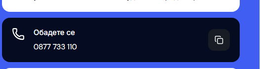
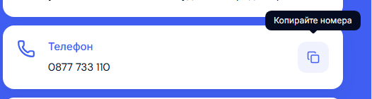

# Desktop Contact: standard card hover and copy tooltip

Contact cards now keep their white background and dark copy during hover and focus. They reuse the soft shadow and blue heading treatment already used by the site's desktop cards. The phone heading stays “Телефон” / “Phone”. The copy button uses the existing design-system tooltip for localized help and copy feedback, with keyboard focus and Escape dismissal. The card destinations and clipboard fallback are retained.

| Before | After |
| --- | --- |
|  |  |

These matched details use Bulgarian Contact at 1440 × 1000 with a visible classic scrollbar and the pointer over the copy button. [Full panel before](assets/modern-contact-card-hover-20261004/panel-before.png) and [full panel after](assets/modern-contact-card-hover-20261004/panel-after.png) show the retained blue pane and aligned form.

The production build and web typecheck passed. All 16 Contact interaction cases passed across Chromium/WebKit and Bulgarian/English, including keyboard tooltip access, Escape and pointer dismissal, actual Chromium clipboard readback, and denied/missing clipboard fallback. The visual matrix passed at 320, 390, 1023, 1024, 1280, 1440 and 1920 px; the six mobile comparisons changed zero pixels. Eight accessibility scans passed with and without the tooltip. At qualification, canonical port 6482 served build `VeDfi3mjWMZDDjseSmbrs`; its panel captures preserve the qualified layout, with only inspected SVG edge antialiasing differences within 100 pixels. Focus return and zero page-width shift remain verified on Cars. Seven refactor checks, release contracts and 87 release-preflight tests also passed.

The source changes are limited to the desktop CSS module, phone-card client component, existing Contact regression suite and template/QA references. [Structured verification](assets/modern-contact-card-hover-20261004/verification.json) records the final checks, viewport matrix, source hashes and canonical preview. Previous screenshots, build output and unrelated work are preserved. This is local template polish, without template promotion or dealer deployment.
