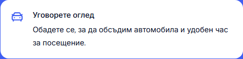

# Desktop Contact: one-line viewing subtext

The viewing card now says “Обадете се за удобен час.” in Bulgarian and “Call to book a viewing.” in English. The shorter copy fits naturally on one line at every supported desktop width. Only these two strings in `apps/web/app/[locale]/contact/page.tsx` changed; the white cards, solid blue pane and form layout are retained.

| Before | After |
| --- | --- |
|  |  |

These matched captures use Bulgarian Contact at 1440 × 1000 with a visible classic scrollbar.

## Verification

- Chromium and WebKit, Bulgarian and English, at 1024, 1280, 1440 and 1920 px: the rendered text range has exactly one line, no clipping, equal-height columns and no horizontal overflow or browser errors (16 desktop states).
- Six before/after mobile captures at 320, 390 and 1023 px in both locales have zero changed pixels.
- Four accessibility scans reported no WCAG A/AA violations.
- Scoped Biome, web typecheck, production webpack build, seven refactor contracts, release preflight contracts and all 87 release preflight tests passed. The build used Node 22.23.2, pnpm 11.4.0 and Next.js 16.3.8. `workspace-doctor.mjs --fetch` completed before integration.
- Port 6482 serves build `zuE4JJ621vsZNIGa584j4`. Bulgarian and English Contact screenshots match the qualified candidate exactly; Cars still opens Make with zero page movement and restores focus with Escape.
- The changed page and unchanged Contact CSS hashes remained fixed through build and browser qualification. The previous builds, evidence, unrelated Modern hero draft and other Cars changes are preserved.

[Structured verification](assets/modern-contact-viewing-copy-20261004/verification.json) records the viewport matrix, line counts, mobile comparisons, canonical build and source hashes. This local master change does not promote a template release or deploy dealers.

The isolated generated output is `C:/Users/radev/AppData/Local/Temp/cars-modern-contact-white-cards-20261004/.next-viewing-copy`, reached through `apps/web/.next-public-e2e-contact-viewing-copy-20261004-demo`. It reuses the parent folder's absolute dependency links and a copied webpack cache. The prior live output was preserved.
