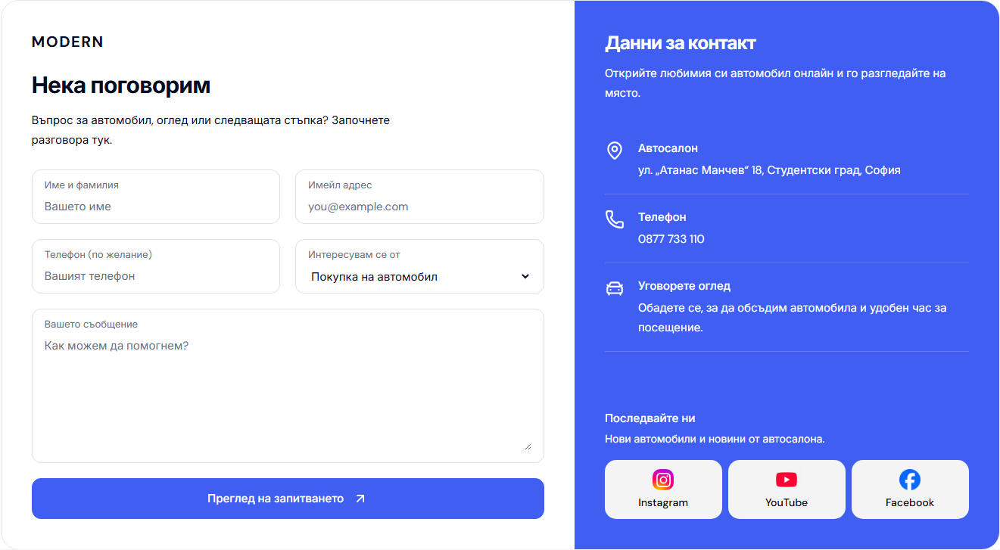
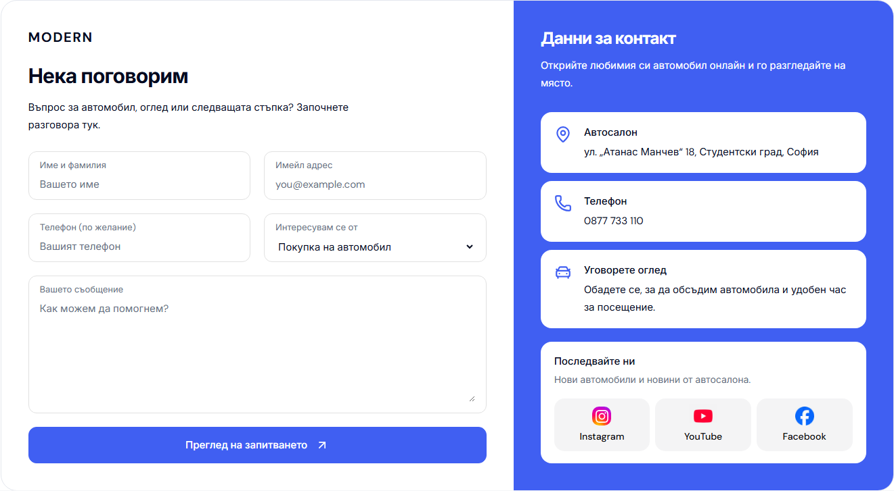

# Desktop Contact: white cards on the blue pane

The owner requested the original white cards for Showroom, Phone, Arrange a viewing and social links, inside the solid blue right-hand Contact pane.

The desktop Contact CSS restores the white surfaces, 16 px corners, dark copy and brand-color icons. Contact links retain their underlined hover state and use the shared focus-ring token against white. The enclosing pane keeps its solid configured brand color, with a white heading and introduction. The small configured logo remains above the form, and both columns continue to stretch to equal height.

The change is contained in `apps/web/app/[locale]/components/boxcar-desktop-pages.module.css` under its existing `min-width: 1024px` media query. Contact form markup, local-preview behavior and the previously verified scrollbar reservation are retained.

| Before | After |
| --- | --- |
|  |  |

Both captures use Bulgarian Contact at 1440 × 1000 with a visible classic scrollbar, settled fonts and decoded images. The images capture the complete form/details panel.

## Verification

- Scoped Biome check, all seven refactor contracts, web typecheck and the production webpack build passed with Node 22.23.2, pnpm 11.4.0 and Next.js 16.3.8.
- Bulgarian and English Contact passed desktop checks at 1024, 1440 and 1920 px in Chromium and WebKit: equal-height columns, a compact 28 px logo, white rounded cards, dark text, blue icons and no horizontal overflow or browser errors.
- Four accessibility scans (both locales and browsers) reported no WCAG A/AA violations. Contact links retain a visible 2 px brand-color focus outline.
- Six Chromium comparisons at 320, 390 and 1023 px, in both locales, matched the previous version with zero changed pixels.
- Port 6482 now serves qualified build `Top3hISwH_fKUeHPHrTgo`. Its Bulgarian and English Contact captures exactly match the qualified candidate. Both Cars routes return 200; opening Make moves the page by 0 px, and Escape restores trigger focus.
- All four recorded product source hashes stayed unchanged through build and browser qualification. `workspace-doctor.mjs --fetch` completed before integration; unrelated Cars source and branch history were preserved.

[Structured verification](assets/modern-contact-white-cards-20261004/verification.json) records the build, browser states, mobile comparisons, canonical preview and source hashes. The prior [modal verification](DESKTOP-MODAL-CONTACT-POLISH-2026-10-04.md) remains historical evidence.

## Source and runtime boundaries

This is reusable Modern master polish. It does not promote an immutable template release or deploy dealers. The unrelated Modern hero draft and other Cars changes are preserved.

The first build exhausted L: storage. Its generated output was retained on C:, and the failed-build logs remain in the ignored `runtime/contact-white-cards-20261004/` folder. A fresh isolated build output uses `C:/Users/radev/AppData/Local/Temp/cars-modern-contact-white-cards-20261004/.next`, reached through the task's `.next-public-e2e-contact-white-cards-isolated-20261004-demo` junction. Explicit dependency junctions in the parent folder resolve the project's Next.js 16.3.8 instead of an unrelated Next.js 15.2.0 installation. Source files and earlier build evidence were preserved.
