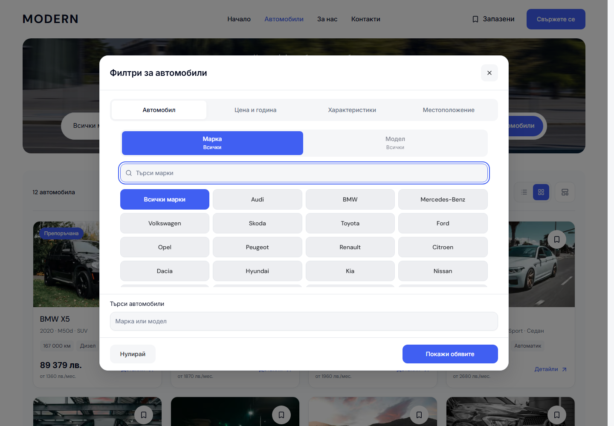
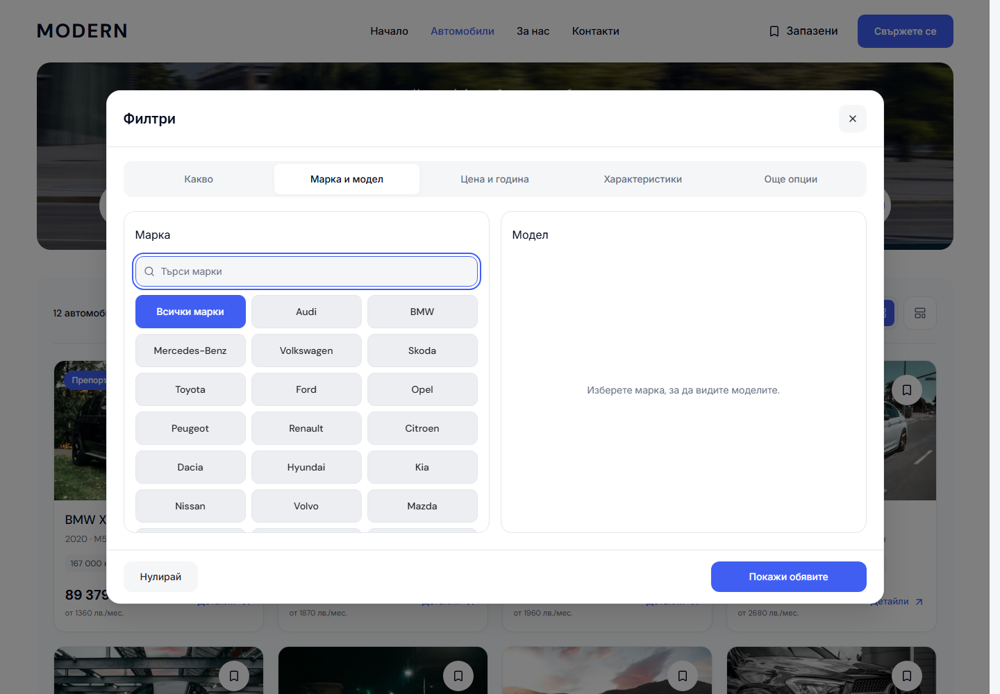

# Desktop inventory: filter groups and vehicle selection

The full filter dialog now separates vehicle type from technical specifications. Its five tabs are **Какво**, **Марка и модел**, **Цена и година**, **Характеристики** and **Още опции**, with corresponding English labels. The dialog's maximum width is 1120 px. It retains the established neutral tab rail, blue actions, shared option controls and controlled draft.

Make and Model sit in adjacent, independently searchable cards. A model appears after selecting its make; changing a make clears its dependent model, derivative and trim. Available body variants live under an optional disclosure in the model card. The focused Make/Model dialogs in the hero retain their existing staged presentation. Keyword search moves into More options alongside location, origin, delivery destination and seller type. The fixed footer contains only Reset and Show results. All 13 existing sections remain reachable once each.

Vehicle type changes the draft taxonomy before Apply and clears incompatible selections. Each category uses the existing server data boundary; when its maintained taxonomy is empty, actual inventory pairs provide its options. The supplied demo includes a Mercedes-Benz V-Class van and no truck/motorbike listings. Empty categories display a clear message with an action that returns focus to Vehicle type. No make/model records or extra equipment filters are invented. Model counts are hidden while draft result criteria differ from the applied facets.

| Before | After |
| --- | --- |
|  |  |

These captures use the same Bulgarian Cars route at 1440 × 1000 with visible classic scrollbars. [Vehicle type before](assets/modern-filter-logic-20261004/type-before.png) and [Vehicle type after](assets/modern-filter-logic-20261004/type-after.png) show the new dedicated group; [a selected make and model](assets/modern-filter-logic-20261004/selected.png) shows the two populated cards.

The production build, web typecheck and scoped Biome check passed. All 58 browser cases are qualified across Chromium/WebKit and BG/EN: 57 passed in the main run, and one preference-setup POST connection reset was resolved by its complete focused rerun. The 24-surface dialog matrix covers 1024, 1280, 1440 and 1920 px plus 600 px-high windows; all five groups, 13 sections, scrolling, label fit and fixed footer passed. Twenty WCAG A/AA scans passed. All 20 matched Cars/Home page captures changed zero pixels, including BG/EN Cars at 320/390/1023 px and Home at 320/390 px. Eleven focused unit cases, seven refactor checks, release contracts and 87 release-preflight tests passed. At qualification, canonical 6482 served qualified build `W5xNUS-vUgyqTRHz2Xr3z`, with the new dialog, zero overlay page-width movement, restored trigger focus and the retained Contact hover/tooltip verified in both languages.

The source remains the reusable Modern master. The existing hero/search controls, card layout, mobile styling, preview FAB, sorting and Grid/List controls are preserved. This work does not promote a template release or deploy a dealer. [Structured verification](assets/modern-filter-logic-20261004/verification.json) records checks, captures, source hashes and the qualified build.
