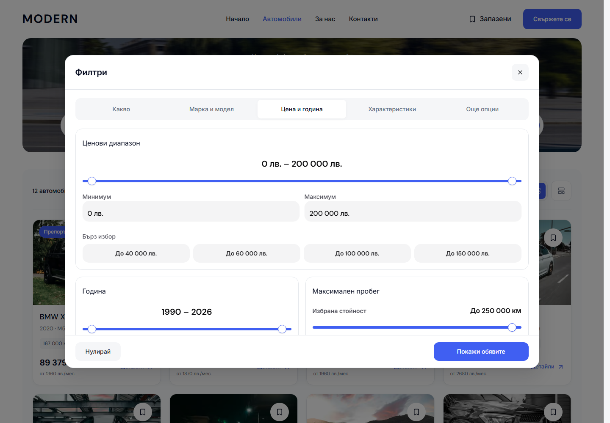
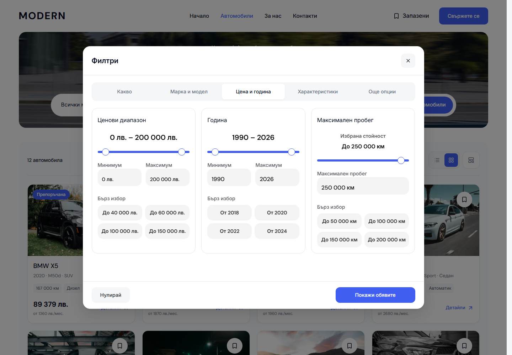

# Compact desktop filter dialog

The full filter dialog returns from 1120 px to a 960 px maximum width, with the existing viewport inset. Its five groups and two Make/Model panels remain intact. Price, Year and Mileage now share one row of three cards instead of stretching Price across the full dialog. Quick presets use two columns, and the price field's formatted value stays on one line in both locales. The focused hero dialogs retain their existing dimensions and behavior.

| Before | After |
| --- | --- |
|  |  |

Both screenshots use the Bulgarian Cars route at 1440 × 1000 with classic scrollbars. [Make/Model before](assets/modern-filter-width-20261004/make-before.png) and [Make/Model after](assets/modern-filter-width-20261004/make-after.png) show the narrower two-panel layout. [English at 1024 px](assets/modern-filter-width-20261004/english-1024.png) shows the smallest desktop state without cropped field values or preset text.

Implementation is confined to `packages/marketplace-ui/components/desktop-full-filter-dialog.module.css` under its existing 1024 px desktop breakpoint. Shared range logic, mobile presentation and the controlled filter draft remain unchanged. The fixed footer stays reachable when a short window requires scrolling.

Verification receipts are recorded in [verification.json](assets/modern-filter-width-20261004/verification.json). This is reusable Modern source and local-preview qualification; template release and dealer publication remain separate.

The production build and web typecheck passed, as did scoped Biome, seven refactor contracts, release contracts and 87 release-preflight tests. All 32 focused browser cases passed in Chromium/WebKit across BG/EN, covering drafts, model dependency clearing, numeric edits, focused hero dialogs, applied search and scrollbar/focus restoration. The 24-surface modal review covers 1024, 1280, 1440 and 1920 px plus 600 px-high windows, with five groups and all 13 sections reachable. Twenty WCAG A/AA scans passed. All 20 matched Cars/Home captures changed zero pixels, including 10 mobile states. Canonical 6482 serves qualified build `tqNfUiJmJmglKlIDEuKxW`; both locales verified a 960 px dialog, three adjacent range cards, zero background movement and restored trigger focus. Existing unrelated work and the generated route-reference preimage were preserved.
