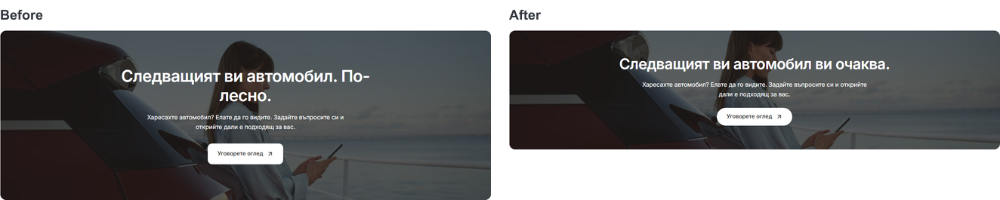
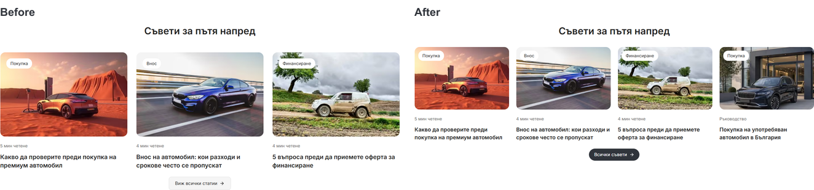
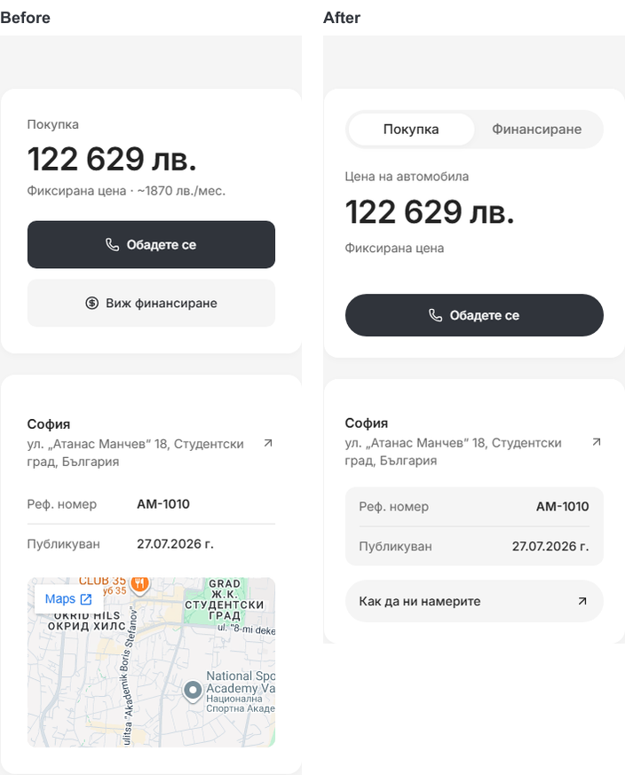

# Modern desktop polish — 6 October 2026

The local Modern preview at [127.0.0.1:6482](http://127.0.0.1:6482/bg) includes the requested final polish for Home, About, Contact and the Mercedes GLS listing. Changes are scoped to the desktop layout at 1024px and above.

## Result

- Home: the viewing banner is 320px high instead of 456px. Its heading is “Следващият ви автомобил ви очаква.” and fits on one line at the checked desktop widths. Advice now has four existing articles/guides, with a small dark rounded “Всички съвети” button. The first three reviewed images remain; the fourth uses the existing buying-guide image.
- Contact: Call and Directions have equal widths. The large decorative location, telephone and vehicle icons are removed from the contact cards; the useful copy and direction actions remain.
- About: buttons read “Нашите автомобили” and “Нашите услуги” and have equal widths. The closing call to action keeps its plain dark background: the photo gallery immediately above already supplies the imagery.
- Listing: Save and Share sit in the utility row above the full title, with Print removed from this desktop dealer view. The GLS title fits on one line at 1024px and 1440px. The purchase card has accessible Purchase/Finance tabs with a stable height. Finance shows the supplied monthly estimate and opens financing with this car selected; it does not calculate a new offer.
- Listing location/details: the tiny embedded map is replaced by a directions button. Reference and publication details sit in a quiet gray inset. Vehicle facts share one structured card, followed by the description; an empty equipment card is omitted on desktop.

## Matched screenshots

Before captures use this task's source preimages while preserving the other work already present in the shared checkout. Images were loaded before taking the final comparison captures.

Additional captures: [Contact](desktop-final-polish-2026-10-06/contact-1440-after.png), [About](desktop-final-polish-2026-10-06/about-1440-after.png), [listing](desktop-final-polish-2026-10-06/pdp-1440-after.png), [Finance selected](desktop-final-polish-2026-10-06/pdp-finance-after.png), and [vehicle facts](desktop-final-polish-2026-10-06/pdp-specifications-after.png).

## Verification

- Node 22.23.2 / pnpm 11.4.0; final production build passed.
- Web and marketplace UI TypeScript checks passed; 289 existing unit tests passed (188 web, 101 marketplace UI).
- Chromium and WebKit: 16 existing contact action cases and four new Purchase/Finance cases passed. These cover keyboard tab selection, preserved price, equal purchase-card height, copy fallback and the selected vehicle on the financing page.
- [20 desktop route checks](desktop-final-polish-2026-10-06/desktop-checks.json) passed across Bulgarian/English and 1024px/1440px: Home, Cars, About, Contact and the GLS listing. No horizontal overflow, broken loaded images or browser errors were recorded.
- [12 mobile comparisons](desktop-final-polish-2026-10-06/mobile-comparisons.json) cover Home, About, Contact and the GLS listing at 320px, 390px and 1023px. Dimensions and layouts are preserved. Ten pairs are pixel identical; Home at 320px/390px has tiny rounded-image-edge raster differences (564/561 pixels), with no visible layout or text change.
- Biome checked all 17 task source/test files; the task-scoped `git diff --check` passed.

## Source and handoff

Reusable changes are in `packages/marketplace-ui/components/`: desktop discovery/hero styles, listing summary/actions/details, seller identity/purchase cards and the new `dealer-listing-purchase-options.tsx`. Page-specific changes are in `apps/web/app/[locale]/`: Home, About, Contact and the existing desktop contact styles/phone card. The focused browser test is `apps/e2e/specs/desktop-purchase-options.spec.ts`.

Work remains local and uncommitted on the existing `main` checkout. Unrelated staged, unstaged and untracked work is preserved, including the existing Git index lock. The preview is running on port 6482. No template promotion or dealer publication was performed.
