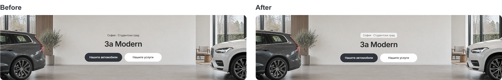

# Modern Home cleanup — 6 October 2026

The [local Home preview](http://127.0.0.1:6482/bg) now has a simpler desktop hierarchy. This continues the [advice cards and hero refinement](DESKTOP-ADVICE-HEROES-2026-10-06.md).

## Home and advice

- The four-car preview appears directly below its heading. The All/Recommended/Latest stock selector is removed; the cards and View all cars link still open the listing and complete inventory. The hero's search and vehicle categories retain their existing behavior.
- The Services supporting sentence is removed in Bulgarian and English. Stock, Services and Advice use 32 px between their heading and cards.
- Each advice card keeps its contained 40 px action, now with subtle grey fill. All advice uses the same charcoal fill, 44 px height and 8 px corners as the other section CTAs.
- Short desktop headlines fit within two lines and reserve a consistent 52 px title area. Full article titles remain in the accessible link name and title tooltip. Original content titles and mobile cards are unchanged.

## Location badge

About and Contact show the configured city and district, “София · Студентски град,” in a quiet 28 px badge above the title. It uses muted supporting text, translucent white fill, a light border and 8 px corners. The existing 352 px hero size and showroom artwork are preserved.

## Verification

- Production demo build passed with Node 22.23.2 and pnpm 11.4.0, reusing this task's isolated `.next-public-e2e-advice-heroes-build-20261006-demo` output. The live preview on port 6482 remains separate.
- Web and marketplace UI TypeScript checks passed; the existing public-content unit suite passed all three tests. Biome checked seven source/test files and task-scoped whitespace checks passed.
- The replacement stock navigation spec passed in Chromium and WebKit, covering BG/EN at 1024/1440 px, four visible cars, keyboard listing navigation, Back, and the full-inventory CTA.
- [Eight advice cases and eight location badge checks](desktop-home-cleaner-2026-10-06/advice-checks.json) passed in Chromium/WebKit and BG/EN. Advice checks cover two-line titles, grey/charcoal fills, action dimensions/corners, aligned button bottoms, keyboard focus and actual article/guide navigation. No browser errors were recorded.
- Matched [Home, About and Contact captures](desktop-home-cleaner-2026-10-06/after-metrics.json) returned HTTP 200 without horizontal overflow at 1440/320/390/1023 px.
- [Nine mobile comparisons](desktop-home-cleaner-2026-10-06/mobile-comparison.json) retain matching page dimensions at 320/390/1023 px. Eight pairs are pixel identical; About at 320 px differs by 38 pixels out of 288,000. All styling changes are scoped from 1024 px, and the shortened headlines are supplied only to the desktop component.

## Source and delivery

Reusable changes are in `packages/marketplace-ui/components/dealer-desktop-stock.tsx`, `dealer-desktop-discovery-content.tsx`, `dealer-desktop-discovery.module.css` and `dealer-desktop-hero.module.css`. The Home page and `apps/web/lib/public-content-data.ts` supply desktop titles. The existing stock spec and TEMPLATE/QA references describe the current behavior.

Changes remain local and uncommitted on `main`. Unrelated source, the existing Git index lock and the port 6482 preview are preserved. Another active Modern build updated shared `next-env.d.ts` to its `mobile-pdp-guides-20261006` type references; those current references are preserved, and this task's pre-build preview references remain in runtime recovery. `tsconfig.json` is unchanged. Template release and dealer publication are outside this local polish.
