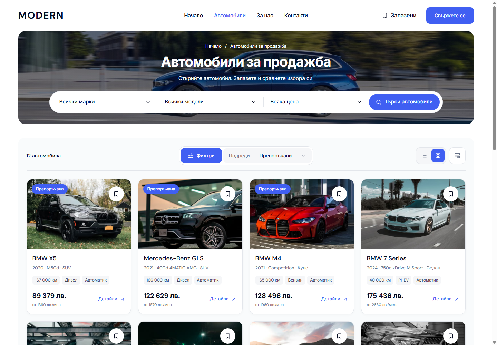
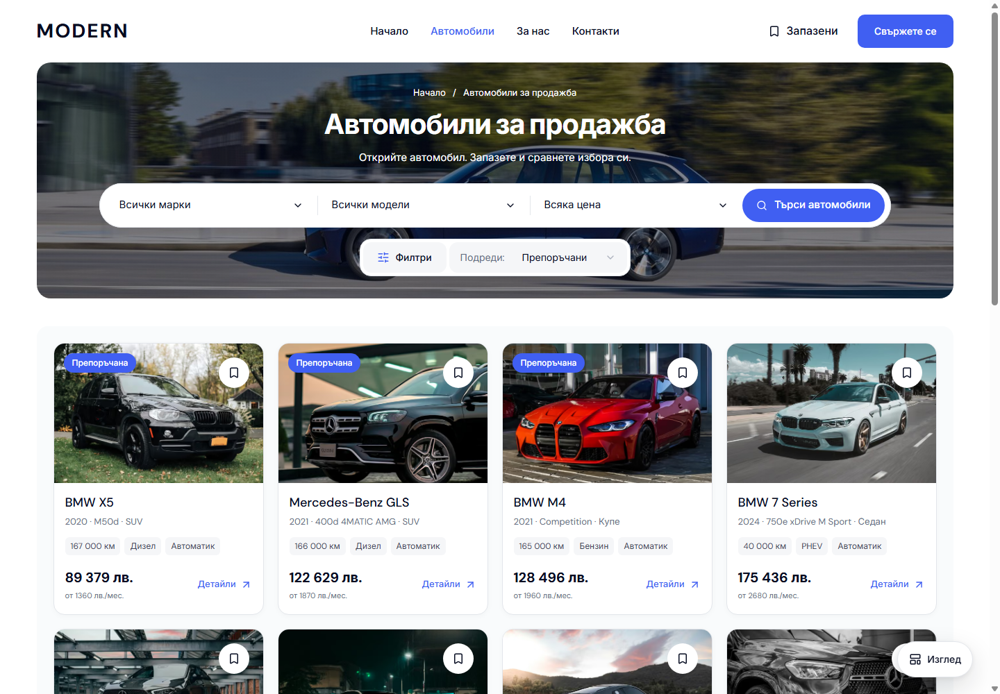

# Inventory banner controls

Desktop Cars now groups Filters and Sort in a centered row below the existing search inside the photographic banner. The visible vehicle count and the separate toolbar row are removed. The result count remains a polite screen-reader announcement. The grid starts directly below the banner, with applied-filter chips shown when needed.

A floating **View / Изглед** button contains Grid/List and the master demo's Quick/Sidebar filter-layout choices. It stays in the lower-right corner while scrolling, shows selected radio choices and restores focus after Escape. The existing listing and filter-layout preferences, URL filters, sorting and sidebar drafts retain their current owners. Dealer builds expose only the Grid/List choices unless desktop preview is enabled.

| Before | After |
| --- | --- |
|  |  |

Both captures use `/bg/cars` at 1440 × 1000 with visible scrollbars. [View menu](assets/modern-banner-controls-20261004/view-menu.png) shows the four demo choices. Matched mobile evidence: [320 before](assets/modern-banner-controls-20261004/mobile-320-before.png), [320 after](assets/modern-banner-controls-20261004/mobile-320-after.png), [390 before](assets/modern-banner-controls-20261004/mobile-390-before.png), [390 after](assets/modern-banner-controls-20261004/mobile-390-after.png).

Changes reuse `DealerDesktopToolbar`, `DealerInventorySummary`, `DealerInventoryFilters` and the existing Radix menu/Select primitives. CSS remains scoped at 1024 px and above. The compact full filter dialog from the preceding change is preserved. Home presentation is unchanged.

Verification is recorded in [verification.json](assets/modern-banner-controls-20261004/verification.json). The production build, web/UI/e2e typechecks, scoped Biome, seven refactor contracts, release contracts, 87 release-preflight tests and 289 web/UI unit tests passed. Sixteen accepted browser cases in Chromium and WebKit qualify BG/EN banner geometry, visible-scrollbar overlays, Grid/List, Quick/Sidebar, persisted choices, URL sorting and filter drafts. Eight WCAG A/AA scans cover the page and opened View menu at 1024 × 600, with zero violations and zero console/page errors.

Cars screenshots cover both locales at 320, 390, 1023, 1024, 1280, 1440 and 1920 px without horizontal overflow. Six of eight mobile/Home comparisons are pixel-identical; the other two contain 22 and 19 edge-antialiasing pixels, at most 8/255 channel difference, with no geometry or content change. The receipt retains these exact differences instead of claiming a zero-pixel result.

Canonical localhost port 6482 serves build `k0mYTeci_rZD1HIteVVpF`. This is reusable Modern source and local-preview verification; owner visual acceptance, immutable template promotion and dealer publication retain their separate boundaries. Unrelated source, staged changes, recovery notes and generated route-reference preimages are preserved.
