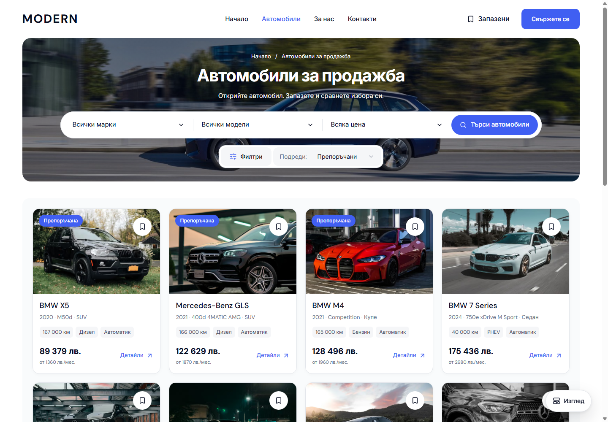
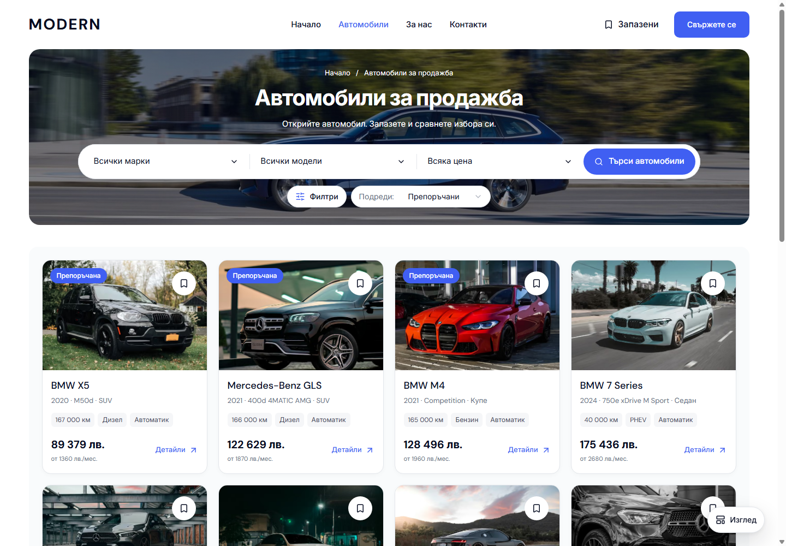

# Compact inventory controls

Filters and Sort now sit directly on the photographic banner as two equal-height, 40 px controls with an 8 px gap. The extra white container is removed. The gap below the primary search is 12 px, bringing the cars higher on the page while preserving the search bar's width and the banner composition. The floating View button uses a 48 px pill profile.

Each secondary control has its own quiet border and a clear hover state. Keyboard focus uses a brand-colored inner ring with a white outer outline against the photograph. Applied-filter badges use the existing soft brand surface. Sort retains enough width for the longest Bulgarian labels at the smallest desktop breakpoint.

| Before | After |
| --- | --- |
|  |  |

Both captures use `/bg/cars` at 1440 × 1000 with visible scrollbars. [Keyboard focus](assets/modern-control-polish-20261005/keyboard-focus.png) and [long Bulgarian sort at 1024 px](assets/modern-control-polish-20261005/long-sort-1024.png) show the less common states. The behavior and placement introduced in the [banner-controls change](DESKTOP-INVENTORY-BANNER-CONTROLS-2026-10-04.md) are retained.

Implementation is confined to `dealer-inventory.module.css` and `dealer-desktop-toolbar.module.css` in `packages/marketplace-ui/components/`, within the existing 1024 px desktop breakpoint. Current URL filters, dialogs, result announcements, display preferences and sidebar drafts retain their existing behavior. The compact full-filter modal is preserved.

[Verification receipt](assets/modern-control-polish-20261005/verification.json) records the production build, typecheck, scoped Biome, contract checks, Chromium/WebKit checks, both locales, sort-label visibility, keyboard focus and short-window menu accessibility. Matched Cars captures cover 320, 390, 1023, 1024, 1280, 1440 and 1920 px; mobile and Home comparisons are recorded individually. This evidence qualifies the reusable source and local preview, with owner visual acceptance and template/dealer publication remaining separate.

Build, typecheck, scoped Biome, release preflight and 94 contract tests passed. All eight browser cases are accepted; one WebKit case exceeded the initial 45-second total budget and passed its isolated recheck with a 90-second budget. Twenty-four sort-label states fit, and eight accessibility scans reported no violations. Mobile and Home comparisons retain the same layout and content, with only small raster edge differences where captures are not identical. The original preview on port 6482 serves verified build `VZknur44y3s7ATC3XuC3g` in BG and EN.
