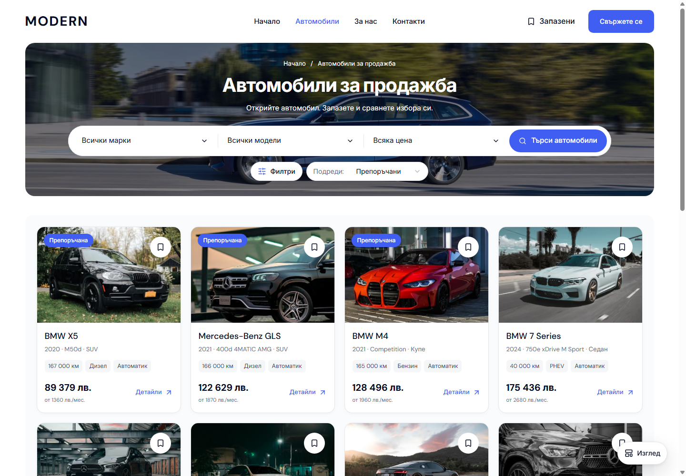

# Inventory controls below the banner

This records the earlier below-banner placement. The [Type and centered-controls review](DESKTOP-INVENTORY-TYPE-AND-CENTERED-CONTROLS-2026-10-05.md) records the subsequent composition.

Desktop Cars keeps the Make, Model, Price and Search capsule in the photographic banner. Filters and Sort now sit on the white page immediately below it, aligned with the left and right edges of the vehicle grid. The row has no surrounding panel. Both controls retain their compact 40 px height, and the banner contracts naturally after their removal. The result count stays accessible without a visible heading. The floating View menu retains Grid/List and master Quick/Sidebar choices.

| Before | After |
| --- | --- |
|  |  |

Matched captures use `/bg/cars` at 1440 × 1000 with visible scrollbars. The row sits 24 px below the banner; the inventory panel follows 16 px later. Its controls align with the cards' 24 px inset. Keyboard focus uses the brand outline against the white page. Long Bulgarian sort labels retain their full width.

`dealer-desktop-toolbar.tsx` renders the existing summary after the hero, retaining the same controlled filters, sort state and result announcement. `dealer-inventory.module.css` scopes row spacing to desktop at 1024 px and above. The visible inventory panel receives closer spacing through its existing desktop-visibility marker; Home's separate collection keeps its spacing. The updated inventory browser assertion checks the controls outside the hero, above the cards, aligned at both edges, with the count hidden and the View menu fixed when scrolling.

The [preceding compact-control review](DESKTOP-INVENTORY-CONTROL-POLISH-2026-10-05.md) and [banner-controls review](DESKTOP-INVENTORY-BANNER-CONTROLS-2026-10-04.md) remain historical evidence. Current validation and mobile preservation are recorded in the [verification receipt](assets/modern-controls-below-banner-20261005/verification.json). Local preview verification remains separate from template/dealer publication.

Production build, web typecheck, scoped Biome, release preflight and 94 contract tests passed. Eight Chromium/WebKit cases passed in BG/EN, covering placement, fixed View-menu behavior and all desktop overlay open/dismiss/focus paths at 1024, 1440 and 1920 px. Twenty-four sort-label states fit at 1024 px; eight accessibility scans found no violations. Mobile at 320/390 px, the 1023 px boundary and Home retain their layout and content. Five of eight preservation captures are identical; three have small raster edge differences, recorded individually. At that review, the original preview served verified build `rtELF3kTLxdLPybEycCrB` on port 6482, with no console/page errors in either locale.

The original preview needed additional startup time beyond its readiness loop. Agent-browser then verified the refreshed page. The separate canonical Chromium helper exited during its first launch; after this task's temporary preview and separate browser were closed, the isolated canonical check passed. These startup/tool events did not produce failed application assertions.
