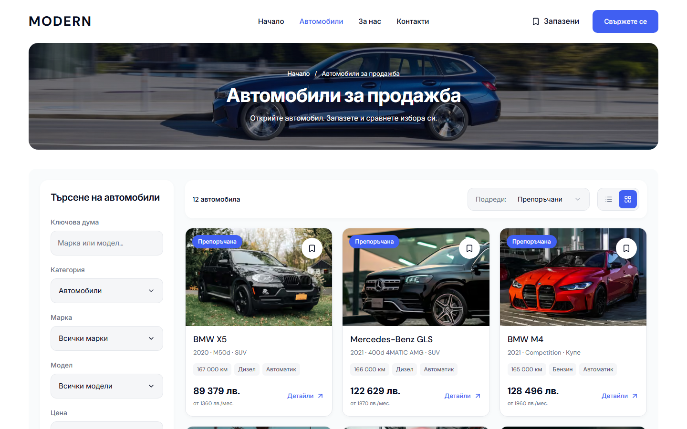
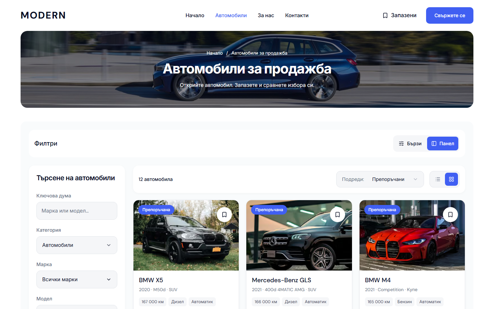

# Modern desktop inventory filter layouts — 4 October 2026

Cars now supports horizontal quick filters and the existing sidebar through one applied URL state. The dealer master defaults to a compact blue quick-filter bar below the retained photo hero, with three vehicle columns at 1024 px and four from 1280 px. The switch restores the white sidebar and its two/three-column grid. Search criteria, sorting, Grid/List and unsubmitted sidebar text survive a layout switch.

## Reusable implementation

- `lead-site.ts` accepts optional `desktopInventoryFilterLayout: "quick" | "sidebar"`; the public schema validates the projection, and older configurations fall back to Quick.
- The inventory route seeds presentation from a versioned, dealer-scoped, one-year cookie at the configured public base path. Invalid values use the dealer default; blocked preference storage leaves filtering usable.
- `DealerInventoryFilters` reuses existing make/model, range and full-filter dialogs. Applied mileage/fuel pills remain visible below their ordinary desktop breakpoint, and a keyword chip makes the active search visible and clearable. Many applied filters wrap instead of being clipped.
- The sidebar remains mounted when hidden so a layout switch preserves its unsubmitted draft. Applied filter changes retain its existing reset behavior. Layout controls do not introduce a second search model or change the URL.
- Native fieldsets, pressed states and focus styling use shared tokens. The full-filter trigger takes focus before opening so the existing overlay coordinator restores it after dismissal in WebKit as well as Chromium. Inventory image hints follow the selected grid width.
- New visual rules are scoped to desktop from 1024 px. Mobile composition and actions remain unchanged.

## Verified production preview

Local origin: `http://127.0.0.1:6482`. Build: `Q1Ochd0MApvFsXmPjIHnA`. Source HEAD during qualification: `6c92fdc2758d5d5b985a9c8a9004c7bb969d313a`; task-owned source was uncommitted during the browser checks. [Machine-readable evidence](assets/modern-inventory-layouts-20261004/verification.json) contains the qualified source hashes and screenshots.

| Check | Result |
| --- | --- |
| Focused inventory, Home-frame, sidebar-draft and category/Back browser flows | 28 passed, Chromium and WebKit |
| Both filter layouts, BG/EN, 1024/1280/1440/1920 px | 32 states passed; no overflow, clipped controls, broken images or app errors |
| Nine applied pills, BG/EN, 1024/1440 px | 8 additional states passed; all selections visible and clearable |
| WCAG A/AA scans on ordinary and applied-filter states | 16 scans, zero violations |
| Mobile BG/EN, 320/390/1023 px | 6 matched captures, zero changed pixels and identical geometry |
| Production webpack build and its TypeScript check | Passed |
| E2E TypeScript / Biome | Passed / 18 files passed |
| Marketplace / Web / Marketplace UI units | 146 / 186 / 95 passed |
| Refactor / preflight contracts and tests | 7 contracts passed; preflight contracts passed; 87 preflight tests passed |

The focused browser command uses the saved local production-preview config under `runtime/modern-inventory-layouts-20261004/desktop.config.mjs` to select `desktop-inventory-layouts.spec.ts`, the relevant `desktop-panel-flows.spec.ts` cases and `desktop-category-navigation.spec.ts`. Logs, full-width screenshots and active-filter captures are retained in that ignored runtime directory.

## Matched desktop screenshots

Before, Quick and Sidebar are native 1440 × 900 px captures of the same Bulgarian Cars route and inventory. Full-page captures are also preserved.

[Full page before](assets/modern-inventory-layouts-20261004/inventory-before-full.png) · [Full page after](assets/modern-inventory-layouts-20261004/inventory-quick-after-full.png)

## Source and release boundary

The earlier reviewed About gallery, generated artwork and blue CTA remain in the pending task-owned scope. Their assets and source are preserved. The unrelated `docs/DESKTOP-HERO-CORRECTION-2026-10-03.md` and all other template/client work are excluded.

This is a local static-demo review. It does not update `templates.lock.json`, promote a release, configure live providers or deploy clients. Git delivery is recorded separately in `runtime/modern-inventory-layouts-20261004/pending-delivery.json` or `commit-receipt.json`; the qualified local build does not establish exact-commit or mounted/public release acceptance.
