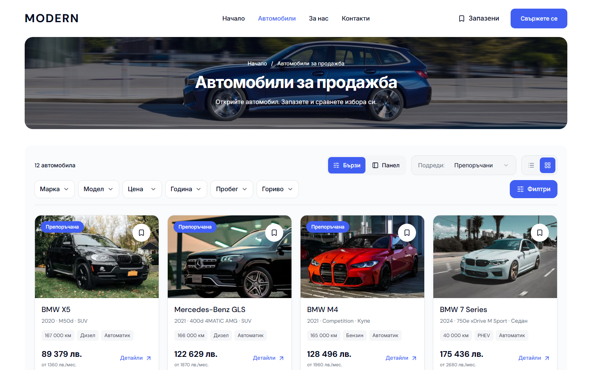
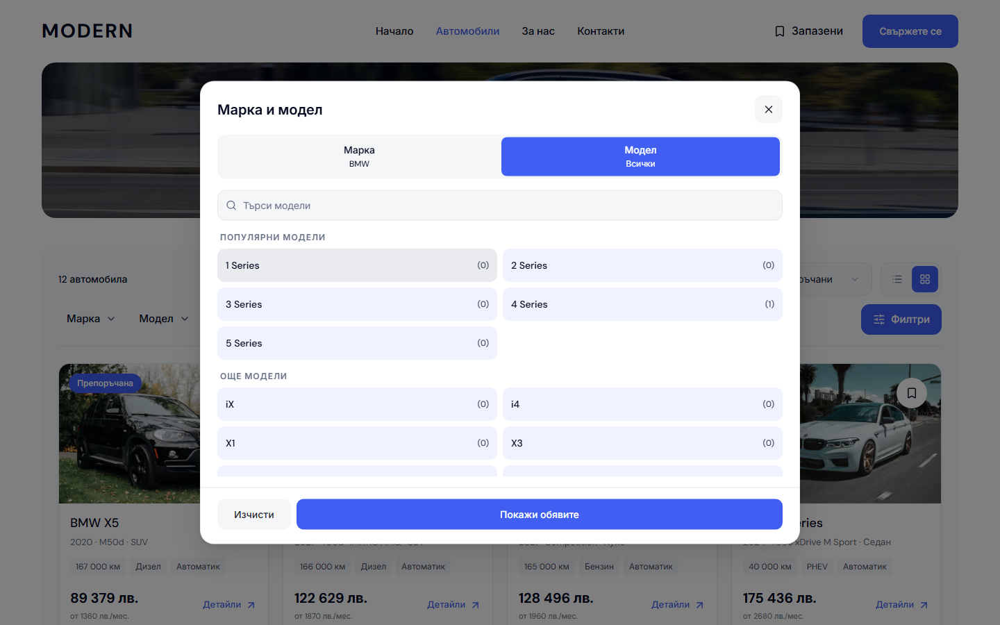
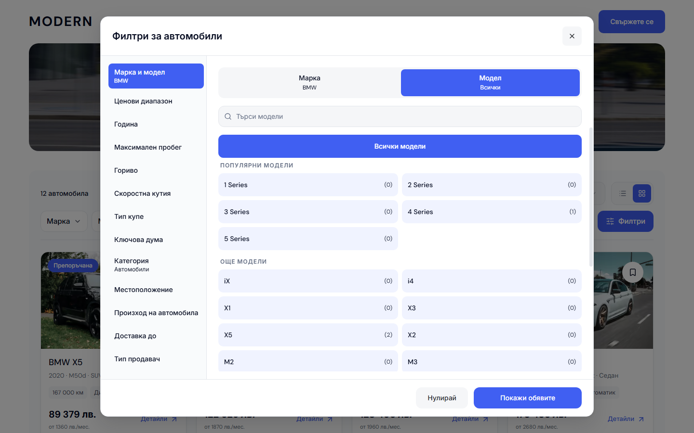

# Modern desktop inventory options — 4 October 2026

The inventory quick controls now use rounded neutral buttons with restrained hover states. Make, Model and the other quick controls open the requested section of one complete desktop filter dialog. All 13 supported filter sections remain available in its side navigation, with the searchable Make/Model/available Body style stages inside the same workspace.

One controlled draft preserves choices when switching sections. Show results applies the complete draft once; dismissal discards it and restores trigger focus. Each selected section can be cleared independently, and Reset clears search criteria while retaining sorting. Numeric fields commit on blur before pointer navigation unmounts their panel. Keyboard navigation and input blur are also covered. All makes and All models are explicit choices, and model counts use the existing exact inventory facet data.

The inventory retains one shared frame below its photo hero, the Quick/Sidebar preference, sorting and Grid/List controls. Sidebar retains its existing draft controls. This revision changes desktop presentation from 1024 px; mobile uses its existing overlay. Home retains its existing composition and standalone search dialogs.

## Ownership and implementation

- `marketplace-shell.tsx` selects the desktop dialog entry and retains the existing overlay coordinator and URL commits.
- `desktop-full-filter-dialog.tsx`, `desktop-full-filter-content.tsx` and `desktop-make-model-fields.tsx` own desktop presentation and controlled draft editing. Shared Make/Model stages and rendering reuse the existing taxonomy and picker options.
- `desktop-full-filter-policy.ts` owns section labels, summaries and independent clearing. Existing range, fuel, transmission, category and country controls remain the option sources.
- `dealer-inventory.module.css` owns the button presentation. Selected colors live in the shared `desktop-tokens.css`; the desktop dialog styles remain in their CSS module. No package/runtime upgrade or live provider integration was added.
- `TEMPLATE.md`, `SITE-CONFIGURATION.md` and `QA.md` describe the current behavior. Earlier inventory search/layout documents and their native screenshots remain historical evidence.

## Qualification

The local production demo at `http://127.0.0.1:6482` used Node 22.23.2 with the existing pnpm 11.4.0 workspace and Next.js 16.3.8. Final build ID: `LARupsQxNgT9mkV79D8xR`. Qualification binds 68 reviewed pending source/document/asset paths by SHA-256 in `runtime/modern-inventory-options-20261004/qualified-source.json`. The final evidence below records those hashes and the original screenshot hashes.

| Check | Actual result |
| --- | --- |
| Production webpack build and web TypeScript | Passed |
| E2E TypeScript | Passed |
| Biome | 16 implementation files and the inventory spec passed |
| Marketplace UI units | 95 tests across 20 files passed |
| Refactor contracts | 7 passed |
| Release preflight contracts | Passed |
| Release preflight tests | 87 passed |
| Focused Chromium/WebKit journeys | All 28 distinct cases qualified: 27 passed in the main run; one WebKit Home/Sidebar case passed unchanged in an isolated rerun |
| Inventory layouts | 32 states: BG/EN, Quick/Sidebar, both engines, 1024/1280/1440/1920 px |
| Make/Model options | 48 states: both locales/engines, Make/Model/empty/Body style at 1440×900, 1024×768 and 1440×600 |
| Full filter navigation | 104 section states: all 13 sections, both locales/engines, 1440×900 and 1024×600 |
| Applied quick controls | 8 states: nine applied criteria remain visible and clearable at 1024/1440 px |
| Axe WCAG A/AA scans | 40 scans with zero violations, including selected/hovered options |
| Native page captures | 28 before and 28 after states across BG/EN Home and Cars |
| Mobile preservation | All 12 comparisons at 320/390/1023 px: zero changed pixels and identical geometry |
| Home desktop preservation | All eight state geometries and all 16 full-page/stock images are identical |

The initial implementation checks found insufficient contrast in selected controls and a typed price lost when leaving its section. Both were corrected before the final production build. Final flows cover pointer and keyboard input commits, Make/Model dependencies, section draft preservation, cancellation/focus restoration, independent clearing, reset/apply, sorting, browser Back, Grid/List, preference reload and invalid/blocked storage.

The main browser run's last WebKit Home/Sidebar journey timed out at its final submit after 120 seconds. The unchanged three-width journey passed in isolation in 28.7 seconds; both receipts are preserved. Four initial Home viewport PNGs have 39–87 differing image-edge pixels, with a maximum channel delta of 2. Their full-page and stock PNGs have zero differences, as do every Home geometry and mobile comparison. The original native captures remain available; this record does not report those four viewport PNGs as pixel-identical.

Qualification helpers, complete captures, console/geometry receipts, initial failure traces and build logs live in `runtime/modern-inventory-options-20261004/`. To preserve available disk space, only this owned local preview's webpack compiler cache was moved to `C:/Users/radev/AppData/Local/Temp/modern-inventory-options-20261004-build-cache`, with a junction at its original ignored cache path. Source and recovery evidence were retained; the preview server output remains under `apps/web/`.

## Native before/after evidence

Matched Chromium BG inventory captures at 1440×900, copied without edits:

The previous Make/Model-only dialog and the full filter workspace, at the same viewport and BMW model state:

[Full before page](assets/modern-inventory-options-20261004/inventory-before-full.png), [full after page](assets/modern-inventory-options-20261004/inventory-after-full.png), [Sidebar after](assets/modern-inventory-options-20261004/inventory-sidebar-after.png) and [verification data](assets/modern-inventory-options-20261004/verification.json).

## Source delivery and limits

This source delivery includes the earlier reviewed, still-pending About gallery/generated artwork, solid blue CTA and inventory layout work. The 48 earlier reviewed paths outside this iteration's deliberate edits retain their exact hashes. Foreign template/client/workflow work, staged state and `DESKTOP-HERO-CORRECTION-2026-10-03.md` remain outside the commit scope. The exact reviewed delivery manifest and commit/push or pending-delivery receipt live in this qualification runtime directory.

An existing `L:/CODEX/cars/.git/index.lock` initially blocked scoped delivery. It was preserved until the owning workflow released it. The 77 reviewed paths were then committed on `main` as `7c4f42eef4fb104e64fe2a4f0b8a839d9b73e13d`, with parent `e7671c9d53574c02721ee91763263431a28160b3`. The commit receipt verifies every committed blob against the reviewed content and confirms unchanged staged state and the excluded hero note. The earlier pending receipt remains historical evidence of the initial block; the final delivery receipt owns the actual commit/push state.

This is local static-demo qualification. It does not select a template release, update `templates.lock.json`, deploy a dealer, prove mounted/public behavior or establish owner visual acceptance.
