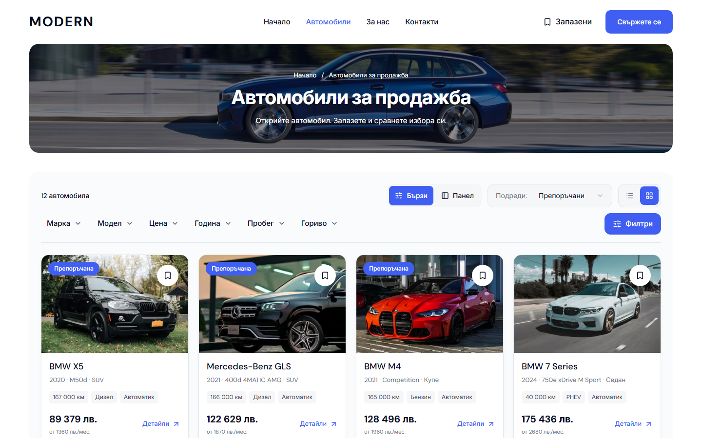
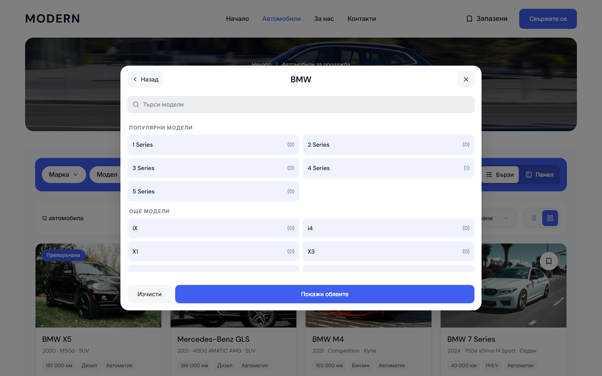

# Modern desktop inventory search — 4 October 2026

The Cars page now places the result count, Quick/Sidebar choice, sorting and Grid/List controls in one row above a flat filter rail. Both rows share the existing pale inventory frame below the photo hero. The separate blue filter box and white sorting box are removed. At 1440 px the first cards start about 60 px higher, while the hero, cards, grid proportions and public search state retain their existing composition.

Make and Model open the same searchable desktop dialog. Its segmented rail shows the current selection, disables Model until a make is selected and exposes Body style for models with derivatives. Search has a clearable empty state. Selecting the same make preserves its model; choosing another make clears dependent choices. Changes remain drafts until Show results, while dismissal restores focus and discards the draft.

## Source ownership

- `DealerInventoryFilters` owns the complete toolbar and reuses `DealerInventorySummary` and `DesktopQuickFilters`. Sorting and Grid/List keep their existing callbacks and URL state.
- `DesktopMakeModelDialog` owns desktop presentation, accessible Radix tabs and initial focus. `MarketplaceModelPicker` retains the shared taxonomy, counts, draft state and apply behavior. Its render helper does not create another search controller.
- Desktop CSS modules use shared spacing, brand, focus and motion tokens from 1024 px. The options viewport shrinks above the footer at a 600 px window height. Picker counts and descriptions use the existing desktop prose color for readable contrast.
- The earlier Quick/Sidebar configuration, server-seeded dealer preference and mounted sidebar draft preservation remain intact. Extra applied filters wrap visibly; inactive fuel/mileage fields retain the existing responsive availability.
- The earlier About gallery, generated blue assets and solid blue CTA work remain in the pending source scope. Their 38 preserved source/evidence files were checked against the earlier reviewed manifest.

## Production-preview verification

Local origin: `http://127.0.0.1:6482`. Final build: `Qmf7DM80CBaCIYb7WOmAt`. Source HEAD: `6c92fdc2758d5d5b985a9c8a9004c7bb969d313a`, with task source uncommitted during qualification. [Verification receipt](assets/modern-inventory-search-20261004/verification.json) records the source hashes and native screenshots.

| Check | Result |
| --- | --- |
| Focused inventory, segmented picker, Home frame, sidebar drafts and browser Back flows | 36 passed, Chromium and WebKit, no retries or skips |
| Quick and Sidebar, BG/EN, Chromium/WebKit, 1024/1280/1440/1920 px | 32 states passed |
| Make, Model, empty search and Body style, both locales/engines | 48 states passed at 1440 × 900, 1024 × 768 and 1440 × 600 px |
| Nine applied filters at 1024/1440 px, both locales/engines | 8 states passed; no hidden selected filters or clipped controls |
| WCAG A/AA scans across ordinary, applied and picker states | 32 scans, zero reported violations |
| Cars route captures, BG/EN, desktop and mobile widths | 14 states: HTTP 200, no horizontal overflow, missing images or app/console errors |
| Cars mobile before/after, BG/EN, 320/390/1023 px | 6 comparisons: zero changed pixels and identical geometry |
| Production webpack build and its TypeScript check | Passed |
| E2E TypeScript, source formatting and whitespace | Passed |
| Refactor/preflight tests and preflight contracts | 94 tests passed; contracts passed |

Mobile visual preservation is established for the matched Cars pages. The existing mobile picker branch is preserved; this run does not claim a separate pixel comparison of its interactive overlays.

The focused browser runner and the layout, applied-filter, picker and pixel-comparison scripts are under `runtime/modern-inventory-search-20261004/`. The browser runner uses the three existing desktop specifications with one worker, Chromium and WebKit, and no retries. Build and browser artifacts are qualified independently of Git delivery.

## Native desktop screenshots

The before and after captures use `/bg/cars`, the same inventory and a 1440 × 900 px viewport. Screenshots are copied unchanged from the browser output. The earlier two-box iteration is the before state for this correction.

[Sidebar](assets/modern-inventory-search-20261004/inventory-sidebar-after.png) · [Full page before](assets/modern-inventory-search-20261004/inventory-before-full.png) · [Full page after](assets/modern-inventory-search-20261004/inventory-after-full.png)

## Git and release boundary

The pending reviewed scope includes the earlier About and inventory work plus this correction. The unrelated `docs/DESKTOP-HERO-CORRECTION-2026-10-03.md` and other template/client/workflow changes remain excluded.

An existing `L:/CODEX/cars/.git/index.lock`, last modified at 03:08:06 +03 on 4 October, prevents scoped commit/push. Its ownership is unconfirmed and it is preserved. `runtime/modern-inventory-search-20261004/pending-delivery.json` records the exact repository, main revision, source paths and hashes. Once the owning workflow releases the lock, recheck the reviewed source and remote state, run the scoped commit helper, push without force and verify the remote revision.

This is local static-demo implementation and verification. It does not update `templates.lock.json`, promote an immutable release, configure live providers, publish a dealer or establish mounted/public release acceptance.
