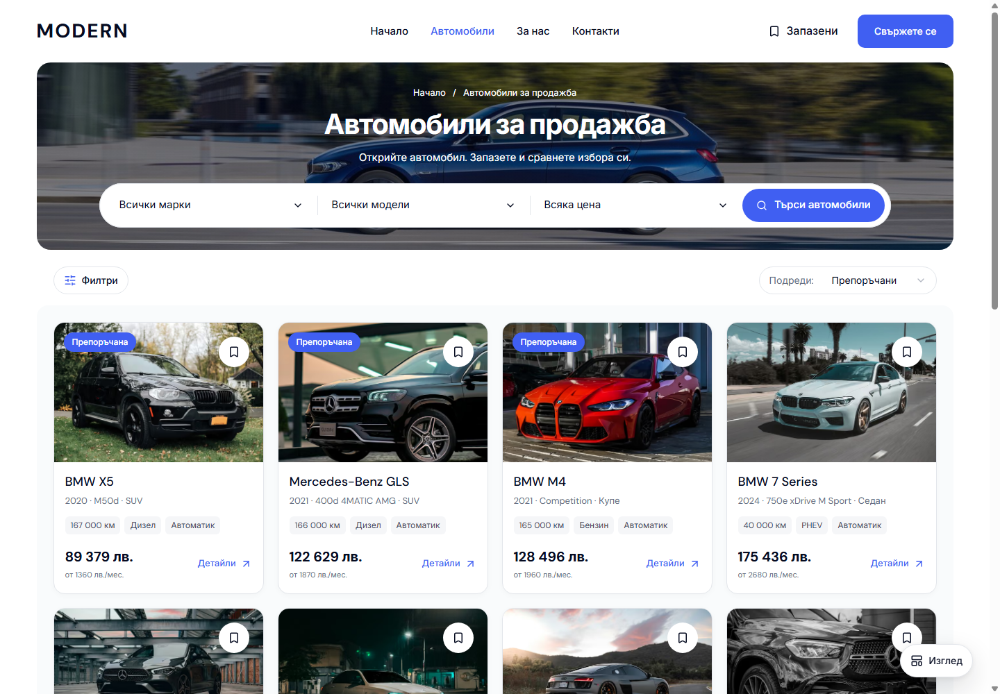
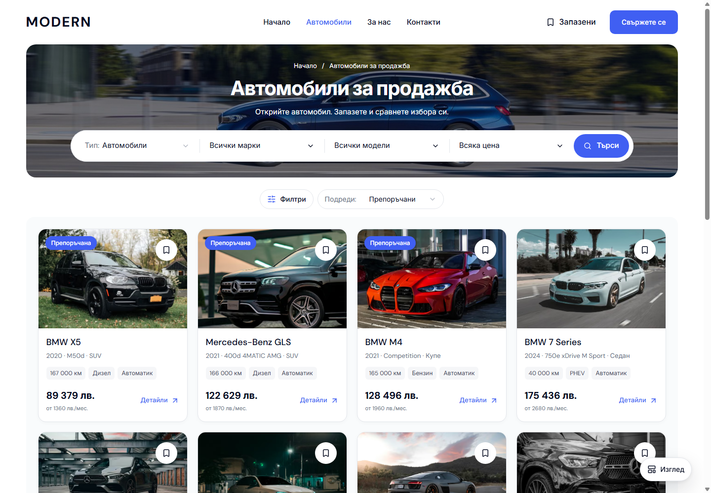

# Inventory Type and centered controls

The desktop inventory search capsule starts with Type, followed by Make, Model, Price and Search. Type offers Cars, Motorbikes, Vans and Trucks using the existing category routes and localized labels. Filters and Sort sit together in a compact centered row below the photographic banner, above the cards. The count remains an accessible announcement, and the floating View menu keeps Grid/List and master Quick/Sidebar choices.

| Before | After |
| --- | --- |
|  |  |

The matched `/bg/cars` captures use 1440 × 1000 with visible scrollbars. The row sits 24 px below the banner and 16 px above the inventory panel. Its midpoint matches the card grid. Type is also legible at 1024 px; the capsule keeps its existing white pill composition and uses the shorter localized Search label.

`DealerInventorySearch` uses the shared Select primitive and existing `withCategory` policy through the shell's filter controller. A category change preserves price, year and sort, clears dependent Make/Model choices, and navigates without replacing the document. Browser Back restores the prior category and selected vehicle filters. Lease remains a car offer rather than a fifth vehicle type. Home already has its category selection and retains its composition. All new presentation rules stay at the 1024 px desktop breakpoint.

The [preceding below-banner placement](DESKTOP-INVENTORY-CONTROLS-BELOW-BANNER-2026-10-05.md) is retained as history. Its verified captures are reused as the matched baseline for this subsequent change. The [verification receipt](assets/modern-inventory-type-centered-20261005/verification.json) binds checks, screenshots and source hashes to the current local build.

The interaction review checks all six sort labels in BG/EN at 1024 × 600, keyboard outlines, the Type popup and floating View menu. Accessibility scans cover the full page, the active Type popup and the page with View open in both engines and locales. Radix's listbox hides the background while trapping focus; its active popup is scanned separately, with Tab and Shift+Tab containment checked directly. Escape restores the Type trigger. These local checks remain separate from template promotion, dealer publication and owner visual acceptance.

Production build, web typecheck, scoped Biome, release preflight contracts and 94 contract tests passed with Node 22.23.2 and pnpm 11.4.0. Sixteen Chromium/WebKit cases passed in BG/EN, covering the four category routes, Back restoration, centered placement, search drafts, and eight desktop overlays with visible scrollbars at 1024, 1440 and 1920 px. The review passed 24 sort-label states and 12 scoped accessibility scans with no violations. Captures cover 320, 390, 1023, 1024, 1280, 1440 and 1920 px in both locales. Four of eight mobile/Home comparisons are identical; four differ by at most 37 raster-edge pixels, with no layout/content change. Both Home captures are identical.

The original port 6482 serves verified build `VzJcEvZUe46jl2PVvzmI_`. Canonical BG/EN checks confirm the centered row, four Type options, hidden count, floating View menu, restored focus and no overflow or console/page errors. No dealer publication or template-lock promotion was performed.
