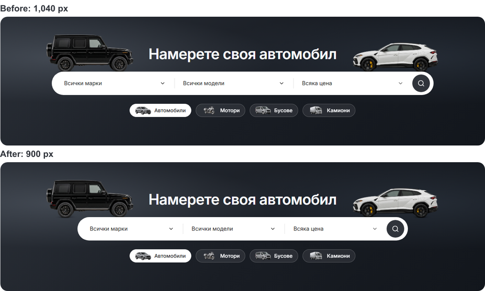

# Modern desktop search width — 6 October 2026

Home and Cars now use a centered 900 px maximum-width search capsule, reduced from 1040 px. This removes 140 px of excess width around Make, Model and Price while keeping the 64 px capsule height, 48 px controls and existing typography. Narrower desktop clamps the capsule to its available frame.

The vehicle artwork keeps its preceding 1040 px span. Separating that span from the control width preserves the approved car positions and title clearance. Both the loaded search and its loading frame use the shared search-width token.

## Checks

- [Six completed Home/Cars geometry cases](desktop-search-width-2026-10-06/search-checks.json) cover Chromium in BG/EN and WebKit in BG at 1024/1440 px. They check matching centered capsules, three fields, 64 px capsule height, 48 px field height, unchanged 352 px hero height, enabled-field focus and no horizontal overflow. WebKit English returned transient hidden geometry during hydration and is not counted as passing.
- [Six mobile comparisons](desktop-search-width-2026-10-06/mobile-comparison.json) cover Home/Cars at 320/390/1023 px. All page dimensions and heading coordinates match; every screenshot pair is pixel identical.
- The existing shared-frame test passed in Chromium, including its updated 900 px expectation. Its broader WebKit run was interrupted by an Imports/Contact navigation, and its retry could not start because the runner exhausted memory. The focused Home/Cars checks use direct browser contexts separately from that broader route sequence.
- Biome checked all three changed source/test files without fixes. Task-scoped whitespace checks passed. The CSS was compiled and inspected in the running preview; a production build was not repeated for this width-only change.

Changes are in `packages/design-system/styles/desktop-tokens.css`, `packages/marketplace-ui/components/dealer-desktop-hero.module.css` and the existing `desktop-panel-flows.spec.ts` width expectation. TEMPLATE/QA describe the revised contract. Work remains local and uncommitted on `main`; existing unrelated work and the preview on port 6482 are preserved.
