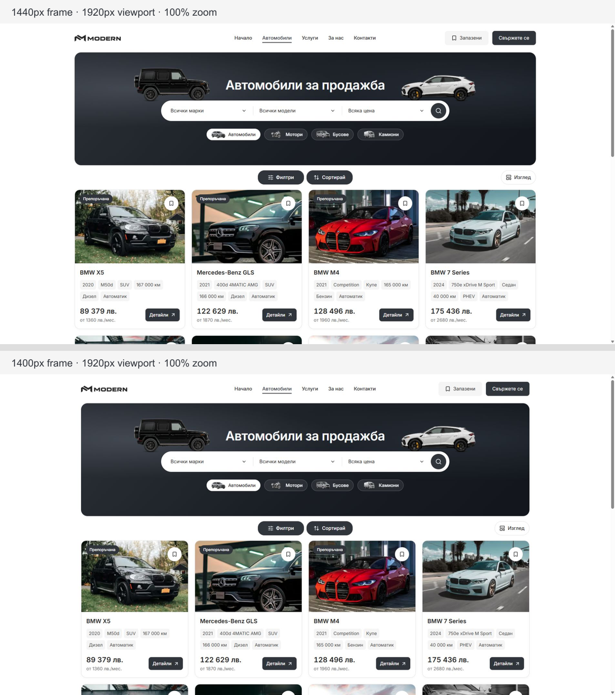
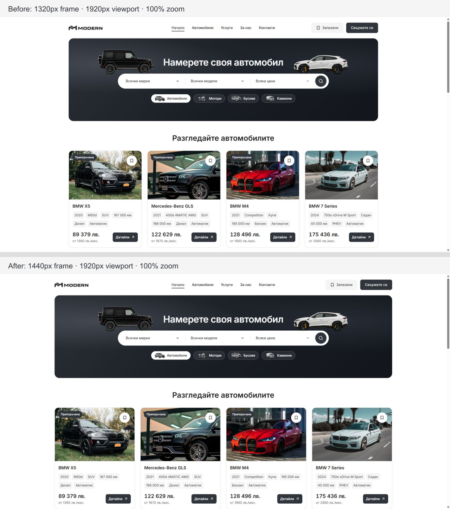
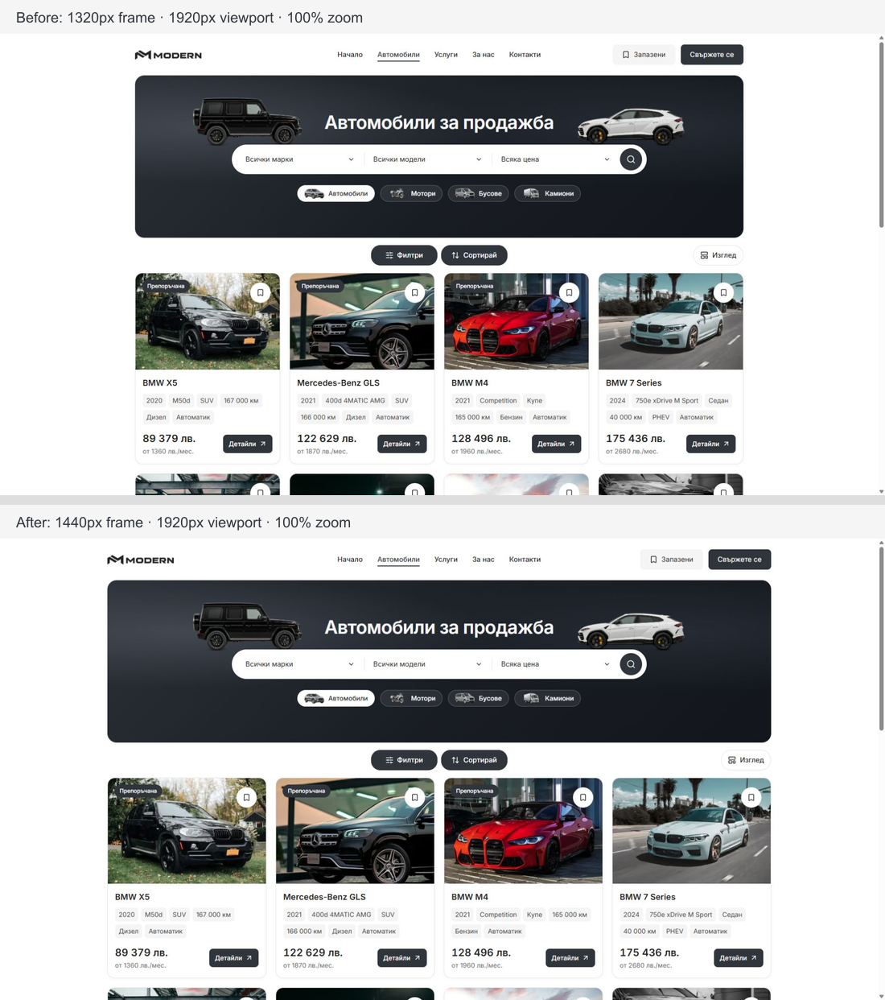
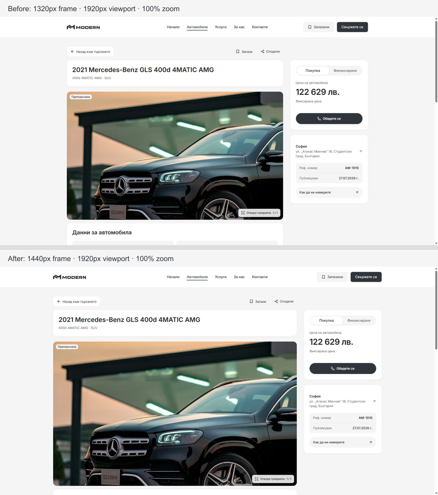

# Modern desktop shell comparison — 6 October 2026

## Current frame: 1400 px

The owner found the first wider trial slightly too large. The desktop cap is now 1400 px, adding 20 px of outer space on each side compared with 1440 px when the frame reaches its maximum. This remains wider than the original 1320 px frame. Existing component designs, typography, search width, header/hero heights and the mobile breakpoint are preserved.

[Baseline metrics](desktop-shell-2026-10-06/before-1400-metrics.json) and [1400 px metrics](desktop-shell-2026-10-06/after-1400-metrics.json) record Home/Cars/PDP at 1920 px and matched Cars/PDP at 320/390 px. The [focused comparison](desktop-shell-2026-10-06/1400-checks.json) records the current geometry and mobile captures. CSS compilation and scoped Biome/whitespace checks are repeated for this one-token refinement; the broader initial checks below remain evidence of the first trial.

All four mobile pairs retain matching page dimensions, visible heading geometry and mobile frame tokens. Their screenshot pixels vary, so this refinement claims matched mobile layout rather than pixel-identical captures. Home/Cars/PDP at 1920 px have no horizontal overflow; Home/Cars retain aligned 1400 px header and hero widths and 352 px hero height.

## Initial frame: 1440 px

The shared desktop frame caps at 1440 px instead of 1320 px, an increase of about 9%. A breakpoint-scoped override in the existing design-system tokens owns the change. The showroom cap now follows the same content-max token, keeping header, outer page content and footer widths coordinated.

This first comparison retains 40 px minimum side margins, existing component designs and typography, the 90 px header, 352 px mastheads, 900 px discovery search and original artwork sizing. Narrower desktop clamps to the available width; values below 1024 px retain their preceding definitions.

## Local checks

- [Matched baseline metrics](desktop-shell-2026-10-06/before-metrics.json) and [new-frame metrics](desktop-shell-2026-10-06/after-metrics.json) cover Home/Cars/PDP at 1440/1920 px and 320/390/1023 px. At 1920 px, header and Home/Cars frames measure 1440 px. At a 1440 px browser viewport with a 15 px scrollbar, the frame clamps to 1345 px. The search stays centered and 900 × 64 px.
- [Additional desktop checks](desktop-shell-2026-10-06/desktop-checks.json) cover Home/Cars/PDP at 1024/1280 px, About/Contact/Services and English Home/Cars at 1920 px. No checked route has horizontal overflow. The context-hero slot in this raw record includes its page wrapper; the contained banner is recorded separately in [context-frame checks](desktop-shell-2026-10-06/context-frames.json).
- [Nine mobile comparisons](desktop-shell-2026-10-06/mobile-comparison.json) retain matching screenshot dimensions and mobile frame token values at 320/390/1023 px. Eight also match the recorded page/heading geometry exactly. The 1023 px PDP screenshots are pixel identical; its earlier DOM measurement was taken before the page settled. Other image pixels vary between captures, so the full set is not claimed as pixel identical.
- Biome checked the changed CSS and existing frame-test expectation without fixes. Scoped whitespace checks pass. The release contracts pass.
- The refactor contract suite passes 6/7 tests and flags an existing literal dimension in `dealer-desktop-discovery.module.css`. Release preflight tests pass 86/87 and flag the existing `public-route-loading.tsx` import of an undeclared `mobile-dealer-title` export. These files are outside this task's change. Diagnostic logs are preserved in ignored `runtime/desktop-shell-20261006/`.

The CSS is compiled and visibly verified in the running local preview on port 6482. This frame-only preview did not repeat a production build or publish a template release. Work remains local and uncommitted on the shared main checkout. The task changes the desktop token override, one existing browser-test cap assertion, and the current TEMPLATE/QA references; unrelated work is preserved.
