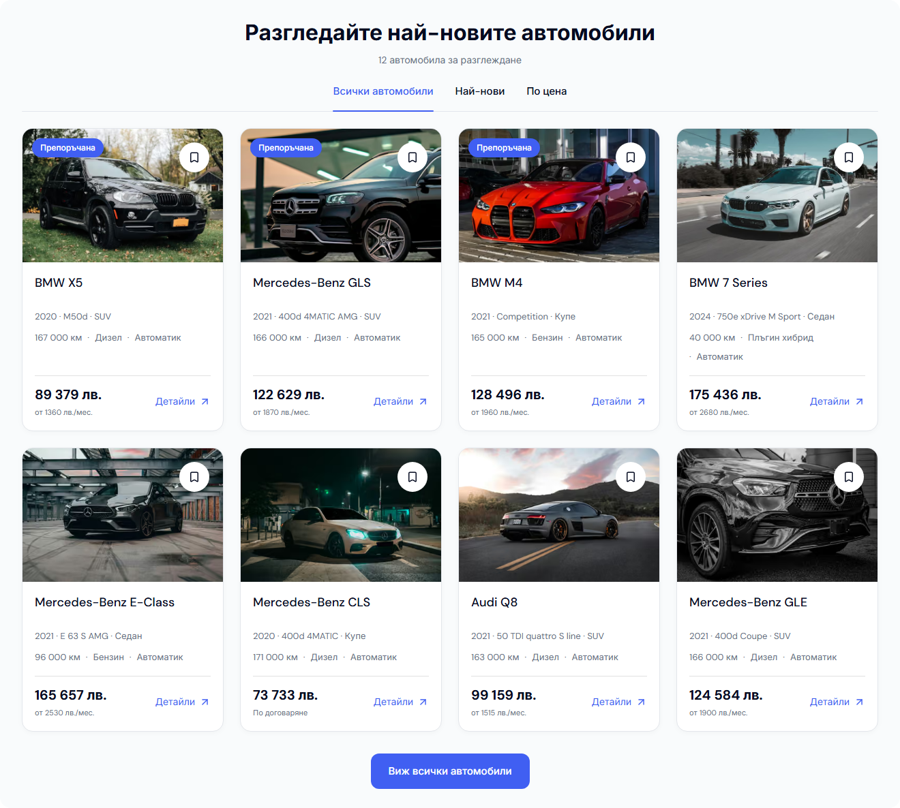
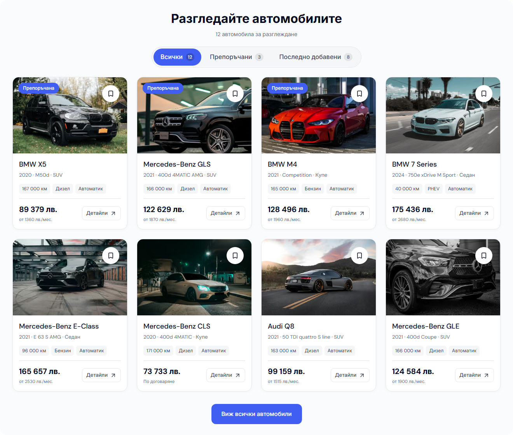

# Modern home stock polish — 3 October 2026

The desktop home stock section now filters in place, with larger tabs and tighter vehicle cards. The existing Boxcars composition, images, blue palette and price/monthly hierarchy are retained. This follows the [desktop audit](DESKTOP-BOXCARS-AUDIT-2026-10-03.md); its release holds remain separate from this local UI review.

## Behavior and ownership

- All / Recommended / Recently added replace the small links that opened the inventory page. Tabs use the existing Radix design-system component, including keyboard navigation, labelled panels, visible focus and a polite result announcement. View all cars remains the link to the full inventory.
- All twelve sample cars are explicitly used. New / Used are offered only when the supplied preview contains both condition badges. Recommended requires a proper promoted subset; Recently added uses actual publication dates. No condition is inferred from vehicle age or mileage. Counts are omitted for incomplete previews.
- `DealerDesktopStock` contains the interaction. Its parent discovery component, services and editorial content remain server-rendered. Listing data and localized/mounted links use the existing boundaries, without new provider dependencies.
- Desktop landing cards use small, quiet mileage/fuel/transmission badges. Existing compact fuel values avoid unnecessary wrapping; the full values remain available through tooltips and accessible labels. The first Bulgarian row at 1440px is **393px high, previously 445px**. The English row is 393px, previously 417px. Images retain their dimensions and crop.
- Details has a clearer outlined treatment within the existing card link. The price and monthly payment remain prominent. Desktop inventory/PDP and mobile card treatments are preserved.

## Verification

Canonical source is `L:/CODEX/cars/templates/modern`, on Cars `main`. Before frames use the previous reviewed implementation, commit `f615f5d485908a22d3410525914b0dbd9a8acb31`, on port 6482. The final production artifact is `.next-public-e2e-desktop-stock-final-20261003-demo`, build ID `EDsRT5-OvIdlVApiICEW2`, with Node 22.23.2, pnpm 11.4.0, Next.js 16.3.8, React 19.2.4 and Tailwind CSS 4.3.0.

| Check | Result |
| --- | --- |
| Formatting/lint, `pnpm check` | 1,108 files; no errors. |
| Workspace typecheck | 28 tasks succeeded; the final card API also passed the focused UI typecheck and final Next build TypeScript check. |
| Marketplace UI unit suite | 95 tests passed in 20 files. |
| Modern script/contracts suite | 98 tests passed. The server/client boundary contract includes the new stock component. |
| Architecture boundaries | 1,144 files in 30 packages; no issues. |
| Final production build | Passed. |
| Initial desktop browser regression | 28 tests passed in Chromium and WebKit. |
| Final focused desktop regression | All 6 cases passed again on the final build: BG/EN stock filtering and keyboard navigation, Home 10 composition/geometry, and narrow related-card/PDP checks in Chromium and WebKit. The initial 28-case suite was not repeated after the final compact fuel/contrast adjustments. |
| Automated accessibility | All three tab states in BG and EN: 6 checks, zero axe WCAG 2 A/AA and 2.1 AA violations. The active count badge contrast was corrected before this final run. |
| Desktop rendered checks | BG/EN Home at 1024, 1280, 1440 and 1920px, plus BG Cars/PDP at 1440px. Completed receipts report HTTP 200 and no overflow, application/console errors, broken images, empty buttons or duplicate IDs. Dedicated final stock captures wait for all eight images and loading skeletons to finish. |
| Mobile preservation | 7 before/after frames match pixel for pixel, including geometry/text: BG Home/Cars/PDP at 320 and 390px and Home at 1023px. No mobile component, style, image hint, source asset or runtime configuration changed in this follow-up. |

Mobile image acceptance used the existing optimized-image cache. A cold isolated Windows preview stalled on unchanged transparent PNG optimization; the actual browser requests were 48px, not the fallback 3840px `img.src`. The QA server was stopped before 72 missing cache entries were copied from the previous artifact, with SHA-256 verification and no overwrites or deletion. These frames prove preserved mobile rendering with retained cache, **not fresh cold optimizer performance or native/hosted acceptance**. The failed cold probes and cache-preservation receipt remain available in the ignored runtime directory.

## Evidence and release boundary

| Before, 1440px | After, 1440px |
| --- | --- |
|  |  |

[Compact verification receipt](assets/modern-desktop-stock-20261003/verification.json). Raw browser reports, full frames, pixel comparisons, build/check logs and image diagnostics are in `runtime/desktop-stock-polish-20261003/`.

The Cars release lock and dealers are unchanged. This evidence is a local review candidate; it does not fill exact-source native localization, mounted/public deployment or owner visual acceptance gates. The previous audit's remaining dependency advisory is not reclassified as resolved by this polish. Use the existing Cars release CLI to bind the committed candidate before promotion.

Only the stock/card implementation, relevant contracts/tests, shared count token, configuration guidance and this evidence are task-owned. Other Cars changes and the pre-existing untracked `docs/DESKTOP-HERO-CORRECTION-2026-10-03.md` are preserved.
