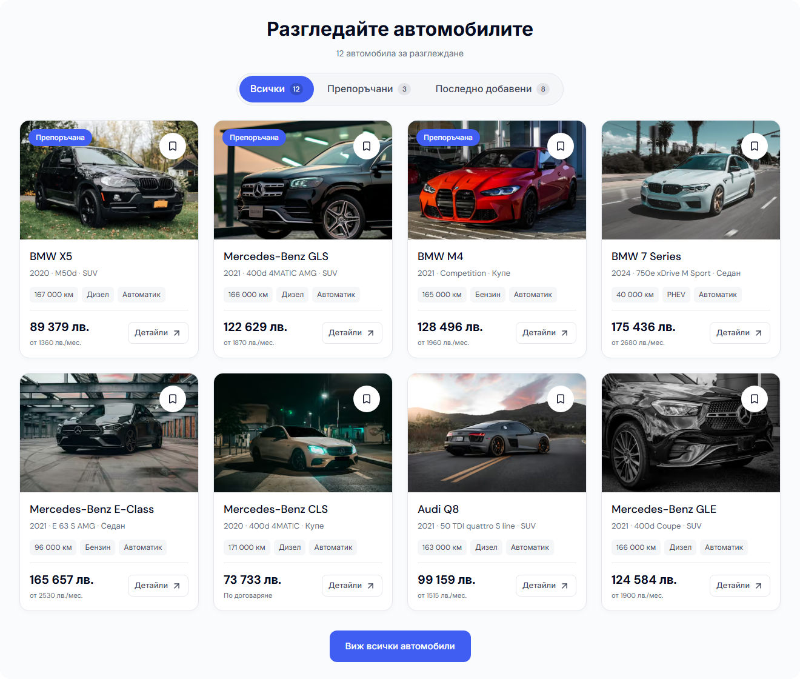

# Modern desktop stock rail — 3 October 2026

Bulgarian recent stock is now **Последни**. The home stock tabs use equal-width segments with one blue selector that slides between them. The existing filtering, card grid, price/monthly display and full-inventory link are preserved.

The indicator is decorative and positioned through the available view count and current view index. It uses the existing `--duration-interaction` token (160ms); reduced motion selects immediately. Radix continues to own tab semantics and keyboard navigation. No animation dependency or DOM measurement was introduced. Styling remains inside the desktop breakpoint.

## Verification

Before captures use Cars commit `629e23fead391fa3b0f853c19a988334f75bac2e`. The production output was rebuilt in the existing isolated demo directory, retaining its unchanged image cache. Final build ID: `2e5VMTmeihQACW_xfWUCI`. Runtime pins remain Node 22.23.2 / pnpm 11.4.0 / Next.js 16.3.8 / React 19.2.4 / Tailwind CSS 4.3.0.

| Check | Result |
| --- | --- |
| Production build and web TypeScript check | Passed. |
| UI and final E2E typechecks | Passed. |
| Formatting/lint | 1,108 files; no errors. |
| UI unit tests | 95 passed in 20 files. |
| Refactor contracts | 7 passed. |
| Release preflight contracts/tests | Contracts passed; 87 tests passed. |
| Desktop browser qualification | Four existing Home 10 and BG/EN filtering/keyboard cases passed in Chromium/WebKit. Both motion cases then passed on the final test rerun, including 1024/1440px movement, indicator alignment and reduced motion. |
| Rail geometry | 24 selected states across BG/EN and 1024/1280/1440/1920px; less than 1px alignment difference, no clipped labels or page overflow. A separate synthetic five-tab layout probe at 1024px also fits both languages; this is layout stress evidence, not native mixed-inventory acceptance. |
| Accessibility | All three selected states in both languages: six axe checks, zero WCAG 2 A/AA or 2.1 AA violations. |
| Mobile preservation | All seven before/after frames match exactly: BG Home/Cars/PDP at 320/390px and Home at 1023px. Card heights remain 393px at 1440px in both languages. |
| Rendered routes | BG/EN Home plus BG Cars/PDP at 1440px returned HTTP 200 without reported application/console errors, overflow, broken images, duplicate IDs or empty buttons. Dedicated stock screenshots wait for all eight images and skeletons to finish. |

The first motion probe used a programmatic click, which did not activate Radix's pointer handler. The final test uses real pointer input. The existing global reduced-motion rule represents an immediate duration as 0.01ms; the test verifies the actual immediate behavior rather than requiring one serialized CSS string. Earlier failed probes remain in runtime and are not counted as passes.

## Before / after

| Before | After |
| --- | --- |
|  |  |

[Verification receipt](assets/modern-desktop-rail-20261003/verification.json). Raw capture, movement, geometry, accessibility, build and check records are retained under `runtime/desktop-stock-polish-20261003/` with the `rail-` prefix.

This is local desktop evidence. The [previous stock review's retained-image-cache limit](DESKTOP-STOCK-POLISH-2026-10-03.md) and [desktop audit's release holds](DESKTOP-BOXCARS-AUDIT-2026-10-03.md) remain. No template release selection, native/mounted/hosted acceptance or dealer deployment is claimed. Other Cars work and the pre-existing untracked hero-correction note are preserved.
