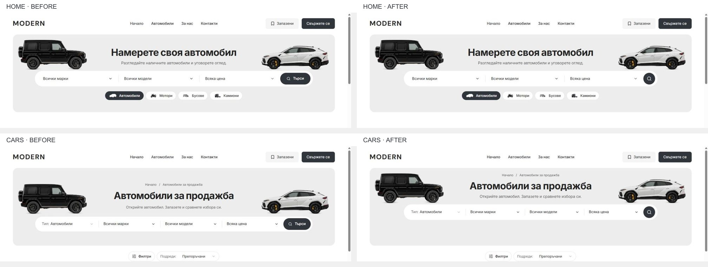

# Home and Cars discovery alignment — 5 October 2026

Implemented in the canonical Modern checkout on `main`, starting at `08c89d63f9e11939acd5b135ece4278252b80f43`. Local frontend refinement only. No template release or dealer publication.

## Result

Home and Cars already shared a centered 1140 px search bar. Cars added a breadcrumb above its heading and used a lower vehicle baseline, which moved its heading and search downward. Both pages now use one discovery heading grid and one control frame. The breadcrumb retains its own row on Cars; Home reserves that space without rendering a breadcrumb.

At a 1440 px viewport with the native browser's stable scrollbar gutter:

| Element | Home before | Cars before | Both after |
| --- | --- | --- | --- |
| Hero | 1320 × 320 px | 1320 × 320 px | 1320 × 320 px |
| Heading top | 140 px | 179 px | 140 px |
| Search top | 240 px | 289 px | 240 px |
| Search size | 1140 × 64 px | 1140 × 64 px | 1040 × 64 px |
| Search action | 123 × 48 px | 111 × 48 px | 48 × 48 px |
| Vehicle baseline within hero | 144 px | 188 px | 144 px |

The icon-only action retains the localized accessible name “Търси” / “Search” and visible keyboard focus. Home still applies its search draft; Cars still opens its keyword dialog. Home keeps its type pills and Cars keeps its Type field. Search width now comes from `--desktop-discovery-search-width`; the page-specific wrappers no longer repeat independent maximum widths.

Home's streamed loading hero now reserves the same heading and control space as the finished hero. Its placeholder capsule is 64 px high, and the overall hero stays 320 px high at both tested desktop widths.

## Changed source

- `packages/design-system/styles/desktop-tokens.css`
- `packages/marketplace-ui/components/dealer-desktop-hero.tsx`
- `packages/marketplace-ui/components/dealer-desktop-hero.module.css`
- `packages/marketplace-ui/components/dealer-desktop-discovery.module.css`
- `packages/marketplace-ui/components/dealer-desktop-toolbar.module.css`
- `packages/marketplace-ui/components/dealer-hero-search.module.css`
- `packages/marketplace-ui/components/dealer-inventory-search.tsx`
- `apps/e2e/specs/desktop-panel-flows.spec.ts`
- `docs/QA.md`

The prior charcoal palette, approved vehicle cutouts, About FAQ container and generated About/Contact showroom artwork remain intact. Mobile presentation rules are unchanged.

## Verification

- Native in-app browser: Home/Cars in BG/EN at 1024, 1280, 1440 and 1920 px. All 16 settled views have a 320 px hero, matching heading/search positions and no horizontal overflow. Screenshots and measurements are in [the capture folder](discovery-alignment-2026-10-05/).
- Matched Home/Cars mobile captures at 320, 390 and the 1023 px boundary: all six geometry records are identical before/after, with no horizontal overflow. The 1023 px screenshots are pixel-identical. Photographic pixels vary in the 320/390 captures, so these are visual and geometry preservation evidence rather than full pixel identity; raw comparisons are retained.
- Native keyboard: Home Search navigates to Cars; Cars Search focuses the keyword input, and Escape returns visible focus to its icon button. Fresh Home/Cars navigation produced no new console errors.
- Scoped Biome: 8 files pass. Final test-file formatting/lint also passes.
- `pnpm refactor:contracts`: 7/7 pass.
- `pnpm release:preflight:contracts`: pass.
- `pnpm release:preflight:test`: 87/87 pass.
- Production build and web typecheck pass. Final isolated output: `.next-public-e2e-discovery-alignment-20261005-demo`, build ID `__p0y8CLuVOqEsnWlzdpH`.
- Initial production browser run: 28/30 pass across Chromium/WebKit. The two WebKit 1024 px failures were exact-equality assertions on a 0.015625 px horizontal button rounding difference. The corrected assertion allows 0.05 px horizontal rounding while keeping width, height and vertical position exact.
- Final production browser run: 6/6 pass across Chromium/WebKit, covering both locales at 1024 px and the actual server-rendered Home loading fallback at 1024/1440 px. The loading check freezes the real streamed HTML before React replaces it and compares its frame and capsule to the finished page.

Logs, preimages, initial failure traces, final browser results, source hashes and a task-only patch are retained in `runtime/discovery-alignment-20261005/`.

## Git and runtime boundary

The existing zero-byte `L:/CODEX/cars/.git/index.lock`, dated 2026-10-05 02:43:04 UTC, prevents scoped commit/push. It was preserved; no alternate index or lock bypass was used. Unrelated staged, unstaged and untracked work remains intact. Source is implemented and locally verified, with commit/push still pending release of that existing lock.

The user's development server remains at `http://127.0.0.1:6482/bg`, PID 48868. The task's separate production verification server on 6498 is stopped after testing. Native verification and passing local builds do not constitute owner visual acceptance or hosted release evidence.
