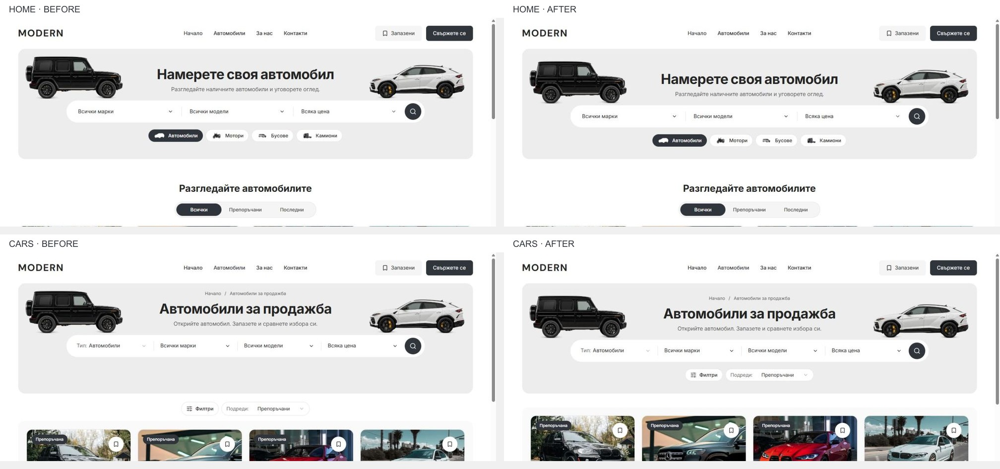

# Discovery hierarchy — 5 October 2026

Home and inventory keep the approved cutout artwork, neutral 320 px banner, centered 1040 px search capsule and charcoal search action. The interior breadcrumb provides page context; 32 px top padding now gives the breadcrumb/title group more breathing room. Heading, search and artwork positions moved down 14 px together, preserving Home/Cars alignment.

Inventory keeps Type, Make, Model and Price in the main search capsule. Its existing Filters/Sort controls now form a centered 36 px secondary row inside the banner, 20 px below search. The results panel starts 40 px below the banner. This establishes context → search → refinement → results without a separate toolbar between banner and listings. Existing filter state, menus, announcements and the floating View menu remain shared.

## Source and preservation

Task changes are limited to `dealer-desktop-hero.module.css`, `dealer-desktop-toolbar.tsx` and its CSS, `dealer-inventory-summary.tsx`, `dealer-inventory.module.css`, two existing desktop browser specs and `QA.md`. Style changes remain inside the desktop breakpoint. No artwork, inventory data, mobile layout or controller was replaced.

The canonical checkout is `L:/CODEX/cars` on `main`, with base HEAD `08c89d63f9e11939acd5b135ece4278252b80f43`. Prior staged, unstaged and untracked work is preserved. Task preimages, a scoped diff and source hashes are saved under ignored `runtime/discovery-hierarchy-20261005/`.

## Verification

- Production demo build and web TypeScript check passed using Node 22.23.2 and pnpm 11.4.0. Build ID: `h64Z5Z761QpFOpV8h3sZ2`; isolated output: `apps/web/.next-public-e2e-discovery-hierarchy-20261005-demo`.
- All 18 focused Chromium/WebKit cases passed against that output in BG/EN. They cover Home/Cars frame alignment at 1024/1440 px, the actual streamed Home loading frame, the banner controls and floating View menu, plus overlay geometry and restored focus at 1024/1440/1920 px with visible scrollbars.
- Scoped Biome passed for seven source/spec files; 7 refactor contracts, preflight contracts and 87 preflight tests passed. Scoped `git diff --check` passed.
- Native browser review covered BG Home/Cars at 1024/1280/1440/1920 px and EN at compact desktop widths. The 1440 px frame is y90/h320, title y154/h48, search y254/h64 and refinement y338/h36. Inventory results begin at y450. No observed horizontal overflow.
- All six native Home/Cars layout measurements at 320/390/1023 px match their task preimages exactly, including page height and card positions. Matched screenshot dimensions also agree; raw screenshot pixels differ, so this is geometry preservation evidence, not a claim of pixel identity.
- The final fresh BG Cars document reported no browser errors. The earlier development log retains prior HMR chunk errors; it is not a clean-history claim.

## Evidence and delivery boundary

[Native measurements](discovery-hierarchy-2026-10-05/mobile-after.json) and [pixel comparison](discovery-hierarchy-2026-10-05/mobile-pixel-comparison.json) accompany the before/after PNGs. Full browser results and build/check logs are in the task runtime folder.

The user's development server remains available at `http://127.0.0.1:6482/bg/cars`. The temporary production QA server is stopped after verification. No template promotion or dealer deployment occurred.

Scoped commit/push remains blocked by the pre-existing `L:/CODEX/cars/.git/index.lock` (zero bytes; last write 2026-10-05 02:43:04 UTC). The lock was preserved. Once its owner releases it, recheck shared source status and commit/push only the reviewed task changes; no index recovery or blanket staging is authorized.
