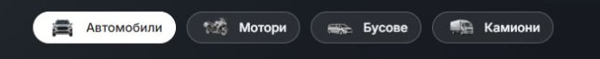
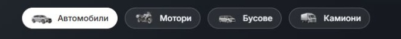

# Discovery pill orientation — 6 October 2026

The initial silver thumbnail set mixed a straight-on car with right-facing angled motorbike, van and truck assets. Home and Cars now use a right-facing, front three-quarter silver SUV for the car pill. The other three thumbnails are unchanged.

`packages/marketplace-ui/components/dealer-vehicle-type-pills.tsx` changes only the car artwork URL to `/images/categories/discovery-pill-car-v2.webp`. Labels, button semantics, category controllers, desktop CSS, 36 px pill height, 36 × 24 px artwork slots and 12/24 px spacing remain intact. Mobile styling and artwork remain intact; the desktop pill group stays hidden below 1024 px.

The new car is a generated silver edit of the existing angled category SUV, using the existing silver van as the finish/viewpoint reference. Its original PNG and prompt are preserved in [provenance](../provenance/assets/discovery-pill-car-right-v2/README.md). Transparent margins are cropped before a proportional thumbnail resize. The new car derivative is 3,244 bytes; the active four assets total 12,890 bytes. Existing source images and the earlier car derivative remain preserved. [Asset manifest](assets/DISCOVERY-PILL-ORIENTATION-2026-10-06.json) records source/output hashes and unchanged companion assets.

| Before — mixed viewing angles | After — all facing right |
| --- | --- |
|  |  |

Matched Home comparisons, uncropped desktop screenshots, mobile baselines and after captures are in [the evidence folder](discovery-pill-orientation-2026-10-06/). Native screenshots use the same capture dimensions within each pair; viewport labels refer to logical browser widths.

Verification passed:

- Eight BG/EN Home/Cars desktop views at 1024/1440 px: four loaded 36 × 24 px images, preserved pill heights and spacing, and no overflow.
- Four matched BG Home/Cars mobile pairs at 320/390 px: identical recorded page height and control geometry, hidden desktop artwork and no overflow. This is layout preservation evidence, not a claim of pixel-identical JPEGs. [Measurements](discovery-pill-orientation-2026-10-06/measurements.json) and [results](discovery-pill-orientation-2026-10-06/verification.json).
- Home Motorbikes selection stays a draft on `/bg`, with the car thumbnail loaded in its inactive glass pill. No fresh browser errors occurred. [Behavior](discovery-pill-orientation-2026-10-06/behavior.json).
- Scoped Biome passed. Refactor contracts passed 7/7; release-preflight contracts passed; release-preflight tests passed 87/87. Scoped `git diff --check` passed. Companion thumbnail hashes are unchanged.

Task preimages are preserved under ignored `runtime/discovery-pill-orientation-20261006/preimages/`. Existing shared dirty work is preserved. This is a local preview correction; no new production build, commit, release selection or dealer deployment was performed.
