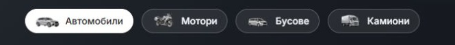

# Discovery pill artwork scale — 6 October 2026

The van looked smaller than the motorbike because each source image was fitted into the same 36 × 24 px box despite different silhouettes and almost-transparent stray pixels outside the vehicle. The old van thumbnail's visible body measured about 27 × 13 px. Home and Cars now crop to the actual visible vehicles and use a shared 44 × 24 px artwork slot: the van reads at about 43 × 20 px beside the motorbike's 30 × 23 px. The wide car and van use more width while the taller bike and truck use more height; the tyres share one baseline. Vehicle proportions and the right-facing viewpoints are preserved.

Source changes are confined to `packages/marketplace-ui/components/dealer-vehicle-type-pills.tsx` (four thumbnail URLs and intrinsic dimensions) and the desktop-only `.categoryArtwork` width in `dealer-hero-search.module.css`. Pill height stays 36 px, image/text gap stays 8 px, between-pill gap stays 12 px and the row stays 24 px below search. Wider artwork slots add 8 px to each pill's width. Category labels, native selection semantics, controllers and focus styling are preserved.

The four new 132 × 72 px transparent WebP derivatives total 19,002 bytes. Cropping uses source alpha greater than 8 to exclude near-invisible margins, preserves original pixels inside the crop, then scales proportionally into a 128 × 68 px box with 2 px padding and bottom alignment. The original master images and preceding thumbnails remain intact. [Asset manifest](assets/DISCOVERY-PILL-SCALE-2026-10-06.json) records bounds, visible sizes and source/output hashes. The existing generated SUV provenance remains in [its source folder](../provenance/assets/discovery-pill-car-right-v2/README.md); no new artwork was generated for this sizing correction.

| Before — undersized van | After — balanced visible scale |
| --- | --- |
|  |  |

Matched Home comparisons, uncropped captures and the selected white van pill are in [the evidence folder](discovery-pill-scale-2026-10-06/).

Verification passed:

- Eight BG/EN Home/Cars desktop views at 1024/1440 px: four loaded 44 × 24 px images, preserved 36 px pill height and 12/24 px spacing, and no horizontal overflow.
- Six matched BG Home/Cars pairs at 320/390/1023 px: identical recorded page heights and control geometry, hidden desktop artwork and no overflow. This is layout preservation evidence, not a claim of pixel-identical JPEGs. [Measurements](discovery-pill-scale-2026-10-06/measurements.json) and [results](discovery-pill-scale-2026-10-06/verification.json).
- Home Vans selection remains a draft on `/bg`, with the correct selected white pill. No fresh browser errors appeared. [Behavior](discovery-pill-scale-2026-10-06/behavior.json).
- Scoped Biome passed. Refactor contracts passed 7/7; release-preflight contracts passed; release-preflight tests passed 87/87. Source hashes and all new derivative hashes verified. Scoped `git diff --check` passed.

Preimages are preserved under ignored `runtime/discovery-pill-scale-20261006/preimages/`; prior shared work remains intact. This is a local preview update with no new production build, commit, template release or dealer deployment.

Capture preservation note: the subsequent car-perspective pass accidentally reused this capture helper's closed-over directory and overwrote the uncropped `before-*`/`after-*` screenshots here. The original cropped comparisons, measurements, verification results and selected-van capture remain intact. The overwritten raw screenshots now show the later car-pose comparison and were copied to [its correct evidence folder](discovery-pill-car-pose-2026-10-06/). They must not be treated as the original scale-pass raw captures.
