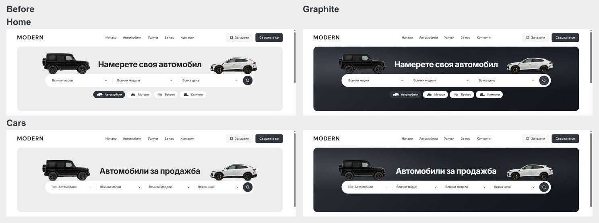

# Graphite discovery banners — 5 October 2026

Home and Cars replace the flat grey discovery surface with a graphite gradient. Two subtle radial highlights sit behind the original vehicle cutouts, with lighter shading behind the black G-Class. The headline uses off-white, the search capsule remains white, and category-pill focus uses a light ring. There is no pure-black fill or asset regeneration.

The new dark surface/background/foreground tokens live in `packages/design-system/styles/desktop-tokens.css`. `dealer-desktop-hero.module.css` applies them only to the desktop vehicle appearance. About/Contact and the other neutral banners retain their existing surface. The existing 320 px height, respective Home/Cars centering, vehicle spacing, centered results controls and fixed chip strip are unchanged.

Focused live BG/EN checks passed for Home/Cars at 1024 and 1440 px: 320 px banner, Home search y226, Cars search y254, off-white title, intact loaded artwork and no horizontal overflow. Home/Cars mobile body/heading/document geometry remained equal at 320/390/1023 px. Scoped CSS Biome and diff whitespace checks passed. This paint-only change used the live development build; a new production build and Playwright suites were not run.

Before/after screenshots and geometry: `docs/graphite-discovery-2026-10-05/`. Exact CSS preimages and incremental patches: ignored `runtime/graphite-discovery-20261005/`. Existing dirty work and the Git index lock are preserved; scoped commit/push remains blocked. No promotion or publication occurred.

