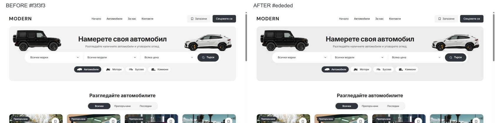

# Discovery hero surface and dev restart — 5 October 2026

Home and Cars now use the approved slightly darker `#ededed` discovery surface, changed from `#f3f3f3` through `--desktop-discovery-surface` in `packages/design-system/styles/desktop-tokens.css`. The white page/search/cards and existing charcoal actions remain as reviewed. The approved cutout assets are unchanged.

Both old local listeners had stopped. The actual app is running again in Next.js development mode at `http://127.0.0.1:6482/bg`, bound to localhost. Node 22.23.2 and pnpm 11.4.0 are used with the existing static-demo environment. The task launcher is `runtime/hero-surface-20261005/start-dev.ps1`; its isolated output is `.next-public-e2e-hero-surface-dev-20261005-demo`. At closeout, the listener is PID 48868. The obsolete static proposal on 6490 is not needed to view the implemented app.

Verification for this surface change:

- Home and Cars render `rgb(237, 237, 237)` at 1440 × 1000; both banners retain their 320 px height and both original vehicle images load. No horizontal overflow.
- Home and Cars at 320/390 × 844 and 1023 × 1000 preserve the measured geometry of the preceding cutout implementation. All six comparisons pass without horizontal overflow; screenshots and `mobile-checks.json` are adjacent to this report.
- The normal browser viewport is restored to 1280 × 720 on the live BG homepage. No captured browser console errors.
- Scoped Biome check passes; refactor contracts: 7 passed; release preflight contracts pass; preflight tests: 87 passed.

This change is compiled and checked in the live development server. The preceding [cutout implementation](HOME-CUTOUTS-2026-10-05.md) records its production build and wider browser qualification; those are not rerun or claimed for this one-value CSS refinement.

Task preimages and command logs are preserved in ignored `runtime/hero-surface-20261005/`. The generated `next-env.d.ts` is restored to its saved pre-start state. Existing unrelated edits are preserved. The pre-existing zero-byte `L:/CODEX/cars/.git/index.lock`, dated 02:43:04 UTC, remains untouched and prevents a scoped commit and push. No template release, dealer deployment or provider change was performed.
