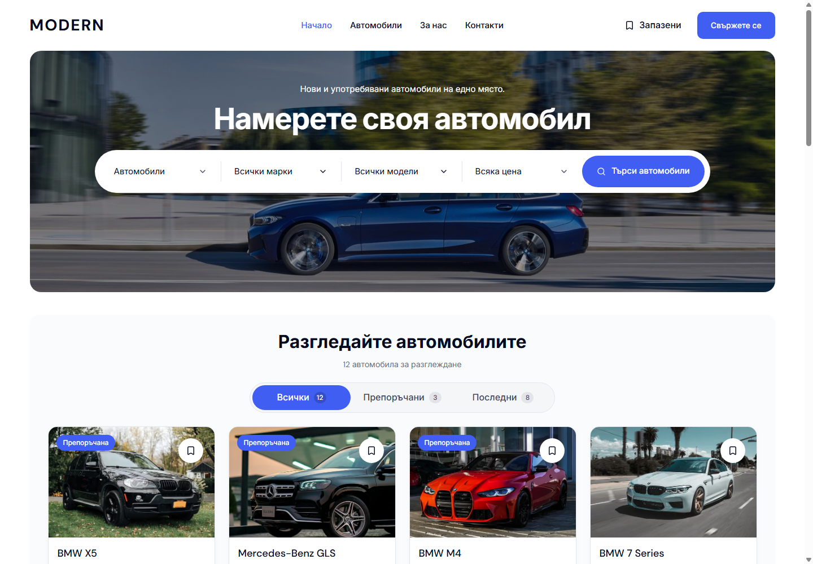
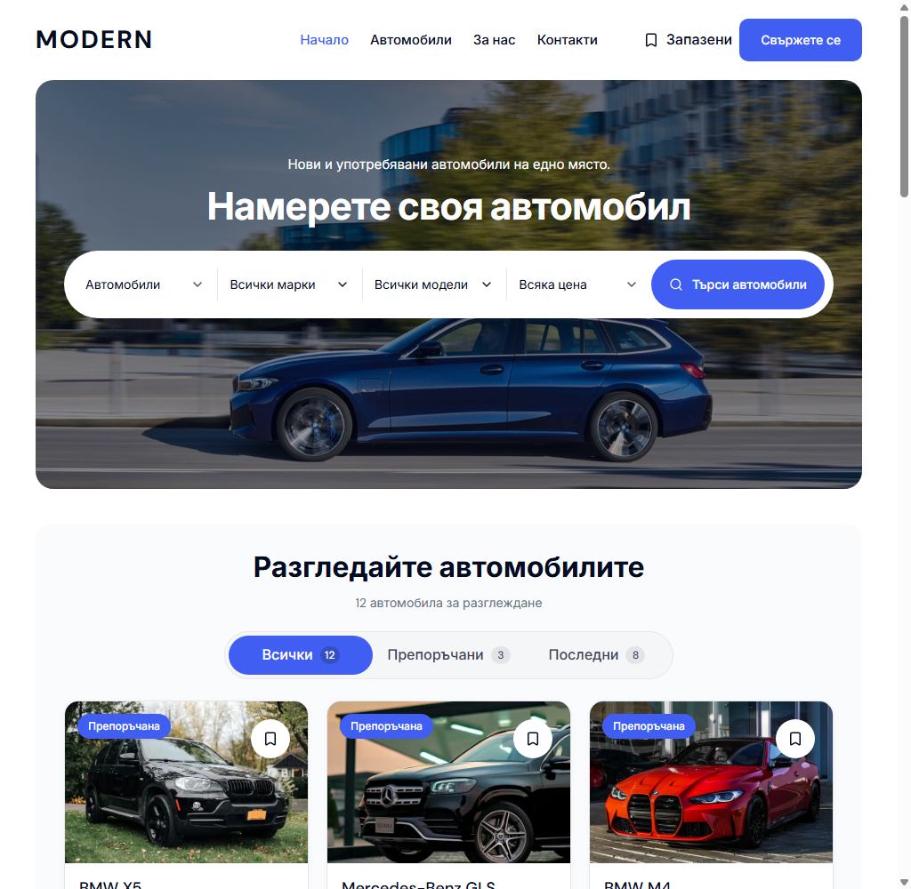
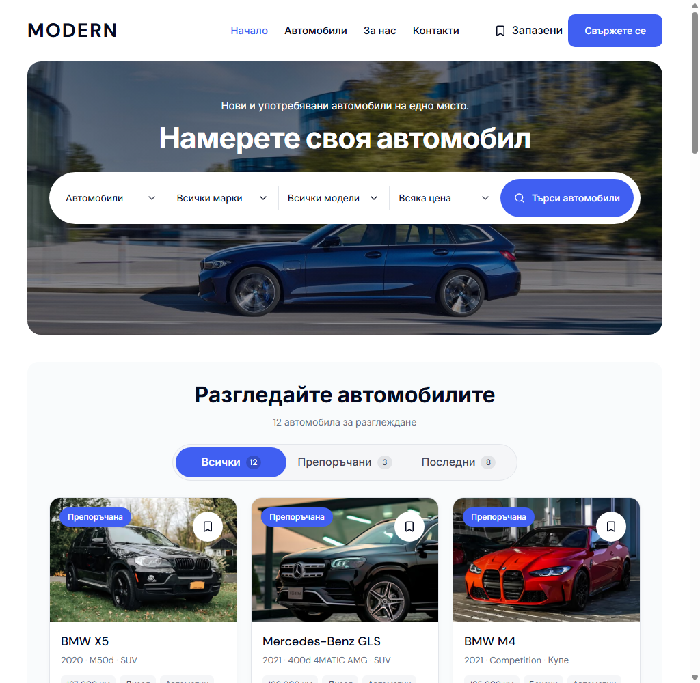

# Compact desktop Home banner — 5 October 2026

The desktop Home banner now uses a 400–440 px height range instead of 460–520 px. Its headline caps at 52 px instead of 60 px. The 76 px search bar, configured photograph, 1320 px frame and stock composition remain intact. A Home-only background position keeps both wheels visible in the shorter crop.

At 1440 px with the visible OS scrollbar, BG and EN measure a 427.5 px banner and a first card starting at 755.5 px. The previous banner measured 520 px, so the stock appears 92.5 px sooner. At 1024 and 1280 px the banner is 400 px; at 1920 px it is 440 px.

| 1440 px before | 1440 px after |
| --- | --- |
|  |  |

| 1024 px before | 1024 px after |
| --- | --- |
|  |  |

## Verification

- Node 22.23.2 and pnpm 11.4.0: production web build, web typecheck and scoped Biome passed.
- Required refactor and release checks passed: 7 refactor contract tests, 87 release preflight tests and release preflight contracts.
- Chromium and WebKit: 14 accepted Home frame/search cases across BG/EN and 1024/1440/1920 px. Ten passed initially. Four 1440 px cases passed after updating an inherited assertion that measured the former inline View toolbar; the current assertion verifies sidebar/card alignment. No application change was needed for that assertion.
- Matched captures: 18 before and 18 after, covering BG/EN Home at 320, 390, 1023, 1024, 1280, 1440 and 1920 px, plus Cars and Leasing at 1440 px. No page errors, console errors or horizontal overflow were recorded.
- Ten preservation comparisons passed. Eight are pixel-identical; BG Home at 390 and 1023 px differ only by 21 and 7 edge pixels respectively, with maximum channel difference 5. Cars and Leasing are pixel-identical in both locales.
- Canonical local preview at `http://127.0.0.1:6482`: BG/EN Home returned HTTP 200 with a 427.5 px banner, 52 px headline, 76 px search bar and first card at 755.5 px, without recorded errors.

[Verification receipt](assets/modern-home-banner-compact-20261005/verification.json) contains the build ID, source hashes, browser reports, capture geometry and preservation results. The changes use the desktop landing variant; mobile and other banner variants retain their earlier presentation. The generated `apps/web/next-env.d.ts` preimage was preserved.

This verifies the local reusable master. Template release selection, dealer deployment and owner visual acceptance remain separate.
