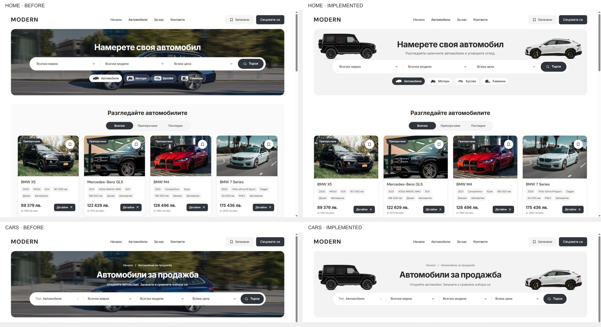

# Home and Cars discovery cutouts — 5 October 2026

The owner accepted the light cutout proposal and requested implementation. Home and Cars now use that composition in the reusable Modern source and the main local production preview at `http://127.0.0.1:6482/bg`.

## Result

The 320 px discovery banner retains the existing shared frame and search controls. Its neutral surface carries dark headings and supporting copy, with the original Import G-Class and Urus facing inward above the search capsule. Home adds “Разгледайте наличните автомобили и уговорете оглед.” and the equivalent English sentence, without a breadcrumb. Cars retains its breadcrumb and inventory context. Charcoal primary actions and selected type controls use the existing brand tokens; other type buttons use white and grey.

Home stock now sits on the white page without its grey wrapper or extra side padding. Card edges align with the banner, and their responsive image hints account for the wider cards. Stock tabs, View all cars, inventory drafts, filters and route behavior remain owned by the existing components.

The complete vehicle pair is configurable through `artwork.desktopDiscoveryVehicles`; each source has validated dimensions, wheel baseline and optional mirroring. Explicitly personalized legacy photography/cutouts retain their existing behavior. About and Contact keep their photographic mastheads. Both new sources and preloads use a 1200 px media condition, with inline image fallbacks below that width.

The two WebP files are byte-identical copies of the approved Import artwork. Their paths, dimensions, presentation metadata and SHA-256 hashes are in [asset provenance](../provenance/assets/desktop-discovery-cutouts-v1/assets.json). No image generation or asset editing was performed for this implementation. The rejected generated proposal remains preserved in the preceding design evidence.

## Actual evidence

Desktop screenshots are matched at a verified 1440 × 1000 browser viewport. The final after screenshots come from the main `6482` origin; the candidate browser checks and mobile comparisons use the same production build on `6499`. Both final banners measure 320 px, both cutouts load at their original 1000 px width, and the native browser reports no console errors or horizontal overflow.

Matched Home/Cars captures at 320/390 × 844 and 1023 × 1000 preserve identical measured header, heading and vehicle-card geometry and document height. All six views have no horizontal overflow and select the inline decorative-image fallback. [Geometry comparison](home-cutouts-2026-10-05/mobile-comparison.json), [before](home-cutouts-2026-10-05/mobile-before.json), [after](home-cutouts-2026-10-05/mobile-after.json) and the adjacent screenshots retain the evidence. Pixel comparisons are recorded separately and are not used as a substitute for geometry checks.

## Qualification

- Node 22.23.2 and pnpm 11.4.0; complete existing workspace.
- Production `pnpm --filter web build`: passed. Build directory `.next-public-e2e-home-cutouts-20261005-demo`; build ID `5wEVNdC0sNU7w9G-3qLT0`.
- `pnpm --filter web typecheck`: passed. Generated `next-env.d.ts` was restored to the preceding saved state.
- Focused `@repo/marketplace` site-configuration tests: 29 passed, including complete custom pairs, invalid source geometry/paths, explicit opt-out and legacy artwork precedence.
- `pnpm refactor:contracts`: 7 passed.
- `pnpm release:preflight:contracts`: passed.
- `pnpm release:preflight:test`: 87 passed.
- Scoped Biome check of 13 changed TS/TSX/CSS files: passed.
- Existing Chromium/WebKit shared-frame, Home type routing, stock keyboard and inventory-draft cases: 26 passed (13 per engine).

The shared-frame suite covers BG/EN at 1024, 1280, 1440 and 1920 px and traverses Cars, Sell, Leasing, Imports, Contact, About, Guides and Terms. It retains the photographic About/Contact assertions and checks frame alignment, search height, stock image sizing and Quick/Sidebar layout switching. The other selected cases check type routing with unapplied search choices, stock tab keyboard browsing, and inventory draft cancellation/focus restoration.

Task-local commands, logs, preimages, source hashes and the task-only diff are preserved in ignored `runtime/home-cutouts-20261005/`. The source changes are limited to the shared artwork schema/defaults/adapter, desktop hero/search/stock presentation, image-size hints, the existing browser assertions and the relevant documentation. Existing unrelated drafts were preserved.

Changed source paths:

- `packages/marketplace-domain/site-config.ts`; `packages/marketplace/{site-artwork.ts,site-config.ts,site-config.test.ts}`.
- `packages/marketplace-ui/components/{dealer-desktop-hero.tsx,dealer-desktop-hero.module.css,dealer-desktop-discovery-hero.tsx,dealer-desktop-toolbar.tsx,dealer-hero-search.module.css,dealer-desktop-discovery.module.css,dealer-desktop-stock.tsx}`; `packages/design-system/styles/desktop-tokens.css`.
- `apps/e2e/specs/desktop-panel-flows.spec.ts`; the two new `apps/web/public/images/desktop/desktop-hero-*-profile-v1.webp` assets and `provenance/assets/desktop-discovery-cutouts-v1/`.
- `TEMPLATE.md`, `docs/QA.md`, `docs/SITE-CONFIGURATION.md`, this report and its screenshot/measurement directory.

## Source and release boundary

The checkout remains `L:/CODEX/cars` on `main`, at `08c89d63f9e11939acd5b135ece4278252b80f43`. Fetch and inspection found no remote drift before implementation. The pre-existing zero-byte `.git/index.lock`, dated 5 October 2026 02:43:04 UTC, still prevents a scoped commit and non-force push. It was preserved; no index workaround, blanket staging or history changes were used.

This records local source/build/browser qualification. No template release selection, dealer regeneration, hosting publication or provider change was performed.
