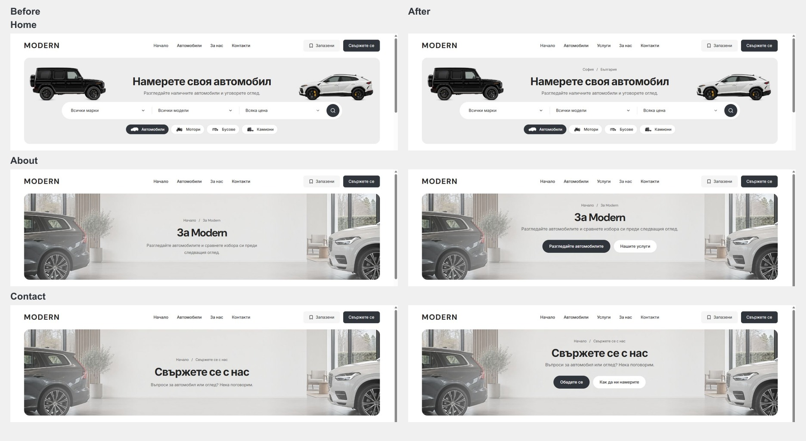
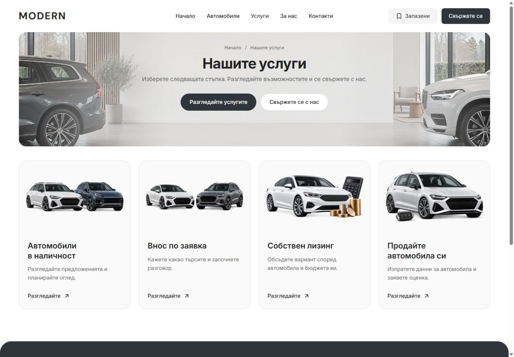

# Mastheads, Services and hover states — 5 October 2026

Desktop banners now share context → title → supporting copy → controls. Home/Cars keep search; other banners have relevant primary and secondary links. The charcoal primary action and white secondary action are both 48 px tall, without glows or shadows. About links to inventory and Services. Contact links to the configured telephone number and map. Existing gallery, FAQ and local form behavior are retained.

Home shows the configured city/country in the same typography as the other breadcrumb rows. The demo reads “София / България”. It uses the existing dealer copy boundary, so personalization supplies the real location. Secondary Home category pills and Cars Filters/Sort controls keep their white surface on hover and gain a stronger border; selected categories retain the configured charcoal fill.

The service catalogue has moved out of About into localized `/services` pages. Four default cards use existing artwork and point to the enabled inventory, imports, leasing and selling flows. The page includes metadata, sitemap integration and desktop/mobile navigation. Its availability and individual cards follow the existing dealer service capabilities. Previous About artwork and provenance are preserved.

## Source boundary

The shared hero component and CSS own the context/action layout. About/Contact supply their destinations; the Services route supplies its card grid. Header, mobile menu and both footers expose Services. Public route access and sitemap generation use the existing capability boundary. The header now selects Cars only on inventory/detail routes, preventing two active links on Services.

Task changes span the shared hero/search/inventory styles, About/Contact, navigation/footer components, the Services route, site configuration and its tests, two browser specs, `TEMPLATE.md` and `docs/QA.md`. Exact task preimages, hashes and the task-only patch are under ignored `runtime/home-location-hover-20261005/`. Earlier dirty source and work elsewhere in Cars are preserved.

## Verification

- Final static-demo production build and web TypeScript check passed using Node 22.23.2 and pnpm 11.4.0. Build ID `PPEYT5kewc1OjVh_nsHVv`; isolated output `apps/web/.next-public-e2e-home-location-hover-20261005-demo`.
- All 10 focused Chromium/WebKit cases passed across BG/EN: desktop context and control geometry at 1024/1440 px, white hover surfaces and stronger borders, CTA destinations, Services navigation/cards, mobile 320/390 px behavior and the streamed Home loading frame. Eight cases passed in the initial run; the two BG cases passed on rerun after correcting an assertion to allow the Imports subtitle to wrap. Original failure evidence is preserved.
- Home/Cars search starts at y254 with height 64; Home, Cars, About, Contact and Services titles start at y154. Shared desktop frames are 320 px tall, and About/Contact/Services action rows start at y254. Controls maintain 20 px below supporting copy; BG Imports naturally moves its row to y278 when the subtitle wraps at 1024 px.
- Native BG Guides, Privacy and Terms also retain y90/320 px frames, y154 titles and two 48 px actions at 1440 px, without horizontal overflow. Measurements are in `home-location-hover-2026-10-05/remaining-mastheads.json`.
- All six native Home/Cars geometry records at 320/390/1023 px match the prior task preimages exactly, with no horizontal overflow. This confirms geometry preservation, not raw pixel identity. Services fits at 320/390 px; desktop-only Contact action markup stays hidden below 1024 px.
- Scoped Biome passed for 19 source/spec files, including the corrected browser assertion. All 30 dealer-configuration tests, seven refactor contracts and preflight contracts passed. Scoped `git diff --check` passed.
- The final fresh Services document reported no browser errors. Historical HMR chunk errors remain in the earlier development logs.

## Visual evidence

[Mobile geometry comparison](home-location-hover-2026-10-05/mobile-comparison.json) and [fresh console evidence](home-location-hover-2026-10-05/fresh-console.json) accompany the native screenshots. Production browser results, original diagnostics and build/check logs remain in the task runtime folder.

## Delivery boundary

The user's development server remains on `http://127.0.0.1:6482/bg/services`. The temporary production QA server is stopped after verification. No dealer deployment or template promotion occurred.

Scoped commit/push remains blocked by the pre-existing `L:/CODEX/cars/.git/index.lock` (zero bytes; last write 2026-10-05 02:43:04 UTC). The lock is preserved. Once its owner releases it, recheck shared source and commit/push only the reviewed task changes; do not stage the broader dirty tree or recover the index without coordination.
