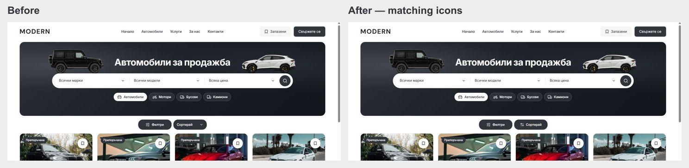

# Matching results control icons — 5 October 2026

Filters and Sort now use the same icon-and-label treatment: an 18 px Lucide leading icon, 2 px stroke, 8 px text gap and centered content in the existing 144 × 44 px controls. Filters uses SlidersHorizontal; Sort uses ArrowUpDown. The redundant trailing sort chevron is hidden locally. The selected sort label still truncates with an ellipsis, with the full label in its title and dropdown.

Live local inspection at 1440 px confirmed one visible 18 × 18 px icon per control, matching dimensions/gaps/strokes, intact default labels and truncated “Най-нисък пробег.” Keyboard Space opened the sort dropdown, selecting a sort value worked, and Escape restored trigger focus. Scoped Biome, all seven refactor contracts and web TypeScript passed. Automated Playwright suites and a production build were not run for this decoration change.

Matched before/after screenshots and measured geometry are in `docs/results-control-icons-2026-10-05/`. Exact source preimages, incremental patches and logs are in ignored `runtime/results-control-icons-20261005/`. Other dirty work and the existing Git index lock are preserved. The lock still prevents commit/push. No deployment or promotion occurred.

