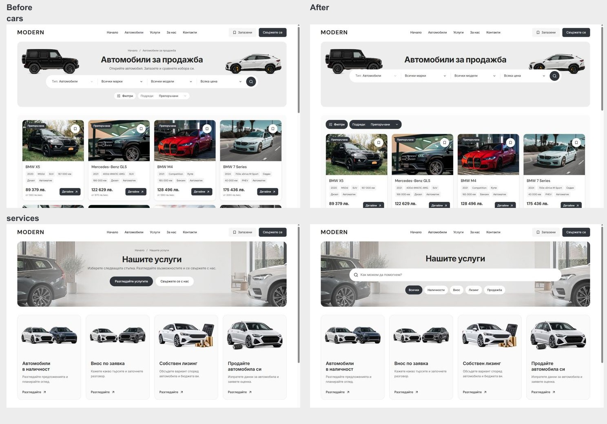
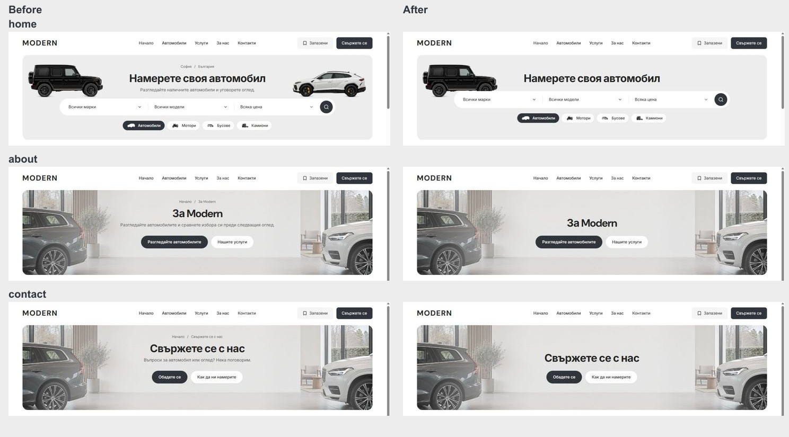

# Results and Services refinement — 5 October 2026

Implemented the owner's latest hierarchy feedback in the reusable Modern master. The live preview remains at http://127.0.0.1:6482/bg/services.

## Result

- Desktop banners are title-led, without breadcrumbs, location rows or subtitles. Home/Cars keep the same title at y154 and 64 px search at y226 in a 320 px banner, retaining the original G-Class/Urus cutouts.
- Charcoal 44 px Filters/Sort controls now sit directly above the cards, in the same toolbar as removable applied-filter chips. Chips wrap at 1024 px; the existing URL, draft/apply, sorting and View behavior is reused. The sort chevron inherits the white foreground.
- About/Contact center the title and 48 px CTA group: the group runs from y190 to y310 around the banner midpoint y250. The showroom backdrop, About gallery and Contact destinations remain intact.
- Services has a live text search and quick pills for server-enabled offerings only. Search combines with the selected service, matches title/description/label without case sensitivity, announces the result count, supports clearing with focus restoration, and offers a reset from its empty state. Existing server-rendered artwork/cards link to the existing inventory/import/lease/sell flows.

## Verification

The final static-demo production build and web typecheck passed with Node 22.23.2 and pnpm 11.4.0. Output: `apps/web/.next-public-e2e-results-services-20261005-demo`; build ID `-kl442h31__MgW-_br-jz`. All 94 refactor/preflight contract tests and the preflight contract report passed. Scoped Biome and diff whitespace checks passed. `apps/web/next-env.d.ts` retains SHA256 `20743ED54E297439DBED7F7B04CB24416E298AB74B5EE291164F32F78687DAE8`.

In-app browser checks covered BG/EN Home, Cars, Services, About and Contact at 1440 px. Cars/Services additionally fit 1024/1280/1920 px without overflow. The live development preview passed filter opening, Escape focus restoration, BMW draft/apply and chip removal, six sort options and URL sorting, plus five applied chips wrapping at 1024 px. Services search, pills, clear, and empty/reset were exercised on desktop and 320/390 px mobile in BG/EN; final production checks repeated English service search/pill/reset and mobile BG/EN filtering/clearing.

All six Home/Cars records at 320/390/1023 px match the earlier production build's body height and every recorded card/title/chrome rectangle exactly, with no horizontal overflow. This is geometry preservation, not a claim of raw pixel identity. Original development baseline captures caught loading skeletons and are preserved as `*-initial-before.jpg`; the matched comparison uses settled earlier production build `PPEYT5kewc1OjVh_nsHVv` and the final production build at the same browser dimensions and QA origin. Measurements and native captures are in `results-services-2026-10-05/`.

The revised Playwright specs cover the current toolbar/banner/search contract. They were reviewed and linted; Chromium/WebKit suites were not rerun in this pass. Browser evidence here is from the Codex in-app Chromium browser, not a claim of WebKit or physical-device acceptance.

## Matched views

## Source and handoff

Task-owned deltas are in the shared hero TSX/CSS, desktop toolbar TSX, inventory filters/summary/CSS, marketplace results, Services page/CSS/new catalogue, four relevant browser specs, `TEMPLATE.md` and `docs/QA.md`. Exact inherited preimages and the task-only patch/hash manifest are under ignored `runtime/results-services-20261005/`. The full inherited dirty tree is preserved; the task made no Git index changes.

Commit/push is blocked by the existing zero-byte `L:/CODEX/cars/.git/index.lock`, written 2026-10-05 02:43:04 UTC. It is preserved. Local main remains `08c89d63f9e11939acd5b135ece4278252b80f43`; origin/main advanced during work to `12bc85420de5ef244983e5a0827cb24173bb3320` with two unrelated Mobile commits. After the lock owner releases it, reconcile the shared dirty source and commit/push only reviewed changes. No dealer publication, template promotion or outreach occurred.

During work, L: filled and the dev server stopped on a disk-write failure. Its existing launcher was restarted on 6482 after space returned. Automatic approval review rejected deleting the stopped earlier QA cache; it was preserved and compressed instead (about 1.8 MB recovered). Three pre-existing cache junction targets were missing and blocked builds; only their empty temporary target directories were recreated, preserving the junctions and any remaining data. Paths are recorded in `runtime/results-services-20261005/restored-empty-cache-targets.json`. The temporary QA listener on 6498 is stopped after verification; the user's development server remains running.
