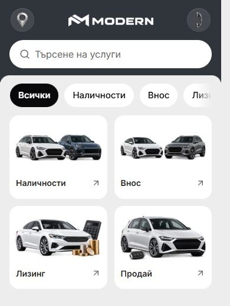
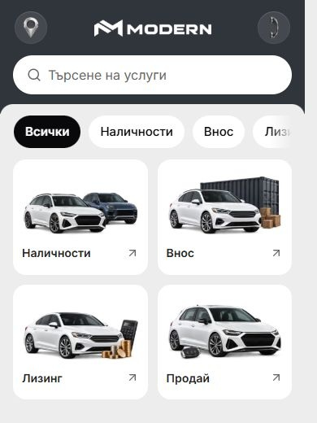

# Mobile Services artwork and reference review — 6 October 2026

The owner requested the new desktop artwork on mobile too and asked whether Modern should adopt richer service cards from `http://127.0.0.1:6483/bg/2/service`.

Services now selects the existing generated card family at all widths. All four production assets are reused unchanged: stock cars, cargo/container import, calculator/coins financing and car/key selling. The two-column mobile layout, 141.59375 px card height, short localized labels, corner arrows and destinations are unchanged. Desktop catalogue cards retain their 350 px height at 1440 px. The individual service-page artwork and desktop Home composition are untouched.

| Mobile before | Mobile after |
| --- | --- |
|  |  |

`apps/web/app/[locale]/services/page.tsx` uses `desktopServiceCards` with the existing `desktopServices` fallback. One image map and the shared `PublicImage` component replace the duplicated desktop/mobile maps and art-direction picture source. This keeps normal responsive optimization and the existing mount-aware image handling. The legacy configuration role name is retained without adding another parallel schema or changing dealer override precedence.

The artwork receipt records the expanded usage scope. The prompt, source master, all four exports and their hashes remain unchanged. Both current template guidance files now describe the shared mobile/desktop catalogue; the preceding desktop report remains historical evidence.

## Reference judgment

The 6483 reference was inspected at 1440 and 390 px. Its desktop cards use large workshop photographs with three included items; mobile uses rows with a small square photograph and the same checklist. It lists maintenance, diagnostics, tyres, brakes and air conditioning, with Demo labels on the latter three. [Desktop capture](service-card-mobile-refresh-2026-10-06/reference-6483-desktop-1440.jpg) and [mobile capture](service-card-mobile-refresh-2026-10-06/reference-6483-mobile-390.jpg) retain the observed page.

Keep Modern's current four compact dealership cards clean. Their recognizable artwork and single sentence suit browsing stock, importing, financing and selling. Adding the reference's full checklists or large photographs would make these choices heavier. Specific action labels are a useful possible follow-up; a standalone servicing card belongs to a concrete servicing offer, rather than being an extra Demo tile. No maintenance offering, fifth card or new request flow was added, and the reference source was not edited.

## Verification

- Nine after-views passed: BG at 320/390/768/1023/1440 px and EN at 320/390/1023/1440 px. Four correct illustrations loaded in every view, text/actions stayed within their cards, and no horizontal overflow was observed.
- Six matched before/after pairs have identical measured card/image geometry, typography, labels, action sizing and destinations: BG 320/390/1023/1440 and EN 390/1440. Artwork changes on mobile are intentional; pixel identity is not claimed.
- The service stylesheet is byte-identical to the task-start preimage. Asset hashes match the preceding generated set. No additional artwork generation or layout changes were made.
- Mobile Imports filtering shows one cargo card with `/bg/imports`; searching for `лизинг` shows `/bg/lease`; clearing restores four. Cards contain no nested links/buttons. The final preview retains these existing interaction semantics.
- Scoped Biome and the web TypeScript check (`pnpm --filter web exec tsc --noEmit --incremental false`) passed. Scoped diff whitespace checks passed. Fresh Services reload observations are recorded separately.

[Measurements](service-card-mobile-refresh-2026-10-06/measurements.json), [verification](service-card-mobile-refresh-2026-10-06/verification.json), [interactions](service-card-mobile-refresh-2026-10-06/behavior.json) and [reload checks](service-card-mobile-refresh-2026-10-06/reload-verification.json) retain the local evidence. Full native JPEGs are preserved; the mobile comparison uses an identical crop containing the brand/search, filters and all four cards.

Task-start preimages and the verification helper are under ignored `runtime/service-card-mobile-refresh-20261006/`. The interruption reset the browser controller and briefly left port 6482 unavailable; it came back on Node 22.23.2 from the canonical Modern checkout before source changes, so the guarded startup helper did not launch a second server. Existing dirty work was preserved. No production build, new browser-engine qualification, mounted-release check, commit, release promotion or deployment was performed.

After the successful Services reloads, the browser URL policy rejected refreshing the user's earlier Cars error tab. That optional restore was stopped without a workaround. The separate, verified Services tab is retained as the preview; the earlier error tab requires a user-controlled refresh.
