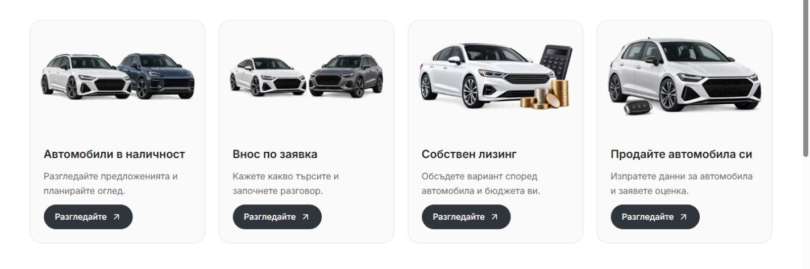
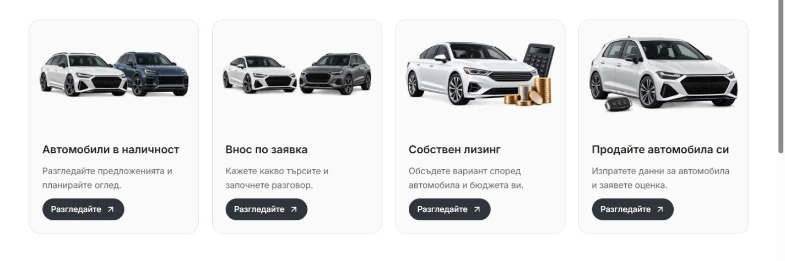
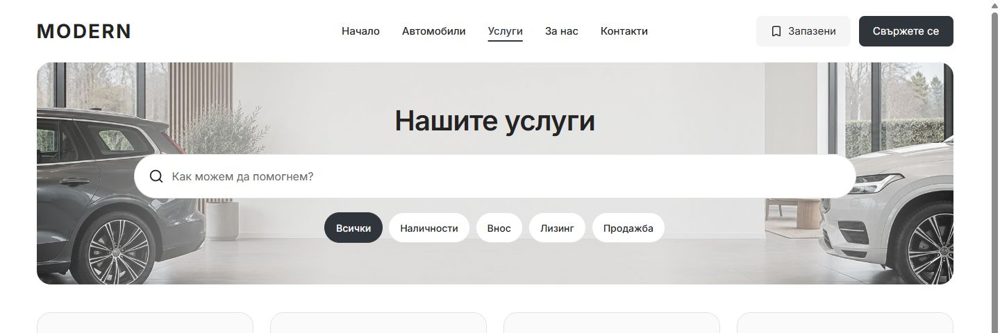

# Services card buttons — 6 October 2026

The Services catalogue's desktop card actions now look like compact rounded buttons: configured charcoal background, white label/arrow, 40 px height and 16 px side padding. They sit on the left and align along the bottom of each grid row. The existing card link owns navigation and keyboard focus; the visual action remains a span inside it.

Only the existing 1024 px desktop block in `apps/web/app/[locale]/services/services.module.css` changes. It reuses brand, radius, spacing, typography and hover tokens. The first pass used 44 px height and 20 px side padding; the owner requested a smaller preview, now 40 px high with 16 px side padding. Titles, descriptions, images and destinations are preserved.

## Current 40 px sizing

| Previous 44 px | Current 40 px |
| --- | --- |
|  |  |

BG/EN at 1024/1440 px confirms 40 px height, buttons 8 px narrower and equal bottoms within each grid row. Labels, font size, destinations and rounding are preserved. All six full-page BG/EN mobile pairs at 320/390/1023 px remain pixel-identical to the preceding captures, with matching card geometry and page height. [Sizing measurements](services-card-buttons-40px-2026-10-06/measurements.json) and [comparisons](services-card-buttons-40px-2026-10-06/comparison.json) record the checks. Scoped Biome, 7/7 desktop contracts, release contract preflight and 87/87 preflight tests passed. The production build recorded below belongs to the first 44 px pass; this two-value CSS sizing preview was verified in the running app.

## Initial button treatment

Bulgarian at 1440 px, showing all four complete cards:

| Before | After |
| --- | --- |
|  |  |

## Initial 44 px verification

- BG/EN at 1024/1440 px: every action is 44 px tall with `#30343b` background and white text. Button bottoms match within each row. No horizontal overflow or visible broken images. Text and all four destinations match the baseline.
- BG/EN at 320/390/1023 px: all six full-page screenshot pairs are pixel-identical. All four cards' geometry and styling, page text and page height match the baseline.
- Keyboard focus retains a visible 2 px outline around the card. Enter on the stock card opens `/bg/cars` after navigation settles. The cards have no nested interactive controls.
- The Imports pill narrows the catalogue to one `/bg/imports` card; All restores four cards.
- Scoped Biome passed. Desktop refactor contracts: 7/7 passed. Release contract preflight passed; preflight tests: 87/87 passed.
- Provider-free production `next build`, including TypeScript, passed with Node 22.23.2. Isolated output: `apps/web/.next-public-e2e-services-card-buttons-20261006-demo`. Protected `apps/web/next-env.d.ts` is restored byte-for-byte to its pre-task contents.

[Measurements](services-card-buttons-2026-10-06/measurements.json), [comparisons](services-card-buttons-2026-10-06/comparison.json) and [interaction checks](services-card-buttons-2026-10-06/interaction-checks.json) record the actual local evidence.

This is a local Modern master styling change on the existing main checkout. Pre-existing dirty and untracked work is preserved; no commit, release selection or deployment was made. Browser proof uses the in-app browser; hosted and WebKit checks were not rerun. Recovery preimages remain in ignored `runtime/services-card-buttons-20261006/`.
