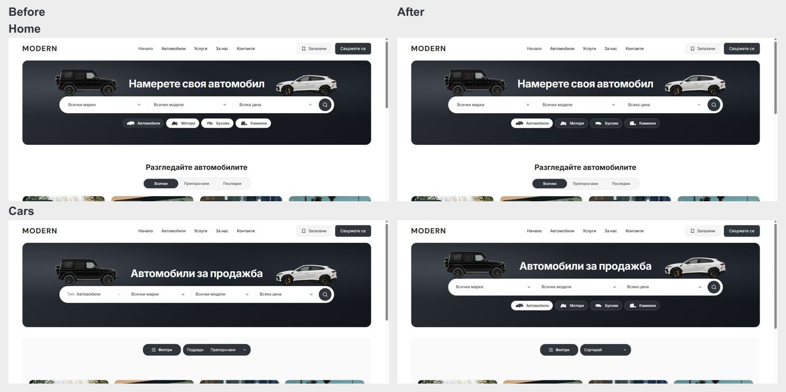

# Shared discovery pills and compact sorting — 5 October 2026

Home and Cars now use the same desktop Make/Model/Price capsule and four vehicle-type pills: Cars, Motorbikes, Vans and Trucks. The shared `DealerVehicleTypePills` component retains the original category assets and localized labels. Inventory's duplicate Type dropdown is removed. Active pills use white with dark text and their original artwork; inactive pills use a translucent white surface, light text and white silhouettes. The palette lives in shared desktop tokens. Both banners keep the graphite background, original cutouts and existing 320 px height.

Home keeps category selection in its draft until Search submits. Inventory applies the existing `withCategory` policy through its route controller. Budget, year and sort survive category changes; incompatible Make/Model choices clear. The category buttons expose `aria-pressed` and retain visible keyboard focus.

The Bulgarian sort trigger shows “Сортирай” for the default recommended order, or only its selected label, such as “Най-нови.” English follows the same rule with “Sort.” Its fixed width is 192 px. Filters remains 144 px and the combined centered row remains 344 px with and without a count badge. Applied chips retain the permanently reserved 56 px horizontal strip. Desktop navigation remains visible in its existing white header; no header/menu change was made.

## Focused local verification

- Live BG/EN Home/Cars at 1024 and 1440 px: equal title/search/pill positions, three search fields, four category pills, white active/glass inactive colors and no horizontal overflow. Title y154, search y226 and pills y310 at the recorded 1000 px-high viewport. This supersedes the earlier Cars-only centering without pills.
- Live inventory category journey through Motorbikes, Vans, Trucks and Cars: budget/year/newest sorting retained, Make/Model cleared. Browser Back restored each category and the original BMW/X5 query. Home's category draft stayed on Home until Search opened Motorbikes.
- All six Bulgarian sort labels fit the 192 px trigger at 1024 px without a prefix or overflow.
- Grid document top remained 610 px with zero filters, three filters and after Clear all. Results row width remained 344 px. Filters dialog Escape restored focus; a category pill exposed a solid keyboard outline.
- Home/Cars mobile body, heading and document measurements exactly matched the saved pre-change measurements at 320/390/1023 px. Corresponding after screenshots are saved with the evidence.
- Web TypeScript, scoped Biome (11 files), release preflight contracts and 94 architecture/refactor/preflight tests passed. Existing browser specs were updated and linted; the automated Playwright suites and a fresh production build were not run for this slice. Earlier development HMR stylesheet errors remain in the tab's history; they do not establish production browser qualification.

Evidence is in `docs/shared-discovery-pills-2026-10-05/`: matched Home/Cars before/after screenshots, responsive geometry, category/Back observations, sort fitting and stable grid checks. Exact source preimages, incremental review patches and logs are in ignored `runtime/shared-discovery-pills-20261005/`. The inherited dirty checkout and existing `.git/index.lock` were preserved. Commit/push remains blocked by that lock. No template promotion or dealer publication occurred.

