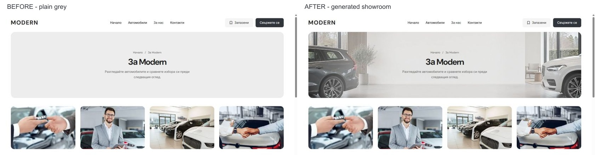

# Generated showroom masthead — 5 October 2026

The owner requested generated artwork to bring more character to the plain About/Contact headers. Both desktop pages now use a warm, neutral showroom scene through the existing configurable `desktopHeroScene` role. The light centre wash keeps dark text readable; the original 1320 px frame, 320 px height, breadcrumb and 40 px content gap are retained. FAQ, gallery and benefit artwork remain as previously reviewed.

The image was generated with `image_gen.imagegen`. Its source PNG, prompt, encoding record and SHA-256 hashes are preserved in [provenance](../provenance/assets/desktop-showroom-editorial-v1/README.md). It is illustrative template artwork, not a photograph of a real dealer location. The served WebP is 2172 × 724 and 147,720 bytes, encoded without changing the original composition. The live asset returns HTTP 200 with the expected image type and byte count.

Verification:

- About/Contact in BG/EN at 1024, 1280, 1440 and 1920 px: 16 native browser cases pass, with intact geometry, loaded artwork and no horizontal overflow.
- About/Contact at 320/390 × 844 and 1023 × 1000: all six mobile geometry comparisons match the preceding version; the desktop banner background is `none` at these widths. The image preload has a 1024 px media condition.
- Home and Cars retain their original G-Class/Urus cutouts, each loaded at 1000 px natural width, with no showroom background or overflow.
- No console errors are captured after the fresh document load.
- Production web build and web typecheck pass. Build output: `.next-public-e2e-showroom-artwork-20261005-demo`; build ID: `Lc9n3GyY7Wxs_Y8c38jTk`. Generated `next-env.d.ts` is restored to its saved pre-start state.
- Site-configuration tests: 29 passed. Scoped Biome: seven files passed. Refactor contracts: 7 passed; release preflight contracts pass; preflight tests: 87 passed. Scoped `git diff --check` passes.

The shared-frame browser expectation now checks the new About/Contact artwork, while preserving the Home/Cars no-background assertions. Rendered checks in this pass use the native development browser; a production Chromium/WebKit suite rerun is not claimed.

Source changes are limited to `packages/marketplace/site-artwork.ts`, the existing desktop tokens and hero CSS, the About/Contact hero artwork bindings, the existing shared-frame assertion, and the corresponding asset/provenance/references. Task preimages and commands are in ignored `runtime/showroom-artwork-20261005/`; unrelated edits are preserved.

The actual development app remains running at `http://127.0.0.1:6482/bg` under PID 48868, with About left open and the normal browser viewport restored. Work remains in `L:/CODEX/cars` on `main` at `08c89d63f9e11939acd5b135ece4278252b80f43`, initially in sync with `origin/main`. The existing zero-byte `.git/index.lock` is preserved and still prevents a scoped commit/non-force push. Once its owner releases the lock, review the task-owned diff against the saved preimages and commit it. No template release or dealer publication was performed.
