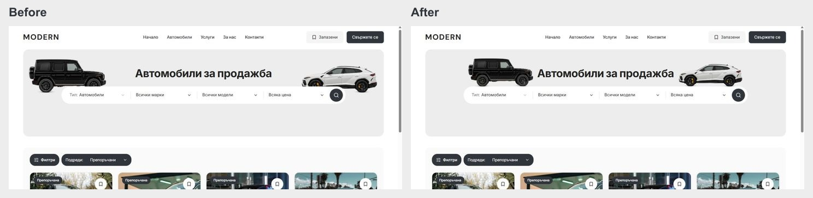

# Discovery vehicle placement — 5 October 2026

The title-led banner moved the search capsule upward while leaving the old vehicle baseline in place. The capsule covered part of the wheels, and the cutouts sat outside its ends.

The shared Home/Cars hero now places both tyre baselines at 136 px from the banner top, matching the capsule top. The original G-Class/Urus artwork is retained. The vehicles use a 210–240 px responsive width and follow the capsule's horizontal edges with a 16 px inset. Filters and Sort remain above the car grid with the applied-filter chips.

Changed source: `packages/marketplace-ui/components/dealer-desktop-hero.module.css` and `packages/design-system/styles/desktop-tokens.css`. The correction is desktop-scoped; mobile source and control behavior are unchanged.

## Verification

- Live dev server at `http://127.0.0.1:6482`: Home and Cars in BG/EN at 1024, 1200, 1280, 1440 and 1920 px. All 20 views had no horizontal overflow or title/artwork collision. Both tyre baselines matched the capsule top in every visible-artwork view. Artwork remains hidden at 1024 px.
- Matched Home/Cars captures at 320, 390 and 1023 px. All six body heights, heading rectangles and document widths matched before/after.
- Scoped CSS Biome check and Git diff whitespace check passed.
- This small CSS correction was checked against the running development build. A new production build and Chromium/WebKit Playwright suites were not run for this correction; the preceding results/services pass has separate build evidence.

Screenshots and geometry are in `docs/vehicle-placement-2026-10-05/`. Exact source preimages and an incremental patch are in ignored `runtime/vehicle-placement-20261005/`.

The shared checkout remains on main. Unrelated dirty work is preserved. The existing `.git/index.lock` prevents a scoped commit/push; it was not removed or bypassed. No template promotion or dealer deployment occurred.

